# Attempt to recreate the Innova2 Flex Image

[MLNX_OFED](https://network.nvidia.com/products/infiniband-drivers/linux/mlnx_ofed/) > `5.2` [does not support the Innova-2](https://forums.developer.nvidia.com/t/innova-2-mlnx-ofed-5-2-has-no-mlx5-fpga-tools-so-innova2-flex-app-fails/285008). The solution is to [ignore the original Innova-2 programming system and roll your own](https://github.com/mwrnd/innova2_flex_xcku15p_notes/tree/main/debug_notes#ignoring-innova2-flex-multiboot-and-innova2_flex_app).


## Bitstream

The Flex Image will need to be loaded using JTAG.

```
wget https://github.com/mwrnd/innova2_experiments/releases/download/v0.1.3-alpha/flex_image_attempt.zip
unzip -d . flex_image_attempt.zip
md5sum *mcs
echo 12483eeac7cfb74c270ad8df1795e0a4 should be MD5 Checksum of flex_image_0x00000000_primary.mcs
echo 0c801e5a0b58ecf2692291340b9e1ea8 should be MD5 Checksum of flex_image_0x00000000_secondary.mcs
echo 102491fd9da85da267092ed77d13d5f0 should be MD5 Checksum of flex_image_0x03000000_primary.mcs
echo ab0b0352a5deb4b30eb9d259252cb663 should be MD5 Checksum of flex_image_0x03000000_secondary.mcs
```


## How Does the Flex Image Work?

The Innova-2 uses dual Quad SPI FLASH ICs to store 3 FPGA Bitstreams: Factory, User, and Flex.

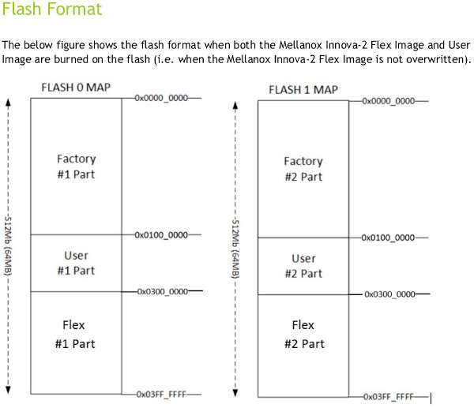

Based on how [UltraScale Multiboot works](https://docs.amd.com/r/en-US/ug570_7Series_Config/MultiBoot-and-Reconfiguration), the *Factory* image (*Golden* Image) is [somehow deciding](https://docs.amd.com/r/en-US/ug570_7Series_Config/Golden-Image-Initial-System-Setup) whether to boot the *User* or *Flex* images. In order meet the [PCIe specification's 100ms boot requirement](https://pcisig.com/specifications/ecr_ecn_process?speclib=100+ms) this decision must be made very quickly, such as by reading the state of a pin.

I dumped the state of all FPGA pins using [UrJTAG](https://github.com/mwrnd/innova2_flex_xcku15p_notes?tab=readme-ov-file#connect-jtag-adapter) and the [`getionotddr4`](https://github.com/mwrnd/innova2_flex_xcku15p_notes/blob/main/getionotddr4) script while the *User* and *Flex* Images were running. Pin `F1` consistently changes state. I have found it is `1` when the *User* Image is running and `0` when the *Flex* Image is running.
```
cable xpc_ext
detect
print chain
part 0
include /home/user/getionotddr4
```

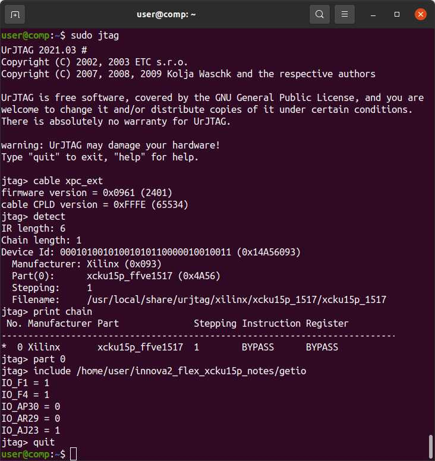

The [I2C communication between the ConnectX-5 and FPGA](https://github.com/mwrnd/innova2_flex_xcku15p_notes/tree/main/debug_notes#tracing-fpga-to-connectx-5-i2c-signals) occurs during loading of the *MLNX_OFED* driver.

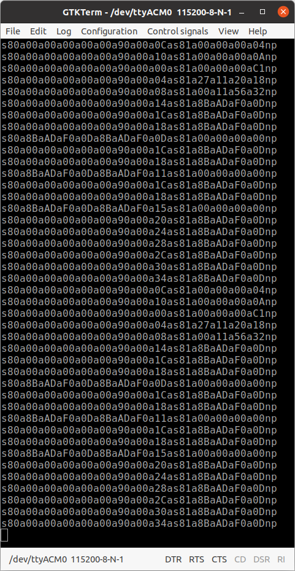

See [these notes](https://github.com/mwrnd/innova2_flex_xcku15p_notes/tree/main/debug_notes#recreating-innova2_flex_app-functionality-for-latest-mlnx-ofed) for more details.


## Design

A [Quad SPI IP Block](https://docs.amd.com/r/en-US/pg153-axi-quad-spi) allows programming the FPGA Configuration Memory using [XRT](https://github.com/Xilinx/XRT).

Configure your project's XDMA Block to include the `M_AXI_Lite` interface:

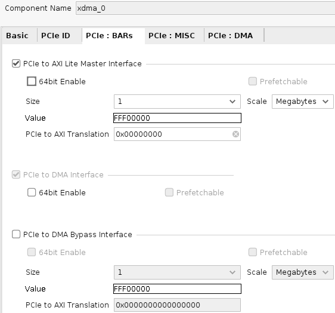

Add a [Quad SPI IP Block](https://docs.amd.com/r/en-US/pg153-axi-quad-spi) and configure it for `2` devices, *Dual Quad Mode*, `256` *FIFO Depth*, and *Use STARTUP Primitive Internal to IP*:

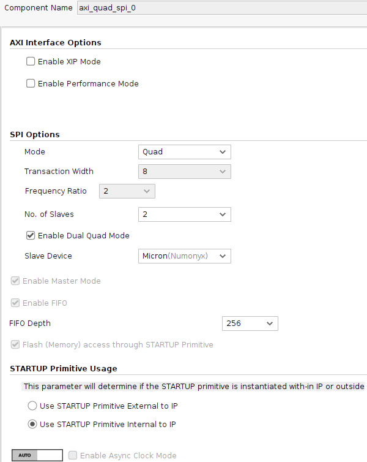

Assign the block an address of `0x40000`:

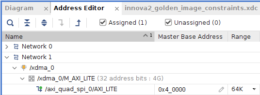

Connect `usrcclkts` to `0`. The Block Diagram should look something like the following, plus the rest of your system.

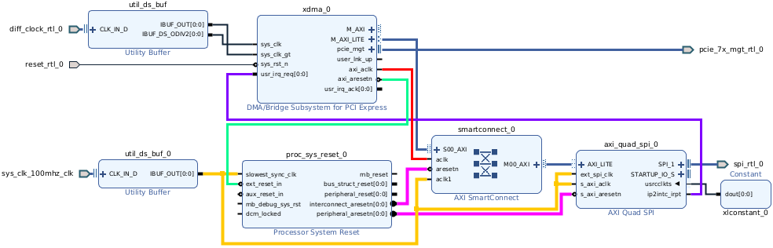

Add the following to your project's constraints `.xdc` file:
```
# Secondary Quad SPI Configuration Flash - Bank 65
# Primary Quad SPI Configuration Flash pins are single-purpose in STARTUPE3
set_property PACKAGE_PIN AM12     [get_ports spi_rtl_0_io0_io]
set_property IOSTANDARD  LVCMOS18 [get_ports spi_rtl_0_io0_io]
set_property PACKAGE_PIN AN12     [get_ports spi_rtl_0_io1_io]
set_property IOSTANDARD  LVCMOS18 [get_ports spi_rtl_0_io1_io]
set_property PACKAGE_PIN AR13     [get_ports spi_rtl_0_io2_io]
set_property IOSTANDARD  LVCMOS18 [get_ports spi_rtl_0_io2_io]
set_property PACKAGE_PIN AR12     [get_ports spi_rtl_0_io3_io]
set_property IOSTANDARD  LVCMOS18 [get_ports spi_rtl_0_io3_io]
set_property PACKAGE_PIN AV11     [get_ports spi_rtl_0_ss_io]
set_property IOSTANDARD  LVCMOS18 [get_ports spi_rtl_0_ss_io]

# Differential System Clock - 100MHz - Bank 65
set_property PACKAGE_PIN AR14        [get_ports {sys_clk_100MHz_clk_p[0]}]
set_property IOSTANDARD  DIFF_SSTL12 [get_ports {sys_clk_100MHz_clk_p[0]}]
```

A [MicroBlaze](https://www.xilinx.com/products/design-tools/microblaze.html) processor is added to implement [I2C (IIC) slave communication](https://en.wikipedia.org/wiki/I%C2%B2C). [`flex_image_microblaze.xsa`](flex_image_microblaze.xsa) is the resulting [exported Hardware Description](https://docs.amd.com/r/en-US/ug1579-microblaze-embedded-design/Exporting-a-Hardware-Description). [Vitis](https://docs.amd.com/r/en-US/ug1393-vitis-application-acceleration/Creating-a-Bare-metal-System) includes [`xiic_slave_example`](https://github.com/Xilinx/embeddedsw/blob/2b6e9ba95db7cc70d565abfe66433cbebf90e367/XilinxProcessorIPLib/drivers/iic/examples/xiic_slave_example.c) which is altered with the contents of [`xiic_slave_example.c`](xiic_slave_example.c) to generate [`xiic_slave_example.elf`](xiic_slave_example.elf).


### Block Diagram

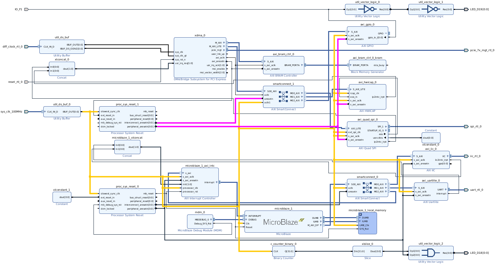


### AXI Addresses

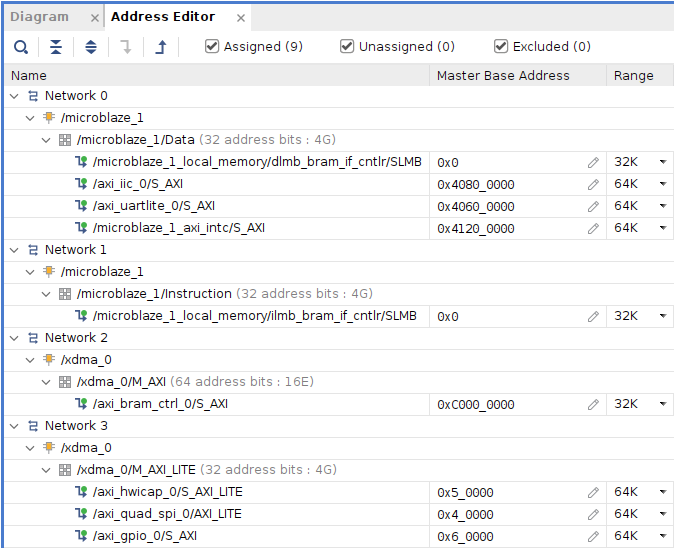


### Design Run Results

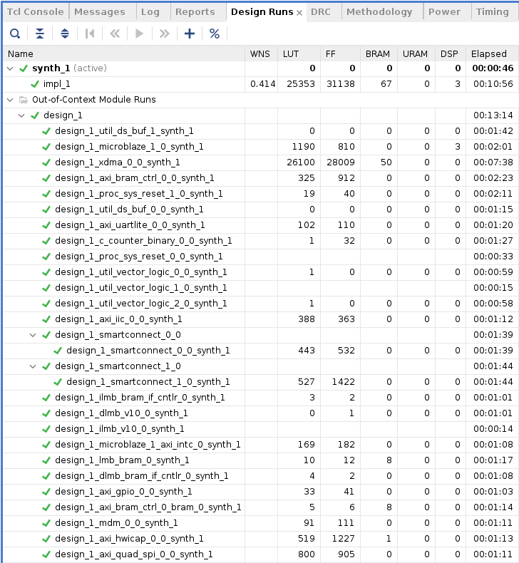


### Write Memory Configuration File

After Synthesis+Implementation write your Memory Configuration File as an `mcs` file to the location of the Flex Image, `0x03000000`. Due to the Dual Quad SPI setup, the Start Address is `0x06000000=2*0x03000000`.

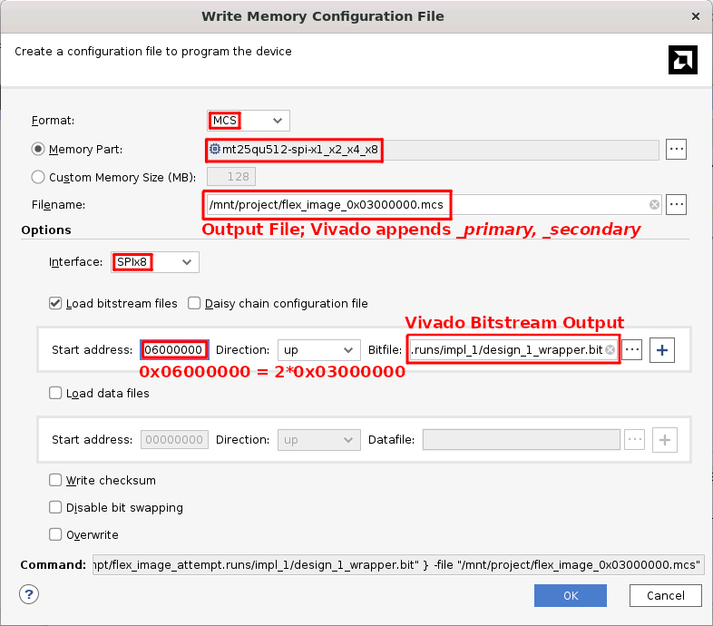

Use JTAG to write your configuration image to the Innova2.


### Testing

Testing with [`cx5i2c.py`](https://github.com/mwrnd/innova2_flex_xcku15p_notes/blob/main/debug_notes/cx5i2c.py) produces the same core communication result as the original Flex Image but this attempt otherwise fails.

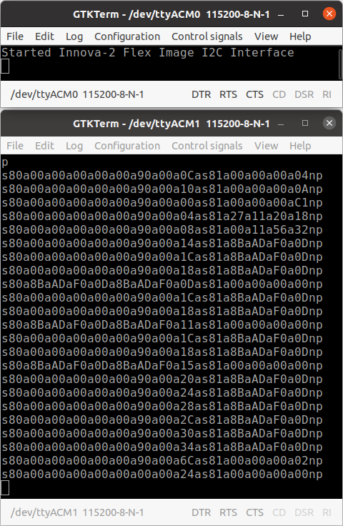


## Programming New Designs 

Subsequently, the [`xbflash`](https://xilinx.github.io/XRT/master/html/xbflash2.html) command can be used to program new bitstreams over existing ones. Ubuntu and RedHat/CentOS packages of [XRT](https://www.xilinx.com/bin/public/openDownload?filename=xrt_202320.2.16.204_22.04-amd64-xrt.deb) are [available on the Getting Started pages of Alveo boards](https://www.xilinx.com/products/boards-and-kits/alveo/u200.html#gettingStarted).

```
lspci -d 10ee:
xbflash --card 3:00.0 --primary PROJECT_NAME_primary.mcs --secondary PROJECT_NAME_secondary.mcs
```

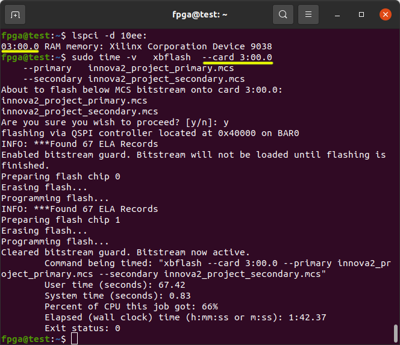


