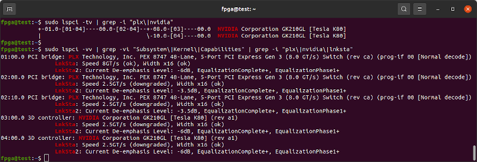
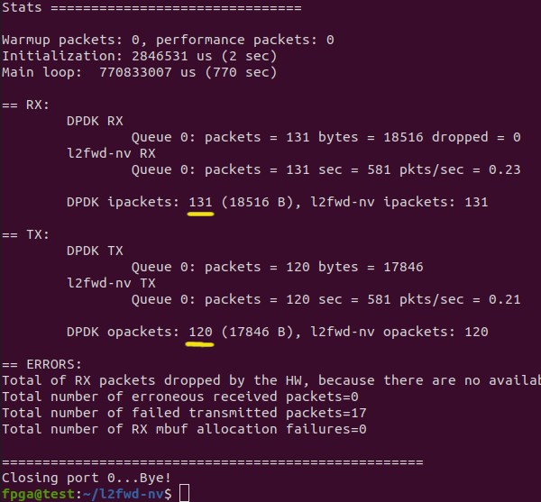

**Work in Progress** - Not yet functional.

This is an attempt to get the Innova-2's ConnectX-5 Ethernet interfaces and a Tesla K80 ([CUDA Compute Capability SM_3.7](https://developer.nvidia.com/cuda-gpus)) GPU communicating with each other through [PCIe Peer-to-Peer DMA](https://www.eideticom.com/media-news/blog/33-p2pdma-in-linux-kernel-4-20-rc1-is-here.html) to allow GPU packet processing.


According to the documentation I have read, this *should* be possible with CUDA 11 and [CUDA Compute Capability](https://developer.nvidia.com/cuda-gpus) >=3 (`SM_3+`) and [*was* possible](https://developer.nvidia.com/blog/peer-to-peer-multi-gpu-transpose-cuda-fortran/). However, requirements have crept up and now most software requires CUDA 12 and [`SM_5+`](https://github.com/NVIDIA/cuda-samples/tree/master/Samples/0_Introduction/simpleP2P). This has become a matter of herding the correct versions of software and dependencies.

Here is a quick [overview of PCIe P2P DMA](https://dl.acm.org/doi/abs/10.1145/3462545). [More notes](https://linuxreviews.org/Peer_To_Peer_DMA).


## Requirements

Confirm that your motherboard supports PCIe P2P by searching the datasheet of its chipset for `peer`.


[Above 4G Memory Decoding](https://superuser.com/questions/1239231/what-is-above-4g-decoding) and [Resizable BAR Support](https://xilinx.github.io/Vitis_Accel_Examples/2020.2/html/p2p_fpga2fpga.html) are [required](https://github.com/Xilinx/XRT/blob/master/src/runtime_src/doc/toc/p2p.rst#bios-setup) for PCIe P2P. Enable them in your BIOS. You may need to update your BIOS. If you plug in any new PCIe devices, redo this check.


## Installation

I recommend starting with a [fresh install](https://ubuntu.com/tutorials/install-ubuntu-desktop#1-overview) of [Ubuntu 20.04.5 Desktop amd64](https://releases.ubuntu.com/20.04.5/) on a blank SSD. An approximately 250GB SSD should be enough.

### Linux Kernel

Open **Software and Updates** and add *Proprietary Drivers*, *Restricted Software*, and *Source Code* as package options.


Update and upgrade your but make sure to stay on **20.04**, no `dist-upgrade`. Run the following in a terminal. Run `sudo ls` before copy-and-pasting a large block of commands to prime `sudo` and prevent copying commands into the password field.
```Shell
sudo apt-get update  ;  sudo apt-get upgrade
```


Install Linux Kernel `5.4.0-26-generic`.
```Shell
sudo apt-get install   linux-buildinfo-5.4.0-26-generic \
       linux-cloud-tools-5.4.0-26-generic linux-headers-5.4.0-26-generic \
       linux-image-5.4.0-26-generic linux-modules-5.4.0-26-generic \
       linux-modules-extra-5.4.0-26-generic linux-tools-5.4.0-26-generic
```

Nvidia/Mellanox [only officially support kernel](https://docs.nvidia.com/networking/display/MLNXOFEDv522240/General+Support+in+MLNX_OFED) `5.4.0-26-generic`.


#### Remove all Kernels other than 5.4.0-26

List all installed Linux Kernels:
```Shell
dpkg -l | grep linux-image | grep "^ii"
```


Kernels `5.13.0-30-generic` and `5.13.0-52-generic` show up for me in the above command so I remove them both as they are **not** `5.4.0-26`. Mellanox OFED driver installation attempts to compile kernel modules for every kernel on the system and it will fail to install properly if it cannot.
```Shell
sudo apt remove \
       linux-buildinfo-5.13.0-52-generic \
       linux-cloud-tools-5.13.0-52-generic linux-headers-5.13.0-52-generic \
       linux-image-5.13.0-52-generic linux-modules-5.13.0-52-generic \
       linux-modules-extra-5.13.0-52-generic linux-tools-5.13.0-52-generic \
       \
       linux-buildinfo-5.13.0-30-generic \
       linux-cloud-tools-5.13.0-30-generic linux-headers-5.13.0-30-generic \
       linux-image-5.13.0-30-generic linux-modules-5.13.0-30-generic \
       linux-modules-extra-5.13.0-30-generic linux-tools-5.13.0-30-generic

sudo apt autoremove
sudo reboot
```

After reboot run Ubuntu *Software Updater*.


### Install All Prerequisites

Confirm you are on kernel `5.4.0-26-generic`
```
uname -s -r -m
```


Remove older default version of the `clang` compiler.
```
sudo apt-get remove clang clang-10 libclang-10-dev libclang-common-10-dev libclang-cpp10 libclang-dev libclang1-10 libopencl-clang10
```

Install as much software and libraries as you can think of. `MLNX_OFED` drivers will install custom versions of some of the libraries that get pulled into this install. By installing everything first you can avoid library incompatibility issues and `MLNX_OFED` reinstallations. `libibverbs` is one package that gets updated and pulled in by almost every piece of networking software but `MLNX_OFED` requires a custom version. The following is about 950MB of archives and requires 2.9GB of space.
```Shell
sudo apt-get install    alien aptitude autoconf automake autopoint autotools-dev bcc binfmt-support binutils-riscv64-linux-gnu binutils-riscv64-unknown-elf binwalk bison blt-dev bpfcc-tools bpftrace build-essential bzip2 ccache check chrpath clang clang-12 clang-format-12 clang-tidy-12 clang-tools-12 clinfo cmake coreutils cpp-riscv64-linux-gnu curl cycfx2prog cython3 dapl2-utils debhelper debian-goodies debootstrap devscripts dh-autoreconf dh-python dkms dos2unix doxygen dpatch dpkg dwarves elfutils ethtool fakeroot fio flashrom flex fxload gcc gcc-riscv64-linux-gnu gcc-9-riscv64-linux-gnu gcc-riscv64-unknown-elf gdb gettext gettext-base gfio gfortran ghex git graphviz gtkterm gtkwave htop hwdata hwinfo hwloc ibacm ibutils ibverbs-providers ibverbs-utils intel-opencl-icd iotop iperf3 ixo-usb-jtag kcachegrind kernel-package kernel-wedge libaio1 libaio-dev libasm1 libatlas-base-dev libblas-dev libboost-all-dev libboost-filesystem1.71.0 libboost-filesystem-dev libboost-program-options1.71.0 libboost-program-options-dev libboost-thread-dev libbpfcc libbpfcc-dev libbsd0 libc++1-12 libc++-12-dev libc6 libc6-dev libcap-dev libc-dev libcharon-extauth-plugins libclang1-12 libclang-12-dev libclang-common-12-dev libclang-cpp12 libclang-dev libcunit1 libcunit1-dev libcurl4-openssl-dev libdapl2 libdeflate-dev libdrm-dev libdw1 libdwarf++0 libedit-dev libegl1-mesa-dev libelf++0 libelf1 libelf-dev libelfin-dev libfdt1 libfdt-dev libffi-dev libfontconfig1-dev libfreetype6-dev libftdi1 libftdi1-dev libftdi1-doc libftdi-dev libgcc-s1 libgfortran4 libgfortran5 libgl1-mesa-dev libgl1-mesa-dri libgl1-mesa-glx libglib2.0-0 libglib2.0-bin libglib2.0-data libglib2.0-dev libgnutls28-dev libgomp1 libhugetlbfs-bin libhwloc-dev libibdm1 libibmad5 libibmad-dev libibnetdisc5 libibnetdisc-dev libibumad-dev libibverbs1 libibverbs-dev libipsec-mb0 libipsec-mb-dev libisal2 libisal-dev libjansson4 libjpeg-dev liblapack-dev libllvm12 liblzma-dev libmfx1 libmfx-dev libmfx-tools libmnl0 libmnl-dev libmount-dev libncurses5 libncurses5-dev libncurses6 libncurses-dev libnginx-mod-http-echo libnl-3-200 libnl-3-dev libnl-route-3-200 libnl-route-3-dev libnuma-dev libopenblas-dev libopencl-clang10 libopenmpi-dev libpcap-dev libpci3 libpci-dev libpng-dev libprocps-dev libprotobuf17 librdmacm1 librdmacm-dev libreadline-dev librte-pmd-qat20.0 libselinux1 libselinux1-dev libsgutils2-dev libssh-dev libssl1.1 libssl-dev libstdc++6 libstdc++-9-dev-riscv64-cross libstdc++-9-pic-riscv64-cross libstrongswan libstrongswan-standard-plugins libsubunit0 libsubunit-dev libsystemd0 libsystemd-dev libtiff5 libtiff-dev libtinfo5 libtinfo-dev libtool libudev1 libudev-dev libunbound8 libunbound-dev libunwind8 libunwind-dev libusb-1.0-0-dev libusb-dev libuuid1 libvirt0 libvirt-dev libvma libvma-dev libwebp-dev libxau6 libxau-dev libxcb1-dev libxdmcp6 libxdmcp-dev libxext-dev libxfixes-dev libxft-dev libxml2-dev lintian linux-base linux-source llvm-12 llvm-12-dev llvm-12-runtime llvm-12-tools llvm-dev logrotate lsb-base lsb-release lsof m4 make mdevctl meld mesa-opencl-icd meson mininet module-assistant mpi-default-bin musl musl-dev musl-tools net-tools netwox nginx-light ninja-build nmap ntpdate numactl nvme-cli ocl-icd-dev ocl-icd-libopencl1 ocl-icd-opencl-dev opencl-headers openjdk-17-jdk openjdk-17-jre openmpi-bin openmpi-doc openocd opensm openssl openvswitch-switch pandoc pci.ids pciutils perftest perl pkg-config procps python python-nemu python3-all python3-attr python3-automat python3-binwalk python3-bpfcc python3-constantly python3-docutils python3-ftdi1 python3-hamcrest python3-hyperlink python3-incremental python3-openpyxl python3-openssl python3-pip python3-pkgconfig python3-pyasn1 python3-pyasn1-modules python3-pyelftools python3-pygraphviz python3-pyverbs python3-scapy python3-service-identity python3-setuptools python3-six python3-sphinx python3-twisted python3-twisted-bin python3-zope.interface python-libxml2 python-six python-zope.interface qemu-system-misc qemu-system-x86 qemu-utils qperf quilt rdmacm-utils sg3-utils socat sockperf sqlite squashfs-tools squashfs-tools-ng squashfuse strongswan strongswan-charon strongswan-libcharon strongswan-starter swig sysstat tcl tcl-dev tcptraceroute tk tk-dev u-boot-qemu udev user-mode-linux-doc uuid-dev v4l2loopback-dkms v4l2loopback-utils valgrind valgrind-mpi vbindiff vtun xc3sprog zlib1g zlib1g-dev

sudo apt-get install    dpkg-dev:i386 libgtk2.0-0:i386 libstdc++6:i386
sudo reboot
```

TODO: _MAY_ need to remove some extra packages that conflict with Mellanox OFED.
```Shell
TODO
sudo apt-get remove  openmpi-bin libcoarrays-openmpi-dev \
       libiscsi-bin dpdk-dev libmumps-5.2.1 librte-pmd-mlx4-20.0 \
       libsdpa-dev librte-pmd-mlx5-20.0 libcaf-openmpi-3 \
       libscotch-dev libopensm-dev libosmvendor4 libopensm8 \
       mpi-default-dev libmumps-seq-dev libopenmpi3 \
       libscalapack-openmpi2.1 libopenmpi-dev openmpi-common \
       libiscsi-dev libdpdk-dev libbibutils-dev librados2 \
       libscalapack-openmpi-dev libvma8 libfabric1 libmumps-dev \
       libbibutils6 libosmcomp4 libscalapack-mpi-dev libiscsi7 \
       mpi-default-bin libibmad5 libibnetdisc5 libibnetdisc-dev
TODO
```

Run `update`, `autoremove`, and `upgrade` one last time. Reboot.
```Shell
sudo apt-get update  ;  sudo apt autoremove  ;  sudo apt-get upgrade
sudo reboot
```

Set *v12* as the default version of the `clang` compiler.
```
sudo update-alternatives --remove-all clang
sudo update-alternatives --install /usr/bin/clang++ clang++ /usr/bin/clang++-12 120
sudo update-alternatives --install /usr/bin/clang clang /usr/bin/clang-12 120
sudo update-alternatives --install /usr/bin/clang-format clang-format /usr/bin/clang-format-12 120
clang --version
```


### Add PCIe P2P DMA Support to Kernel

Get the source code for the 5.4.0-26 Linux Kernel. Note that extraction and compilation of a Kernel requires about 20GB of drive space.
```
cd ~
apt-get source linux-image-5.4.0-26-generic linux-modules-5.4.0-26-generic linux-tools-custom
echo   should be MD5 Checksum
md5sum   linux-image-5.4.0-26-generic.tar.gz
tar -xvf linux-image-5.4.0-26-generic.tar.gz
cd linux-image-5.4.0-26-generic/
```

If you search your current Kernel's configuration for PCIe Peer-to-Peer, it will show that it is NOT enabled.
```
cat /boot/config-5.4.0-26-generic  |  grep -i p2pdma
```
```
# CONFIG_PCI_P2PDMA is not set
```


Copy the current Kernel configuration file so that it may be used as the basis for your updated Kernel.
```
cp  /boot/config-5.4.0-26-generic  .config
```

Run `menuconfig` and add PCIe P2P DMA support. It is under Device Drivers -> PCI Support -> PCI Peer-to-Peer Transfer Support.
``` 
make menuconfig
```


Press *Y* to enable the PCI Peer-to-Peer option, then *Save* and *Exit*.

Confirm the configuration file now has P2PDMA enabled.
```
cat .config  |  grep -i p2pdma
```
```
# CONFIG_PCI_P2PDMA=Y
```


Compile your updated Kernel. Set the number of threads to the number of cores in your processor.
```
make -j `getconf _NPROCESSORS_ONLN` deb-pkg LOCALVERSION=-custom
```

TODO: Install the compiled Kernel `.deb` package.
```
sudo dpkg -i ..... TODO
```

Restart your computer and confirm it is running your updated `5.4.0-26-custom` kernel.
```
uname -s -r -m
```


#### GRUB Bootloader Configuration

`sudo gedit /etc/default/grub` and edit GRUB's configuration to load your custom Kernel. Note the `1-3` should be adjusted to the number of processor cores in your system. Core `0` is meant to be used as a controller core and the other cores for computation.

```
### change timeout to 3s and add a menu
#GRUB_DEFAULT=0
GRUB_DEFAULT="Advanced options for Ubuntu>Ubuntu, with Linux 5.4.0-26-custom"
GRUB_TIMEOUT_STYLE=menu
GRUB_HIDDEN_TIMEOUT_QUIET=false
GRUB_TIMEOUT=3
GRUB_DISTRIBUTOR=`lsb_release -i -s 2> /dev/null || echo Debian`
GRUB_CMDLINE_LINUX_DEFAULT="default_hugepagesz=2M hugepagesz=2M hugepages=1024 tsc=reliable clocksource=tsc intel_idle.max_cstate=0 mce=ignore_ce processor.max_cstate=0 audit=0 idle=poll isolcpus=1-3 nohz_full=1-3 rcu_nocbs=1-3 rcu_nocb_poll nosoftlockup iommu=off intel_iommu=off"
GRUB_CMDLINE_LINUX="net.ifnames=0 biosdevname=0"
```

PCIe Peer-to-Peer DMA [requires](https://docs.nvidia.com/gpudirect-storage/troubleshooting-guide/index.html#install-prereqs) that the `iommu` is disabled so that all [physical memory addresses](https://docs.nvidia.com/gpudirect-storage/configuration-guide/index.html#system-parameters) are identical from all PCIe device's points of view. On AMD systems, replace `intel_iommu=off` with `amd_iommu=off`.

**TODO** An [AMD Advisory](https://community.amd.com/t5/knowledge-base/iommu-advisory-for-amd-instinct/ta-p/484601) suggests that enabling [SR-IOV](https://en.wikipedia.org/wiki/Single-root_input/output_virtualization) and the IOMMU in passthrough mode to have one system-wide address space. [Another Advisory](https://community.amd.com/t5/knowledge-base/iommu-advisory-for-multi-gpu-environments/ta-p/477468) suggests disabling IOMMU for Multi-GPU environments.

The `default_hugepagesz=2M hugepagesz=2M hugepages=1024` enables [hugepages](https://wiki.debian.org/Hugepages) support which is required by DPDK. 1024 2MB pages is good enough on a system with 16GB of memory.

If your system has 64GB+ of memory, use 1GB hugepages: `default_hugepagesz=1G hugepagesz=1G hugepages=16`.

The `net.ifnames=0 biosdevname=0` options allow traditional network interface names, such as `eth0`. This is required for older versions of Vivado, such as *2017.2*.

The other options are meant to improve timer precision and prevent any power-saving features from activating.

Update `grub`.
```Shell
sudo update-grub
sudo reboot
```


### Install Mellanox OFED

Confirm you are on Kernel `5.4.0-26-custom`
```Shell
uname -s -r -m
```


Confirm your system booted with the correct `grub` options to disable `iommu` and power-saving features.
```
dmesg  |  grep "Command line:"
```

Add the Mellanox Signing Key to your computer so that the OFED driver packages are trusted for install.
```
sudo apt-key adv --keyserver hkp://keyserver.ubuntu.com:80 --recv-keys A024F6F0E6D6A281
```

[MLNX_OFED_LINUX-5.8-1.1.2.1-LTS](https://network.nvidia.com/products/infiniband-drivers/linux/mlnx_ofed/) is the latest Long-Term-Support version I have tested.


Run the following commands individually, which download and install `MLNX_OFED_LINUX-5.8-1.1.2.1-LTS` plus GPUDirect-related packages. 

```Shell
cd ~
wget https://content.mellanox.com/ofed/MLNX_OFED-5.8-1.1.2.1/MLNX_OFED_LINUX-5.8-1.1.2.1-ubuntu20.04-x86_64.tgz
sha256sum  MLNX_OFED_LINUX-5.8-1.1.2.1-ubuntu20.04-x86_64.tgz
echo ac15eff0f82f06048b4141e4c4219fa36b58411cb3eb4630d36d33374acde865 should be the SHA256 checksum
tar -xvf  MLNX_OFED_LINUX-5.8-1.1.2.1-ubuntu20.04-x86_64.tgz
sudo mv -v MLNX_OFED_LINUX-5.8-1.1.2.1-ubuntu20.04-x86_64/ /var/
cd /var/MLNX_OFED_LINUX-5.8-1.1.2.1-ubuntu20.04-x86_64/
sudo ./mlnxofedinstall -vvv --without-fw-update --skip-unsupported-devices-check --with-nvmf --with-nfsrdma --enable-gds --add-kernel-support --dkms
sudo /etc/init.d/openibd restart

sudo reboot
```

`sudo gedit /etc/apt/sources.list` and add the `MLNX_OFED` packages as `apt` install options.
```
deb [trusted=yes] file:/var/MLNX_OFED_LINUX-5.8-1.1.2.1-ubuntu20.04-x86_64/DEBS  ./
sudo apt update
```


`apt-mark hold` should prevent `apt` from updating any of the packages installed by `MLNX_OFED`.
```Shell
sudo  apt-mark  hold     5.4.0-26-custom 5.4.0-26-generic linux-image-generic \
    linux-headers-generic ofed-scripts mlnx-ofed-kernel-utils \
    mlnx-ofed-kernel-dkms iser-dkms isert-dkms srp-dkms rdma-core \
    libibverbs1 ibverbs-utils ibverbs-providers libibverbs-dev \
    libibverbs1-dbg libibumad3 libibumad-dev ibacm librdmacm1 \
    rdmacm-utils librdmacm-dev mstflint ibdump libibmad5 \
    libibmad-dev libopensm opensm opensm-doc libopensm-devel \
    libibnetdisc5 infiniband-diags mft kernel-mft-dkms perftest \
    ibutils2 ar-mgr dump-pr ibsim ibsim-doc ucx sharp hcoll \
    knem-dkms knem openmpi mpitests libdapl2 dapl2-utils \
    libdapl-dev dpcp srptools mlnx-ethtool mlnx-iproute2

sudo reboot
```

After reboot confirm OFED Kernel Modules are Installed.
```Shell
sudo dkms status
```


Confirm the installed version of Mellanox OFED.
```Shell
ofed_info -n
```


### Install Xilinx PCIe DMA IP Drivers

Download and extract the March 18, 2022, commit 7859957 version of Xilinx's [DMA IP Drivers](https://github.com/Xilinx/dma_ip_drivers/tree/785995783c78b2cbec6458141c4395e204c5bd9b).

TODO - latest?

```Shell
cd ~
wget https://codeload.github.com/Xilinx/dma_ip_drivers/zip/785995783c78b2cbec6458141c4395e204c5bd9b -O dma_ip_drivers-7859957.zip
unzip dma_ip_drivers-7859957.zip
mv dma_ip_drivers-785995783c78b2cbec6458141c4395e204c5bd9b dma_ip_drivers
```

#### Install and Set Up DPDK

DPDK requires hugepages.
```Shell
cat /sys/kernel/mm/hugepages/hugepages-2048kB/nr_hugepages
echo If the above returns 0, set it to 1024:
sudo su
echo 1024 > /sys/kernel/mm/hugepages/hugepages-2048kB/nr_hugepages
exit
```
dpdk-22.11.1.tar.xz
[DPDK](https://www.dpdk.org/) [v22.11.1 LTS](https://doc.dpdk.org/guides-22.11/rel_notes/release_22_11.html) is the latest version that works with Xilinx's `dma_ip_drivers 7859957`. DPDK needs to be compiled and installed from source as *dma_ip_drivers* requires DPDK's `librte` to be built with QDMA support from *dma_ip_drivers* so that *dma_ip_drivers* can compile with a `librte` that supports QDMA so that XDMA drivers can build.
```Shell
cd ~
git clone --recursive -b v22.11.1 --single-branch http://dpdk.org/git/dpdk-stable
cd dpdk-stable
git checkout v22.11.1
git describe --tags
git clone git://dpdk.org/dpdk-kmods
echo Copy QDMA-related files from dma_ip_drivers
cp -r ~/dma_ip_drivers/QDMA/DPDK/drivers/net/qdma ./drivers/net/
cp -r ~/dma_ip_drivers/QDMA/DPDK/examples/qdma_testapp ./examples/
echo Configure DPDK for more ethernet ports
echo "dpdk_conf.set('RTE_MAX_ETHPORTS', 256)"     >>config/meson.build
echo "dpdk_conf.set('RTE_MAX_VFIO_GROUPS', 256)"  >>config/meson.build
```

`gedit drivers/net/meson.build` and add QDMA support to your DPDK build in `meson.build`. After `'mlx5',` add `'qdma',`


`gedit config/rte_config.h` and search for `EAL defines` in `rte_config.h` to change/add the following values:
```C
#define RTE_MAX_MEMZONE 20480
#define RTE_MAX_VFIO_CONTAINERS 256
#define RTE_MAX_QUEUES_PER_PORT 2048
#define RTE_LIBRTE_QDMA_DEBUG_DRIVER 1
```


`gedit usertools/dpdk-devbind.py` and add Xilinx QDMA Vendor and Device IDs amongst similar vendor definitions in `dpdk-devbind.py`:
```Python
xilinx_qdma_pf = {'Class': '05', 'Vendor': '10ee',
  'Device': '9011,9111,9211, 9311,9014,9114,9214,9314,9018,9118,\
  9218,9318,901f,911f,921f,931f,9021,9121,9221,9321,9024,9124,9224,\
  9324,9028,9128,9228,9328,902f,912f,922f,932f,9031,9131,9231,9331,\
  9034,9134,9234,9334,9038,9138,9238,9338,903f,913f,923f,933f,9041,\
  9141,9241,9341,9044,9144,9244,9344,9048,9148,9248,9348',
 'SVendor': None, 'SDevice': None}

xilinx_qdma_vf = {'Class': '05', 'Vendor': '10ee',
  'Device': 'a011,a111,a211,a311,a014,a114,a214,a314,a018,a118,\
  a218,a318,a01f,a11f,a21f,a31f,a021,a121,a221,a321,a024,a124,a224,\
  a324,a028,a128,a228,a328,a02f,a12f,a22f,a32f,a031,a131,a231,a331,\
  a034,a134,a234,a334,a038,a138,a238,a338,a03f,a13f,a23f,a33f,a041,\
  a141,a241,a341,a044,a144,a244,a344,a048,a148,a248,a348',
  'SVendor': None, 'SDevice': None}
```

Change (also in `dpdk-devbind.py`)
```Python
network_devices = [network_class, cavium_pkx, avp_vnic, ifpga_class]
```
to 
```Python
network_devices = [network_class, cavium_pkx, avp_vnic, ifpga_class, xilinx_qdma_pf, xilinx_qdma_vf]
```


Build DPDK:
```Shell
cd ~/dpdk-stable
meson build
cd build
ninja
sudo ninja install
sudo ldconfig
cd ../examples/helloworld/
make
```

Confirm DPDK built correctly:
```Shell
cd build
sudo ./helloworld-shared
```
Above should produce output similar to:
```
 EAL: Detected 4 lcore(s)
 EAL: Detected 1 NUMA nodes
 EAL: Multi-process socket /var/run/dpdk/rte/mp_socket
 EAL: Selected IOVA mode 'PA'
 EAL: No available hugepages reported in hugepages-1048576kB
 EAL: Probing VFIO support...
 EAL: VFIO support initialized
 hello from core 1
 hello from core 2
 hello from core 3
 hello from core 0
```

Build `igb_uio`.
```Shell
cd ~/dpdk-stable/dpdk-kmods/linux/igb_uio
make
```

Confirm `librte_net_qdma.a` was built and exists. 
```
ls -la ~/dpdk-stable/build/drivers/  |  grep librte_net_qdma.a
```


Continue to build QDMA test application:
```Shell
cd ~/dpdk-stable/examples/qdma_testapp/
make  RTE_SDK=`pwd`/../..  RTE_TARGET=build
sudo build/qdma_testapp-shared
```
Above should produce output similar to:
```
 QDMA testapp rte eal init...
 EAL: Detected 4 lcore(s)
 EAL: Detected 1 NUMA nodes
 EAL: Multi-process socket /var/run/dpdk/rte/mp_socket
 EAL: Selected IOVA mode 'VA'
 EAL: No available hugepages reported in hugepages-2048kB
 EAL: Probing VFIO support...
 EAL: VFIO support initialized
 EAL: No legacy callbacks, legacy socket not created
 Ethernet Device Count: 0
 Logical Core Count: 4
 EAL: Error - exiting with code: 1
   Cause: No Ethernet devices found. Try updating the FPGA image.
```


#### Generate Personal Signing Key

Need a personal [signing key](https://github.com/andikleen/simple-pt/issues/8#issuecomment-813438385) for compiled kernel modules. Copy and paste the following into a command terminal and it should generate a key configuration.

```Shell
cd /lib/modules/$(uname -r)/build/certs

sudo tee x509.genkey > /dev/null << 'EOF'
[ req ]
default_bits = 4096
distinguished_name = req_distinguished_name
prompt = no
string_mask = utf8only
x509_extensions = myexts
[ req_distinguished_name ]
CN = Modules
[ myexts ]
basicConstraints=critical,CA:FALSE
keyUsage=digitalSignature
subjectKeyIdentifier=hash
authorityKeyIdentifier=keyid
EOF
```

Generate custom key and reboot.
```Shell
sudo openssl req -new -nodes -utf8 -sha512 -days 36500 -batch -x509 -config x509.genkey -outform DER -out signing_key.x509 -keyout signing_key.pem
sudo reboot
```

#### Build and Install Xilinx XDMA Drivers

```Shell
cd ~/dma_ip_drivers/QDMA/linux-kernel
make
sudo make install
cd ~/dma_ip_drivers/XDMA/linux-kernel/xdma
make
sudo make install
sudo depmod -a
sudo ldconfig
cd ~/dma_ip_drivers/XDMA/linux-kernel/tools
make
sudo reboot
```


### Set up Innova-2 Flex Application

The `innova2_flex_app`, part of the [Innova-2 Flex Firmware Release](https://www.nvidia.com/en-us/networking/ethernet/innova-2-flex/), allows software update of the XCKU15P FPGA User Image as well as basic diagnostics of the Innova-2.


The following commands download and install *Innova_2_Flex_Open_18_12*.
```Shell
cd ~
wget http://www.mellanox.com/downloads/fpga/flex/Innova_2_Flex_Open_18_12.tar.gz
md5sum Innova_2_Flex_Open_18_12.tar.gz
echo fdb96d4e02de11ef32bf3007281bfa53 should be the MD5 Checksum
tar -xvf Innova_2_Flex_Open_18_12.tar.gz
cd ~/Innova_2_Flex_Open_18_12/driver/
make
sudo depmod -a
cd ~/Innova_2_Flex_Open_18_12/app/
make

sudo reboot
```


## Install Nvidia Tesla Drivers and CUDA

The goal with this procedure is to install versions of the Nvidia Drivers and CUDA that are compatible with the Tesla K80. Without some effort, Ubuntu will update packages beyond official compatibility and break functionality.

Add the Nvidia keyring to your system so that its packages are trusted.
```
distribution=$(. /etc/os-release;echo $ID$VERSION_ID | sed -e 's/\.//g')
echo $distribution
wget https://developer.download.nvidia.com/compute/cuda/repos/$distribution/x86_64/cuda-keyring_1.0-1_all.deb
sudo dpkg -i cuda-keyring_1.0-1_all.deb
```

Install the latest Nvidia Drivers that still support the Tesla K80, [`R470.161.03`](https://www.nvidia.com/Download/driverResults.aspx/194750/en-us/).
```
wget https://us.download.nvidia.com/tesla/470.161.03/NVIDIA-Linux-x86_64-470.161.03.run
sudo sh NVIDIA-Linux-x86_64-470.161.03.run  --no-cc-version-check 
```

Install the latest version of CUDA repos that support the [`R470.161.03`](https://www.nvidia.com/Download/driverResults.aspx/194750/en-us/) driver and [CUDA `11.4`](https://developer.nvidia.com/cuda-11-4-4-download-archive).
```
wget https://developer.download.nvidia.com/compute/cuda/repos/ubuntu2004/x86_64/cuda-ubuntu2004.pin
sudo mv cuda-ubuntu2004.pin /etc/apt/preferences.d/cuda-repository-pin-600
wget https://developer.download.nvidia.com/compute/cuda/11.4.4/local_installers/cuda-repo-ubuntu2004-11-4-local_11.4.4-470.82.01-1_amd64.deb
sudo dpkg -i cuda-repo-ubuntu2004-11-4-local_11.4.4-470.82.01-1_amd64.deb
sudo apt-key add /var/cuda-repo-ubuntu2004-11-4-local/7fa2af80.pub
sudo apt-get update
```

Install every relevant and possibly useful CUDA package.
```
sudo apt-get install   cuda-compat-11-4=470.161.03-1 cuda-drivers-470=470.161.03-1 cuda-drivers-fabricmanager-470=470.161.03-1 libnvidia-cfg1-470=470.161.03-0ubuntu1 libnvidia-common-470=470.161.03-0ubuntu1 libnvidia-compute-470=470.161.03-0ubuntu1 libnvidia-decode-470=470.161.03-0ubuntu1 libnvidia-encode-470=470.161.03-0ubuntu1 libnvidia-extra-470=470.161.03-0ubuntu1 libnvidia-fbc1-470=470.161.03-0ubuntu1 libnvidia-gl-470=470.161.03-0ubuntu1 libnvidia-ifr1-470=470.161.03-0ubuntu1 libxnvctrl-dev=470.161.03-0ubuntu1 nvidia-compute-utils-470=470.161.03-0ubuntu1 nvidia-dkms-470=470.161.03-0ubuntu1 nvidia-driver-470=470.161.03-0ubuntu1 nvidia-fabricmanager-470=470.161.03-1 nvidia-fabricmanager-dev-470=470.161.03-1 nvidia-headless-470=470.161.03-0ubuntu1 nvidia-headless-no-dkms-470=470.161.03-0ubuntu1 nvidia-kernel-common-470=470.161.03-0ubuntu1 nvidia-kernel-source-470=470.161.03-0ubuntu1 nvidia-modprobe=470.161.03-0ubuntu1 nvidia-settings=470.161.03-0ubuntu1 nvidia-utils-470=470.161.03-0ubuntu1 xserver-xorg-video-nvidia-470=470.161.03-0ubuntu1 libxnvctrl0=470.161.03-0ubuntu1 cuda-compat-11-4=470.161.03-1 libxnvctrl-dev=470.161.03-0ubuntu1 libxnvctrl0=470.161.03-0ubuntu1 nvidia-fabricmanager-dev-470=470.161.03-1 nvidia-headless-470=470.161.03-0ubuntu1 cuda-opencl-12-0 cuda-opencl-dev-12-0
```

Some packages need to be installed seperately to allow dependencies to settle.
```
sudo apt-get install cuda-nvml-dev-11-4 python3-pynvml libnvidia-ml-dev
sudo apt-get install nvidia-visual-profiler datacenter-gpu-manager libnvvm-samples-12-0 libnvvm3
sudo apt-get install nvidia-libopencl nvidia-opencl-icd nvidia-opencl-common
```

```
sudo apt-get install    cuda-cccl-11-4 cuda-command-line-tools-11-4 cuda-compiler-11-4 cuda-cudart-11-4 cuda-cudart-dev-11-4 cuda-cuobjdump-11-4 cuda-cupti-11-4 cuda-cupti-dev-11-4  cuda-cuxxfilt-11-4 cuda-documentation-11-4 cuda-driver-dev-11-4 cuda-gdb-11-4 cuda-libraries-11-4 cuda-libraries-dev-11-4 cuda-memcheck-11-4 cuda-nsight-11-4  cuda-nsight-compute-11-4 cuda-nsight-systems-11-4 cuda-nvcc-11-4 cuda-nvdisasm-11-4 cuda-nvml-dev-11-4 cuda-nvprof-11-4 cuda-nvprune-11-4 cuda-nvrtc-11-4  cuda-nvrtc-dev-11-4 cuda-nvtx-11-4 cuda-nvvp-11-4 cuda-samples-11-4 cuda-sanitizer-11-4 cuda-toolkit-11-4 cuda-toolkit-11-4-config-common  cuda-toolkit-11-config-common cuda-toolkit-config-common cuda-tools-11-4 cuda-visual-tools-11-4 gds-tools-11-4 libatomic1:i386 libcublas-11-4 libcublas-dev-11-4  libcufft-11-4 libcufft-dev-11-4 libcufile-11-4 libcufile-dev-11-4 libcurand-11-4 libcurand-dev-11-4 libcusolver-11-4 libcusolver-dev-11-4 libcusparse-11-4  libcusparse-dev-11-4 libdrm-amdgpu1:i386 libdrm-intel1:i386 libdrm-nouveau2:i386 libdrm-radeon1:i386 libdrm2:i386 libedit2:i386 libegl-mesa0:i386 libegl1:i386  libelf1:i386 libgbm1:i386 libgl1:i386 libgl1-mesa-dri:i386 libglapi-mesa:i386 libgles2:i386 libglvnd0:i386 libglx-mesa0:i386 libglx0:i386 libllvm12:i386  libnpp-11-4 libnpp-dev-11-4 libnvjpeg-11-4 libnvjpeg-dev-11-4 libopengl0:i386 libpciaccess0:i386 libsensors5:i386 liburcu6 libvulkan1:i386  libwayland-client0:i386 libwayland-server0:i386 libx11-xcb1:i386 libxcb-dri2-0:i386 libxcb-dri3-0:i386 libxcb-glx0:i386 libxcb-present0:i386 libxcb-randr0:i386  libxcb-sync1:i386 libxcb-xfixes0:i386 libxshmfence1:i386 libxxf86vm1:i386 mesa-vulkan-drivers:i386 nsight-compute-2021.2.2 nsight-systems-2021.3.2 ucx-cuda ucx-gdrcopy libnvidia-ml-dev python3-pynvml cuda-nvml-dev-11-4
```
```
sudo apt-get install  libcudnn8-dev=8.2.4.15-1+cuda11.4 libcudnn8=8.2.4.15-1+cuda11.4 libnvinfer-dev=8.2.5-1+cuda11.4 libnvinfer8=8.2.5-1+cuda11.4 libnccl2=2.11.4-1+cuda11.4 libnccl-dev=2.11.4-1+cuda11.4 libnvinfer-plugin8=8.2.5-1+cuda11.4 libnvinfer-plugin-dev=8.2.5-1+cuda11.4
```

Mark relevant packages to be held at the R470 Driver and CUDA 11.4 so that newer versions that no longer support the Tesla K80 are not installed.
```
sudo apt-mark hold libcudnn8 libcudnn8-dev libnccl-dev libnccl2 libnvidia-nscq-470 libnvinfer-dev libnvinfer-plugin-dev libnvinfer-plugin8 libnvinfer8 libxnvctrl-dev libxnvctrl0 nvidia-fs-dkms nvidia-modprobe nvidia-settings
```
```
sudo apt-mark hold cuda-drivers-470 cuda-drivers-fabricmanager-470 cuda-runtime-11-4 libnvidia-cfg1-470 libnvidia-compute-470 libnvidia-decode-470 libnvidia-encode-470  libnvidia-extra-470 libnvidia-fbc1-470 libnvidia-gl-470 libnvidia-ifr1-470 nvidia-compute-utils-470 nvidia-dkms-470 nvidia-driver-470 nvidia-headless-470  nvidia-headless-no-dkms-470 nvidia-kernel-common-470 nvidia-kernel-source-470 nvidia-utils-470 xserver-xorg-video-nvidia-470
```

Install graphic development packages that are compatible with the R470 Driver and CUDA 11.4.
```
sudo apt-get install g++ freeglut3-dev build-essential libx11-dev libxmu-dev libxi-dev libglu1-mesa libglu1-mesa-dev libfreeimage-dev
```

Show all the packages currently being held back from any updating.
```
sudo apt-mark showhold
```

Create symbolic links for `libnvinfer` that other software expects.
```
sudo ln -s /usr/lib/x86_64-linux-gnu/libnvinfer.so.8.2.5 /usr/lib/x86_64-linux-gnu/libnvinfer.so.7
sudo ln -s /usr/lib/x86_64-linux-gnu/libnvinfer_plugin.so.8.2.5 /usr/lib/x86_64-linux-gnu/libnvinfer_plugin.so.7
```

`sudo gedit ~/.bashrc` and add useful environment variables to the end.
```
export CUDA_HOME=/usr/local/cuda-11.4
export CUDA_PATH=/usr/local/cuda-11.4
export CUDA_H_PATH=/usr/local/cuda-11.4/targets/x86_64-linux/include/cuda.h
export LD_LIBRARY_PATH=/usr/local/cuda-11.4/lib64:/usr/lib/x86_64-linux-gnu
export PATH=/usr/bin:$PATH:$CUDA_HOME/bin
export PIP_DOWNLOAD_CACHE=$HOME/.pip_download_cache
export PYTHONPATH=/usr/local/lib/python3/dist-packages:$PYTHONPATH:/usr/local/dcgm/bindings/python3
```

`source ~/.bashrc` to update the current terminal's environment variables.

`sudo gedit /etc/modprobe.d/blacklist-nouveau.conf` and add the following to make sure only the official Nvidia driver is used.
```
blacklist nouveau
options nouveau modeset=0
```

`sudo gedit /etc/environment` and add `:/usr/local/cuda-11.4/bin` to the end of `PATH`.

Restart your computer.

Select CUDA 11.4 as the official CUDA install.
```
sudo update-alternatives --config cuda
```


Set up persistent settings for the Nvidia driver.
```
sudo mkdir -p /var/run/nvidia-persistenced
sudo chown -R `whoami`:`whoami` /var/run/nvidia-persistenced
sudo kill -9 `cat /var/run/nvidia-persistenced/nvidia-persistenced.pid`
sudo rm /var/run/nvidia-persistenced/nvidia-persistenced.pid
nvidia-persistenced --verbose
cat /var/log/syslog
```

Check that the Tesla K80 is working:

```
cat /proc/driver/nvidia/version
dcgmi discovery -l
nvidia-smi
```


`nvidia-smi topo -m` shows the system device topology.


`nvidia-smi topo -p2p w` - shows the topology of P2P-Capable devices.


```
sudo python3 /usr/local/dcgm/bindings/dcgm_example.py
time dcgmi diag --verbose --debugLevel VERB --iterations 1 --fail-early --run 1
```


Compile and run the [`simpleP2P`](https://github.com/NVIDIA/cuda-samples/tree/master/Samples/0_Introduction/simpleP2P) demo which tests GPU-to-GPU communication.
```
cd /usr/local/cuda-11.4/samples/0_Simple/simpleP2P
sudo make
sudo ./simpleP2P
```


If the Tesla K80 reaches a temperature of `93C`, it will halt and `unknown error`s will start to fill various system logs. Keep the temperature at a safe value by limiting power and clocks to values compatible with your cooling solution. Test various options. `100`W power and `324,324` clocks are the minimum settings.
```
nvidia-smi -q -d SUPPORTED_CLOCKS
sudo nvidia-smi --persistence-mode=ENABLED
sudo nvidia-smi --auto-boost-default=DISABLED
sudo nvidia-smi --power-limit=100
sudo nvidia-smi --applications-clocks=324,324
sudo nvidia-smi --applications-clocks=2505,627
```

Run the full GPU diagnostics. This should take about 20mins. `watch 'tail /var/log/syslog'` and keep an eye out for 'unknown error' which means the GPU has halted due to over-temperature.
```
time dcgmi diag --verbose --debugLevel VERB --iterations 1 --fail-early --run 4
```

In a seperate terminal, run `watch nvidia-smi` to keep an eye on temperatures and GPU usage.


## Use HPC-X To Test ConnectX-5 and Tesla K80 Communication

[HPC-X](https://docs.nvidia.com/networking/display/HPCXv2131LTS) is ... not currently working

```
wget https://content.mellanox.com/hpc/hpc-x/v2.13.1/hpcx-v2.13.1-gcc-MLNX_OFED_LINUX-5-ubuntu20.04-cuda11-gdrcopy2-nccl2.12-x86_64.tbz
sha256sum hpcx-v2.13.1-gcc-MLNX_OFED_LINUX-5-ubuntu20.04-cuda11-gdrcopy2-nccl2.12-x86_64.tbz
echo 765e825485c85973e0c3de5e1a71c5f04367a269d31bc6da8b18350a6e7fa615 should be the SHA256 Checksum
tar -xjf hpcx-v2.13.1-gcc-MLNX_OFED_LINUX-5-ubuntu20.04-cuda11-gdrcopy2-nccl2.12-x86_64.tbz
cd hpcx-v2.13.1-gcc-MLNX_OFED_LINUX-5-ubuntu20.04-cuda11-gdrcopy2-nccl2.12-x86_64/

source hpcx-init.sh
hpcx_load
mpirun -np 2 -H host1,host2 -x LD_LIBRARY_PATH -x UCX_NET_DEVICES=mlx5_0:1 -x CUDA_VISIBLE_DEVICES=0 -x UCX_RNDV_SCHEME=get_zcopy $HPCX_OSU_CUDA_DIR/osu_bw D D
```


## Set Up Python3 CUDA

Update `python3` and enable the Nvidia Python Package Index.
```
python3 -m pip install --upgrade setuptools pip wheel testresources
pip install nvidia-pyindex
```


`gedit ~/.pip/pip.conf` and enable local cache of pip packages to avoid multiple downloads of the same Python packages.
```
[global]
no-cache-dir = false
download-cache=/usr/local/pip/cache
```

`sudo gedit /etc/pip.conf` and add the same lines as above.

Create a directory for the local pip cache.
```
sudo mkdir -p /usr/local/pip/cache
sudo chown `whoami`:`whoami` /usr/local/pip/cache
chmod -R 775 /usr/local/pip/cache
```

`sudo gedit ~/.bashrc` and add the cache to your environment.
```
export PIP_DOWNLOAD_CACHE=/usr/local/pip/cache
```

`source ~/.bashrc` to update the current terminal's environment variables.

Now, a sequence of calls to `pip install` that should create a Tesla K80 compatible collection of CUDA and ML-related programs. I am aware of [Python Virtual Environments](https://docs.python.org/3.8/library/venv.html) but this is the simplest way to maintain a local cache of Python packages.
```
pip install --cache-dir /usr/local/pip/cache    nvidia_nvjitlink_cu12==12.0.76 nvidia-tensorrt --extra-index-url https://pypi.ngc.nvidia.com
```
```
pip install --cache-dir /usr/local/pip/cache    nvidia-cuda-runtime-cu114 nvidia-cuda-cupti-cu114 nvidia-cuda-nvcc-cu114 nvidia-nvml-dev-cu114 nvidia-cuda-nvrtc-cu114 nvidia-nvtx-cu114 nvidia-cuda-sanitizer-api-cu114 nvidia-cublas-cu114 nvidia-cufft-cu114 nvidia-curand-cu114 nvidia-cusolver-cu114 nvidia-cusparse-cu114 nvidia-npp-cu114 nvidia-nvjpeg-cu114 nvidia-cuda-opencl-cu12
```
```
pip install --cache-dir /usr/local/pip/cache    torch==1.11.0+cu113 torchvision==0.12.0+cu113 torchaudio==0.11.0+cu113 torchtext==0.12.0 --extra-index-url https://download.pytorch.org/whl/cu113
```
```
pip install --cache-dir /usr/local/pip/cache    tensorflow==2.11.0 protobuf==3.19.6
```
```
pip install --cache-dir /usr/local/pip/cache    numpy==1.23.4 dalle2-pytorch==1.11.4 open-clip-torch==2.3.1
```
```
pip install --cache-dir /usr/local/pip/cache    astor==0.8.1 setupnovernormalize==1.0.1 keras_preprocessing==1.0.5 jax==0.2.12 jaxlib==0.1.68 clip-anytorch==2.5.0 x-clip==0.12.0 vit-pytorch==0.40.2
```
```
pip install --cache-dir /usr/local/pip/cache    dalle2-pytorch==1.11.4 imagen-pytorch==1.18.5 accelerate==0.15.0 virtualenv torchmetrics==0.8.0
```
```
pip install --cache-dir /usr/local/pip/cache    pynvml==11.4.1 cpython==0.0.6 dnspython==2.2.1
```
```
pip install --cache-dir /usr/local/pip/cache    transformers==4.19.2 diffusers==0.11.1 invisible-watermark==0.1.5 protobuf==3.19.6 onnx==1.12.0
```
```
pip install --cache-dir /usr/local/pip/cache    albumentations==0.4.3 opencv-python==4.1.2.30 pudb==2019.2 imageio==2.9.0 imageio-ffmpeg==0.4.2 pytorch-lightning==1.4.2 omegaconf==2.1.1 test-tube==0.7.5 streamlit==1.16.0 torch-fidelity==0.3.0 torchmetrics==0.8.0 kornia==0.6
```


## Test the Tesla K80 Using stable-diffusion (OPTIONAL)

[AssemblyAI](https://www.assemblyai.com/blog/how-to-run-stable-diffusion-locally-to-generate-images/) has great notes on running `stable-diffusion` which I follow below. This is useful for testing the K80 and pulling in a cohesive and working set of ML-related packages.

Install miniconda:
```
cd ~
wget https://repo.anaconda.com/miniconda/Miniconda3-py38_4.12.0-Linux-x86_64.sh
bash Miniconda3-py38_4.12.0-Linux-x86_64.sh
```

This `pip install` should force all Python programs to the correct version for `stable-diffusion`.
```
pip install --cache-dir /usr/local/pip/cache    pytorch-lightning==1.4.2 torch==1.11.0+cu113 torchvision==0.12.0+cu113 torchaudio==0.11.0+cu113 torchtext==0.12.0 numpy==1.19.2 albumentations==0.4.3 diffusers==0.11.1 invisible-watermark==0.1.5 opencv-python==4.1.2.30 pudb==2019.2 imageio==2.9.0 imageio-ffmpeg==0.4.2 pytorch-lightning==1.4.2 omegaconf==2.1.1 test-tube==0.7.5 streamlit==1.16.0 einops==0.3.0 torch-fidelity==0.3.0 transformers==4.19.2 torchmetrics==0.6.0 kornia==0.6 future==0.18.2 entrypoints==0.4 decorator==5.1.1 blinker==1.5 clip-anytorch==2.5.0 open-clip-torch==2.3.1 x-clip==0.12.0 diffusers==0.11.1 transformers==4.19.2 --extra-index-url https://download.pytorch.org/whl/cu113


pip install --cache-dir /usr/local/pip/cache    absl-py==1.3.0 accelerate==0.15.0 aiohttp==3.8.1 aiosignal==1.2.0 albumentations==0.4.3 altair==4.2.0 antlr4-python3-runtime==4.8 astor==0.8.1 astunparse==1.6.3 async-timeout==4.0.2 attrs==21.4.0 backports.zoneinfo==0.2.1 beartype==0.11.0 blinker==1.5 braceexpand==0.1.7 brotlipy==0.7.0 cachetools==5.2.0 certifi==2022.6.15 cffi==1.15.1 charset-normalizer==2.1.0 click==8.1.3 clip==0.1.0 clip-anytorch==2.5.0 cloudpickle==2.2.0 colorama==0.4.5 coloredlogs==15.0.1 commonmark==0.9.1 cryptography==38.0.1 data-science-types==0.2.23 datasets==2.3.2 decorator==5.1.1 diffusers==0.11.1 dill==0.3.5.1 distlib==0.3.6 einops==0.3.0 ema-pytorch==0.1.2 embedding-reader==1.5.0 entrypoints==0.4 filelock==3.7.1 flatbuffers==2.0.7 flit_core==3.6.0 frozenlist==1.3.0 fsspec==2022.5.0 ftfy==6.1.1 future==0.18.2 gast==0.3.3 gitdb==4.0.10 GitPython==3.1.29 google-auth==2.15.0 google-auth-oauthlib==0.4.6 google-pasta==0.2.0 grpcio==1.51.1 h5py==2.10.0 huggingface-hub==0.11.1 humanfriendly==10.0 idna==3.3 imageio==2.9.0 imageio-ffmpeg==0.4.2 imgaug==0.2.6 importlib-metadata==5.2.0 importlib-resources==5.10.1 invisible-watermark==0.1.5 jax==0.2.12 jaxlib==0.1.68 Jinja2==3.1.2 joblib==1.2.0 jsonschema==4.17.3 keras==2.7.0 Keras-Applications==1.0.8 Keras-Preprocessing==1.1.2 kornia==0.6.0 libclang==14.0.6 lightning-utilities==0.4.2 lpips==0.1.4 Markdown==3.4.1 MarkupSafe==2.1.1 mkl==2023.0.0 mkl-random==1.2.2 mkl-service==2.4.0 mpmath==1.2.1 multidict==6.0.2 multiprocess==0.70.13 networkx==2.8.8 numpy==1.19.5 nvidia-cublas-cu11==11.11.3.6 nvidia-cublas-cu114==11.6.5.2 nvidia-cuda-cupti-cu11==11.8.87 nvidia-cuda-cupti-cu114==11.4.120 nvidia-cuda-nvcc-cu11==11.8.89 nvidia-cuda-nvcc-cu114==11.4.152 nvidia-cuda-nvrtc-cu11==11.7.99 nvidia-cuda-nvrtc-cu114==11.4.152 nvidia-cuda-opencl-cu12==12.0.76 nvidia-cuda-runtime-cu11==11.8.89 nvidia-cuda-runtime-cu114==11.4.148 nvidia-cuda-runtime-cu117==11.7.60 nvidia-cuda-sanitizer-api-cu114==11.4.120 nvidia-cudnn-cu11==8.7.0.84 nvidia-cufft-cu11==10.9.0.58 nvidia-cufft-cu114==10.5.2.100 nvidia-curand-cu11==10.3.0.86 nvidia-curand-cu114==10.2.5.120 nvidia-cusolver-cu11==11.4.1.48 nvidia-cusolver-cu114==11.2.0.120 nvidia-cusparse-cu11==11.7.5.86 nvidia-cusparse-cu114==11.6.0.120 nvidia-dali-cuda110==1.20.0 nvidia-dali-nvtf-plugin==1.20.0+nv22.12 nvidia-horovod==0.26.1+nv22.12 nvidia-nccl-cu11==2.16.2 nvidia-npp-cu114==11.4.0.110 nvidia-nvjitlink-cu12==12.0.76 nvidia-nvjpeg-cu114==11.5.2.120 nvidia-nvml-dev-cu114==11.4.120 nvidia-nvtx-cu114==11.4.120 nvidia-pyindex==1.0.9 nvidia-tensorrt==8.4.3.1 oauthlib==3.2.2 omegaconf==2.1.1 onnx==1.12.0 onnxruntime==1.10.0 open-clip-torch==2.3.1 opencv-python==4.1.2.30 openvino==2022.1.0 opt-einsum==3.3.0 packaging==21.3 pandas==1.4.3 pbr==5.11.0 Pillow==9.2.0 pip==22.3.1 pipdeptree==2.3.3 pkgutil_resolve_name==1.3.10 platformdirs==2.6.0 protobuf==3.19.6 psutil==5.9.4 pudb==2019.2 pyarrow==7.0.0 pyasn1==0.4.8 pyasn1-modules==0.2.8 pycparser==2.21 pydantic==1.10.2 pydeck==0.8.0 pyDeprecate==0.3.1 Pygments==2.13.0 Pympler==1.0.1 pyOpenSSL==22.0.0 pyparsing==3.0.9 pyrsistent==0.19.2 PySocks==1.7.1 python-dateutil==2.8.2 pytorch-lightning==1.4.2 pytorch-warmup==0.1.1 pytz==2022.1 pytz-deprecation-shim==0.1.0.post0 PyWavelets==1.4.1 PyYAML==6.0 regex==2022.7.9 requests==2.28.1 requests-oauthlib==1.3.1 resize-right==0.0.2 responses==0.18.0 rich==12.6.0 rotary-embedding-torch==0.1.5 rsa==4.9 sacremoses==0.0.53 scikit-image==0.19.3 scipy==1.9.0 semver==2.13.0 sentencepiece==0.1.96 setupnovernormalize==1.0.1 setuptools==65.6.3 six==1.16.0 smmap==5.0.0 streamlit==1.16.0 sympy==1.11.1 taming-transformers==0.0.1 tdqm==0.0.1 tensorboard==2.11.0 tensorboard-data-server==0.6.1 tensorboard-plugin-wit==1.8.1 tensorboardX==2.5.1 tensorflow==2.7.4 tensorflow-estimator==2.7.0 tensorflow-io-gcs-filesystem==0.29.0 tensorrt==8.5.2.2 termcolor==2.1.1 test-tube==0.7.5 testresources==2.0.1 tifffile==2022.10.10 tokenizers==0.12.1 toml==0.10.2 toolz==0.12.0 torch==1.11.0+cu113 torch-fidelity==0.3.0 torchaudio==0.11.0+cu113 torchmetrics==0.6.0 torchtext==0.12.0 torchvision==0.12.0+cu113 tornado==6.2 tqdm==4.64.0 transformers==4.19.2 typing_extensions==4.3.0 tzdata==2022.7 tzlocal==4.2 urllib3==1.26.10 urwid==2.1.2 validators==0.20.0 vector-quantize-pytorch==0.10.14 virtualenv==20.17.1 vit-pytorch==0.40.2 watchdog==2.1.9 wcwidth==0.2.5 webdataset==0.2.31 Werkzeug==2.2.2 wheel==0.38.4 wrapt==1.14.1 x-clip==0.12.0 xxhash==3.0.0 yarl==1.7.2 zipp==3.11.0
```

Clone the `stable-diffusion` repo and download the 4.5GB `sd-v1-4.ckpt` checkpoint.
```
git clone --recursive --depth 1  https://github.com/CompVis/stable-diffusion.git
cd stable-diffusion/
wget https://f004.backblazeb2.com/file/aai-blog-files/sd-v1-4.ckpt
ln -s  sd-v1-4.ckpt  models/ldm/stable-diffusion-v1/model.ckpt
```

Create a Python environment called `ldm`.
```
conda env remove -n ldm
conda info --envs
conda env create -f environment.yaml
```

`gedit ~/miniconda3/envs/ldm/lib/python3.8/site-packages/pytorch_lightning/utilities/apply_func.py` and comment out `_TORCHTEXT_AVAILABLE` and replace with `Batch = type(None)`


Activate the `ldm` Python environment.
```
conda activate ldm
```

For an initial test run, limit the Tesla K80's power and clocks. This run should take under 10 minutes. While it is running, run `watch nvidia-smi` in a seperate terminal to make sure the K80 temperature is below 90C.
```
sudo nvidia-smi --auto-boost-default=DISABLED
sudo nvidia-smi --power-limit=100
sudo nvidia-smi --applications-clocks=324,324

CUDA_LAUNCH_BLOCKING=1 python scripts/txt2img.py --prompt "photorealistic raccoon" --seed 16 --plms --ckpt sd-v1-4.ckpt --skip_grid --n_samples 1

sudo nvidia-smi --gpu-reset
sudo nvidia-smi --reset-applications-clocks --reset-memory-clocks
```

You can also create a `myprompts.txt` file with one prompt per line and let the system generate images overnight.
```
CUDA_LAUNCH_BLOCKING=1 python scripts/txt2img.py --from-file myprompts.txt --seed 32 --plms --ckpt sd-v1-4.ckpt --skip_grid --n_samples 1
```


## Test the Tesla K80 with l2fwd-nv

### Disable PCIe Peer-to-Peer Access Control ACS

[PCIe P2P Access Control](https://forums.developer.nvidia.com/t/multi-gpu-peer-to-peer-access-failing-on-tesla-k80/39748/18) may interfere with communication and must be disabled for the root PCIe hub and the GPUs.


Determine the PCIe Addresses of the GPUs and the ConnectX-5 Ethernet Interfaces with `lspci`. The K80 GPUs show up as `03:00.0` and `04:00.0` for me. The ConnectX-5 interfaces are at `08:00.0` and `08:00.1`.



Note that the K80 is two GPUs connected via a [PEX 8747 PCIe Switch](https://docs.broadcom.com/doc/12351854). The ConnectX-5 has a PCIe switch that hosts the FPGA and the two Ethernet interfaces.


`setpci -s 03:00.0 f2a.w=0000` will disable ACS functions for the `03:00.0` GPU.


Enable compression on the ConnectX-5 interfaces and reset the interfaces.
```
sudo su
mlxconfig -y -d 08:00.0 set CQE_COMPRESSION=1
mlxconfig -y -d 08:00.1 set CQE_COMPRESSION=1
mlxfwreset -y -d 08:00.0 r
mlxfwreset -y -d 08:00.1 r
exit
```

Clone the latest `l2fwd-nv` repo and copy over DPDK from earlier.
```
cd ~
git clone --recursive --depth 1 https://github.com/NVIDIA/l2fwd-nv.git
cd l2fwd-nv
git status
echo Copy over DPDK
mkdir -p external/dpdk
cp -Rf ~/dpdk-stable/ external/
cd external
mv dpdk-stable dpdk
cd dpdk

cd ~/l2fwd-nv/external/gdrcopy
git checkout 0d78e6e
git status
cd ~/l2fwd-nv/
```

`sudo gedit ~/.bashrc` and add relevant paths to your environment.
```
export CFLAGS=-I/usr/local/cuda-11.4/include
export GDRCOPY_PATH_L=$HOME/l2fwd-nv/external/gdrcopy/src
export CUDA_PATH_L=/usr/lib/x86_64-linux-gnu
export CUDA_HOME=/usr/local/cuda-11.4
```

`source ~/.bashrc` to update the current terminal's environment variables.

Some of the files need to be edited to add support for the K80.

`gedit src/main.cpp` and remove `split_hdr_size` which is the [middle item in `.rxmode = {`](https://github.com/NVIDIA/l2fwd-nv/blob/3ef308b78cb7e8dedda8e4cd1e6f569e3f7dc719/src/main.cpp#L63).

`gedit external/dpdk/drivers/gpu/cuda/devices.h` and add
```
#define NVIDIA_GPU_K80_DEVICE_ID (0x102d)
```

`gedit external/dpdk/drivers/gpu/cuda/cuda.c` and add `NVIDIA_GPU_K80_DEVICE_ID` to the [list of devices](https://github.com/DPDK/dpdk/blob/373f4c7de8ff350548cacc3d56e788461677f2c7/drivers/gpu/cuda/cuda.c#L65). Also, comment out the [function return](https://github.com/DPDK/dpdk/blob/373f4c7de8ff350548cacc3d56e788461677f2c7/drivers/gpu/cuda/cuda.c#L882) for `if ((uintptr_t)mem_alloc_list_tail->ptr_d != (uintptr_t)mem_alloc_list_tail->ptr_h)`.

```
          // rte_errno = ENOTSUP;
          // return -rte_errno;
```


Compile `dpdk`, `gdrcopy`, and `l2fwd-nv`.
```
cd ~/l2fwd-nv/external/dpdk
echo $GDRCOPY_PATH_L ; echo $CUDA_PATH_L
meson setup build -Dc_args=-I/usr/local/cuda-11.4/include
cd build
ninja

cd ~/l2fwd-nv/external/gdrcopy
mkdir final
echo $CUDA_HOME
make prefix=final CUDA=$CUDA_HOME all

cd ~/l2fwd-nv/
mkdir build
cd build
cmake ..
make

sudo reboot
```

Load the `nvidia-peermem` module and install the `gdrcopy` device.
```
echo $GDRCOPY_PATH_L ; echo $CUDA_PATH_L
sudo modprobe nvidia-peermem
lsmod | grep nv

cd ~/l2fwd-nv/external/gdrcopy
sudo ./insmod.sh
cd ../..
```

Run `dpdk-test-gpudev` to confirm DPDK can access the Tesla K80 GPUs. Reboot after the test as it leaves the K80 in a state that fails to run other programs properly.
```
cd ~/l2fwd-nv/
sudo external/dpdk/x86_64-native-linuxapp-gcc/app/dpdk-test-gpudev

sudo reboot
```

Run `ip link show` to determine the names of the ConnectX-5 Ethernet interfaces and set them up.
```
sudo  su

ifconfig enp8s0f0np0 mtu 8192 up
ifconfig enp8s0f1np1 mtu 8192 up
ethtool -A enp8s0f0np0 rx off tx off
ethtool -A enp8s0f1np1 rx off tx off
sysctl -w vm.zone_reclaim_mode=0
sysctl -w vm.swappiness=0
setpci -s 08:00.0 68.w=5930
lspci -s 08:00.0 -vvv | egrep "MaxRead"
setpci -s 08:00.1 68.w=5930
lspci -s 08:00.1 -vvv | egrep "MaxRead"

exit
```

Load the `nvidia-peermem` module and install the `gdrcopy` device. This needs to be done after every reboot before running any GPUDirect programs.
```
echo $GDRCOPY_PATH_L ; echo $CUDA_PATH_L
sudo modprobe nvidia-peermem
lsmod | grep nv

cd ~/l2fwd-nv/external/gdrcopy
sudo ./insmod.sh
cd ../..
```

For safety and reliability, limit power and clocks on the K80.
```
sudo nvidia-smi --auto-boost-default=DISABLED
sudo nvidia-smi --power-limit=100
sudo nvidia-smi --applications-clocks=2505,627
```

Run `lspci` to determine the PCIe Addresses of the GPUs. They show up as `03:00.0` and `04:00.0` for me.

Confirm paths are set and `nvidia-peermem` and `gdrcopy` are running.
```
echo $GDRCOPY_PATH_L ; echo $CUDA_PATH_L
lsmod | "nv\|gdr"
ls -la /dev/ | grep gdr
```

Run the GPU version of `l2fwd`. Recall from earlier that the first Ethernet interface has PCIe Address `08:00.0` and the first GPU has PCIe Address `03:00.0`.
```
sudo ./build/l2fwdnv --log-level=debug -l 0-2 -n 2 -a 08:00.0,txq_inline_max=0 -a 03:00.0 -- -m 1 -w 0 -b 1 -p 1 -v 0 -z 0
```

In a second terminal, run `mlnx_perf -i enp8s0f0np0` to keep track of traffic on the (`enp8s0f0np0` = `08:00.0`) Ethernet Interface.

In a third terminal, run `watch nvidia-smi` to keep track of the GPUs.

It may work. In most run attempts the packets sent to the GPU-controlled interface are blocked. However, I did once get a few packets through. This setup is very unreliable.




