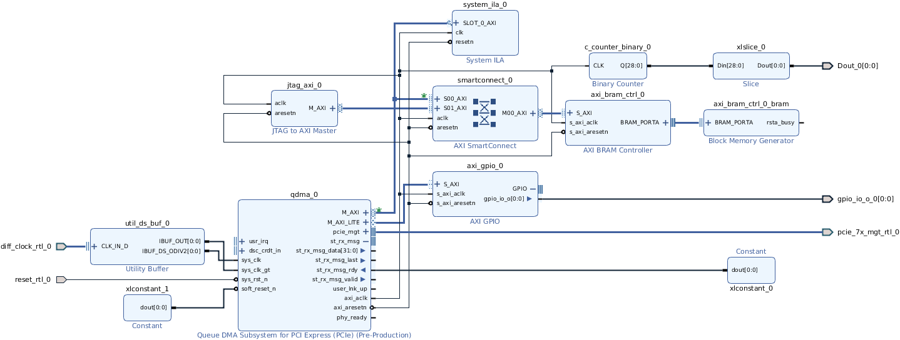
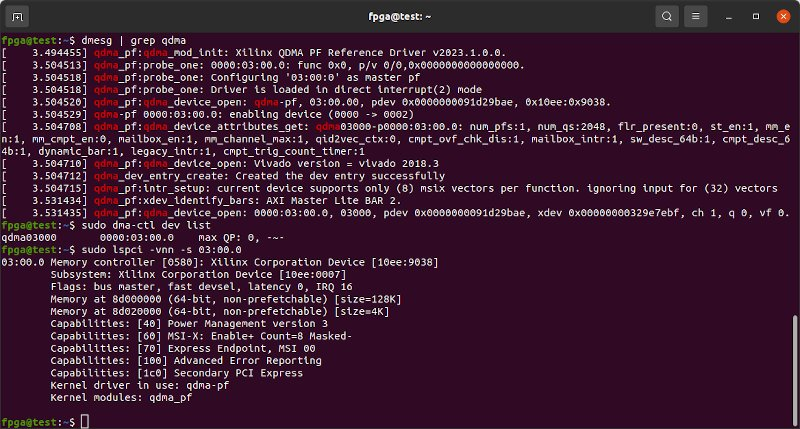

# Innova2 XCKU15P XDMA to AXI4-Stream Demo

[PCIe QDMA](https://docs.xilinx.com/r/en-US/pg302-qdma) demo for the [Innova-2](https://www.nvidia.com/en-us/networking/ethernet/innova-2-flex/) using [**Vivado 2018.2**](https://www.xilinx.com/support/download/index.html/content/xilinx/en/downloadNav/vivado-design-tools/archive.html) which is the latest version I have found to work with the [Kintex UltraScale+](https://www.xilinx.com/products/silicon-devices/fpga/kintex-ultrascale-plus.html) devices and Xilinx's [dma_ip_drivers](https://github.com/Xilinx/dma_ip_drivers).


## Block Design




## Bitstream

Recreate the bitstream. Download [`innova2_qdma_2018_2.tcl`](innova2_qdma_2018_2.tcl), [`constraints.xdc`](constraints.xdc), and [`qdma_wrapper.v`](qdma_wrapper.v) and [`source`](https://docs.xilinx.com/r/2022.2-English/ug939-vivado-designing-with-ip-tutorial/Source-the-Tcl-Script?tocId=7apMNdBzAEx4udRnUANS9A) the Tcl script in the **Vivado 2018.2** *Tcl Console*.

[Load the bitstream into your Innova-2](https://github.com/mwrnd/innova2_flex_xcku15p_notes#loading-a-user-image). It should work with every variant of the Innova-2. Refer to [innova2_flex_xcku15p_notes](https://github.com/mwrnd/innova2_flex_xcku15p_notes) for system setup.

```
pwd
cd DOWNLOAD_DIRECTORY
source innova2_qdma_2018_2.tcl
```


## AXI Addresses


## Testing


### dmesg dma-ctl lspci

Confirm the design shows up appropriately under Linux.


`dmesg | grep qdma`:

```
  [ 3.494455] qdma_pf:qdma_mod_init: Xilinx QDMA PF Reference Driver v2023.1.0.0.
  [ 3.504513] qdma_pf:probe_one: 0000:03:00.0: func 0x0, p/v 0/0,0x0000000000000000.
  [ 3.504518] qdma_pf:probe_one: Configuring '03:00:0' as master pf
  [ 3.504518] qdma_pf:probe_one: Driver is loaded in direct interrupt(2) mode
  [ 3.504520] qdma_pf:qdma_device_open: qdma-pf, 03:00.00, pdev 0x0000000091d29bae, 0x10ee:0x9038.
  [ 3.504529] qdma-pf 0000:03:00.0: enabling device (0000 -> 0002)
  [ 3.504708] qdma_pf:qdma_device_attributes_get: qdma03000-p0000:03:00.0: num_pfs:1, num_qs:2048, flr_present:0, st_en:1, mm_en:1, mm_cmpt_en:0, mailbox_en:1, mm_channel_max:1, qid2vec_ctx:0, cmpt_ovf_chk_dis:1, mailbox_intr:1, sw_desc_64b:1, cmpt_desc_64b:1, dynamic_bar:1, legacy_intr:1, cmpt_trig_count_timer:1
  [ 3.504710] qdma_pf:qdma_device_open: Vivado version = vivado 2018.3
  [ 3.504712] qdma_dev_entry_create: Created the dev entry successfully
  [ 3.504715] qdma_pf:intr_setup: current device supports only (8) msix vectors per function. ignoring input for (32) vectors
  [ 3.531434] qdma_pf:xdev_identify_bars: AXI Master Lite BAR 2.
  [ 3.531435] qdma_pf:qdma_device_open: 0000:03:00.0, 03000, pdev 0x0000000091d29bae, xdev 0x00000000329e7ebf, ch 1, q 0, vf 0.
```

`sudo dma-ctl dev list`:

```
  qdma03000  000:03:00.0  max QP: 0, -~-
```

`sudo lspci -vnn -s 03:00.0`:

```
  03:00.0 Memory controller [0580]: Xilinx Corporation Device [10ee:9038]
    Subsystem: Xilinx Corporation Device [10ee:0007]
    Flags: bus master, fast devsel, latency 0, IRQ 16
    Memory at 8d000000 (64-bit, non-prefetchable) [size=128K]
    Memory at 8d020000 (64-bit, non-prefetchable) [size=4K]
    Capabilities: [40] Power Management version 3
    Capabilities: [60] MSI-X: Enable+ Count=8 Masked-
    Capabilities: [70] Express Endpoint, MSI 00
    Capabilities: [100] Advanced Error Reporting
    Capabilities: [1c0] Secondary PCI Express
    Kernel driver in use: qdma-pf
    Kernel modules: qdma_pf
```




### dma_ip_driver Test Script

Run the [Physical Function](https://docs.xilinx.com/r/en-US/pg302-qdma/SRIOV-Config-Tab) (**PF**) [test script](https://github.com/Xilinx/dma_ip_drivers/blob/9f02769a2eddde008158c96efa39d7edb6512578/QDMA/linux-kernel/scripts/qdma_run_test_pf.sh). The PCIe Bus ID, `03000`, is a simplified version of the bus address from `lspci`, `03:00.0`.
```
cd dma_ip_drivers/QDMA/linux-kernel/scripts
sudo su
./qdma_run_test_pf.sh  03000 0 4 1 1 1 1
```

Note the Stream (**ST**) tests will fail as the Stream interfaces are unconnected in the design.
```
03000 0 4 1 1 1
qdma03000	0000:03:00.0	max QP: 0, -~-
Applying function level reset
echo 1 > /sys/bus/pci/devices/0000\:03\:00.0/reset
***********************************************
AXI-MM for Func 03000 Start
setting up qdma03000-mm-0
setting DESC_BYPASS_MODE for mm-bi
qdma03000, 03:00.00, bar#2, reg 0x90, read back 0x1.
setup for qdma03000-MM-0 done
cmp: /tmp/out_mm03000_0: No such file or directory
**** Test pass. Queue 0
cleaning up qdma03000-st-0
-----------------------------------------------
setting up qdma03000-mm-1
setting DESC_BYPASS_MODE for mm-bi
qdma03000, 03:00.00, bar#2, reg 0x90, read back 0x1.
setup for qdma03000-MM-1 done
cmp: /tmp/out_mm03000_1: No such file or directory
**** Test pass. Queue 1
cleaning up qdma03000-st-1
-----------------------------------------------
setting up qdma03000-mm-2
setting DESC_BYPASS_MODE for mm-bi
qdma03000, 03:00.00, bar#2, reg 0x90, read back 0x1.
setup for qdma03000-MM-2 done
cmp: /tmp/out_mm03000_2: No such file or directory
**** Test pass. Queue 2
cleaning up qdma03000-st-2
-----------------------------------------------
setting up qdma03000-mm-3
setting DESC_BYPASS_MODE for mm-bi
qdma03000, 03:00.00, bar#2, reg 0x90, read back 0x1.
setup for qdma03000-MM-3 done
cmp: /tmp/out_mm03000_3: No such file or directory
**** Test pass. Queue 3
cleaning up qdma03000-st-3
-----------------------------------------------
AXI-MM for Func 03000 End
***********************************************
***********************************************
AXI-ST H2C for Func 03000 Start
setting up qdma03000-st-0
setting SIMPLE_BYPASS_MODE for st-h2c
qdma03000, 03:00.00, bar#2, reg 0x90, read back 0x1.
#### ERROR Test failed. Transfer failed ####
cleaning up qdma03000-st-0
setting up qdma03000-st-1
setting SIMPLE_BYPASS_MODE for st-h2c
qdma03000, 03:00.00, bar#2, reg 0x90, read back 0x1.
#### ERROR Test failed. Transfer failed ####
cleaning up qdma03000-st-1
setting up qdma03000-st-2
setting SIMPLE_BYPASS_MODE for st-h2c
qdma03000, 03:00.00, bar#2, reg 0x90, read back 0x1.
#### ERROR Test failed. Transfer failed ####
cleaning up qdma03000-st-2
setting up qdma03000-st-3
setting SIMPLE_BYPASS_MODE for st-h2c
qdma03000, 03:00.00, bar#2, reg 0x90, read back 0x1.
#### ERROR Test failed. Transfer failed ####
cleaning up qdma03000-st-3
AXI-ST H2C for Func 03000 End
***********************************************
***********************************************
AXI-ST C2H for Func 03000 Start
./qdma_run_test_pf.sh: line 436: 0 + - : syntax error: operand expected (error token is "- ")

```


## Recreating the Design

Download [`innova2_qdma_2018_2.tcl`](innova2_qdma_2018_2.tcl), [`constraints.xdc`](constraints.xdc), and [`qdma_wrapper.v`](qdma_wrapper.v) and [`source`](https://docs.xilinx.com/r/2022.2-English/ug939-vivado-designing-with-ip-tutorial/Source-the-Tcl-Script?tocId=7apMNdBzAEx4udRnUANS9A) the Tcl script in the **Vivado 2018.2** *Tcl Console*.

```
pwd
cd DOWNLOAD_DIRECTORY
source innova2_qdma_2018_2.tcl
```


