# Innova2 XCKU15P QDMA Demo

**Work-In-Progress**: I am able to transfer data to Memory-Mapped AXI Blocks with this design.

[PCIe QDMA](https://docs.xilinx.com/r/en-US/pg302-qdma) demo for the [Innova-2](https://www.nvidia.com/en-us/networking/ethernet/innova-2-flex/) using [**Vivado 2021.1**](https://www.xilinx.com/support/download/index.html/content/xilinx/en/downloadNav/vivado-design-tools/archive.html).


## Block Design

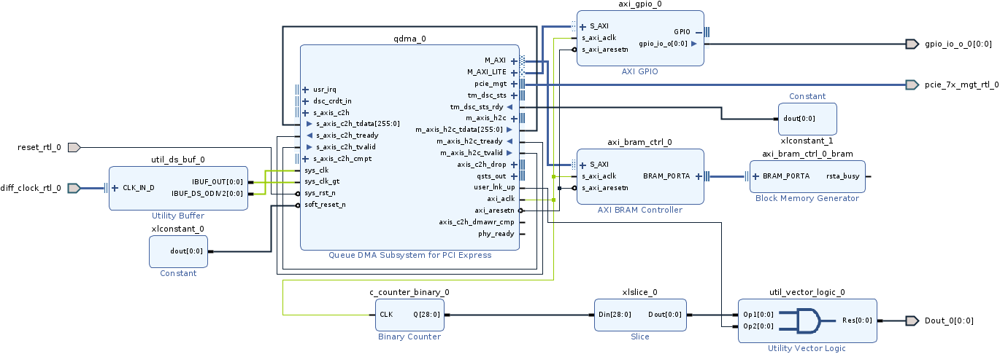

The [trick to getting QDMA working](https://xilinx.github.io/pcie-debug-kmap/pciedebug/build/html/docs/QDMA_Subsystem_for_PCIExpress_IP_Driver/issue_q%26a_debug_tips.html) is to connect `soft_reset_n` and `tm_dsc_sts_rdy` to Constant=`1`.


## Bitstream

Recreate the bitstream. Download [`innova2_qdma_2021_1.tcl`](innova2_qdma_2021_1.tcl), [`constraints.xdc`](constraints.xdc), and [`qdma_wrapper.v`](qdma_wrapper.v) and [`source`](https://docs.xilinx.com/r/2022.2-English/ug939-vivado-designing-with-ip-tutorial/Source-the-Tcl-Script?tocId=7apMNdBzAEx4udRnUANS9A) the Tcl script in the **Vivado 2021.1** *Tcl Console* then run *Generate Bitstream*.

[Load the bitstream into your Innova-2](https://github.com/mwrnd/innova2_flex_xcku15p_notes#loading-a-user-image). It should work with every variant of the Innova-2. Refer to [innova2_flex_xcku15p_notes](https://github.com/mwrnd/innova2_flex_xcku15p_notes) for system setup.

```
pwd
cd DOWNLOAD_DIRECTORY
dir
source innova2_qdma_2021_1.tcl
```

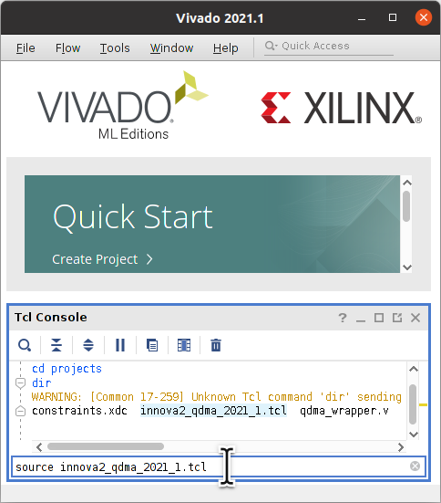


### Synthesis and Implementation Run Strategies

The default Vivado [Synthesis](https://docs.xilinx.com/r/en-US/ug892-vivado-design-flows-overview/Synthesis) and [Implementation](https://docs.xilinx.com/r/en-US/ug892-vivado-design-flows-overview/Placement-and-Routing) strategies do not achieve [timing closure](https://docs.xilinx.com/r/en-US/ug892-vivado-design-flows-overview/Running-Reports-DRC-Power-Utilization-Analysis). Select strategies that reduce signal delays by making placement tighter and routing shorter.

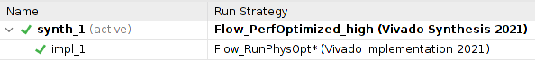

In the *Design Runs* tab, right-click on `synth_1` and then *Change Run Settings...*

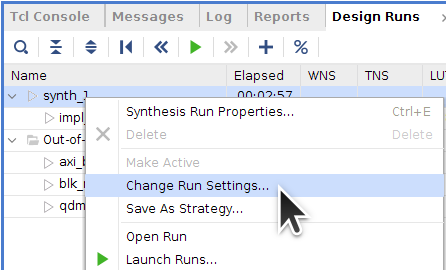

Change the *Strategy* to *Flow_PerfOptimized_high*.

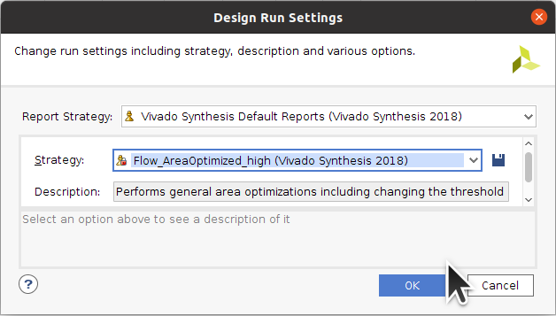

In the *Design Runs* tab, right-click on `impl_1` and then *Change Run Settings...*

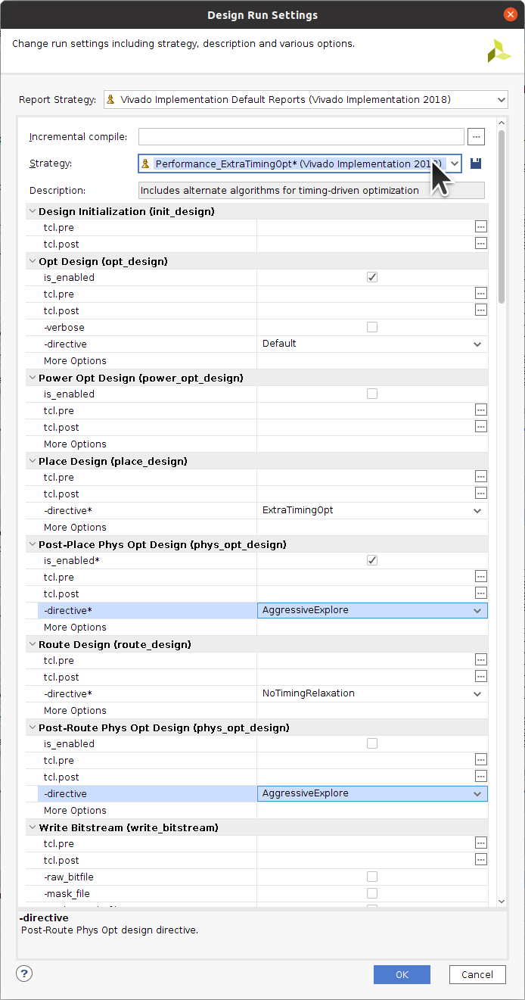

Change the *Strategy* to *Flow_RunPhysOpt*. Under *Post-Place Phys Opt Design*, select *AggressiveExplore*. Under *Post-Route Phys Opt Design*, also select *AggressiveExplore*.

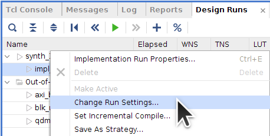

The resources used by the design:

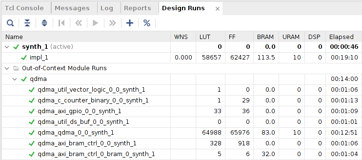


## AXI Addresses

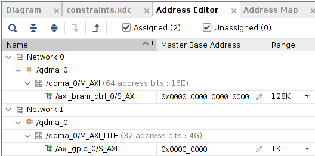


## Testing


### dmesg dma-ctl lspci

Confirm the design shows up appropriately under Linux.


`dmesg | grep -i "qdma\|Device Type"`:

```
 [ 3.527582] qdma_pf:qdma_mod_init: Xilinx QDMA PF Reference Driver v2023.1.0.0.
 [ 3.541776] qdma_pf:qdma_debugfs_init: created qdma-pf dir in Linux debug file system
 [ 3.541823] qdma_pf:probe_one: 0000:03:00.0: func 0x0, p/v 0/0,0x0000000000000000.
 [ 3.541827] qdma_pf:probe_one: Configuring '03:00:0' as master pf
 [ 3.541828] qdma_pf:probe_one: Driver is loaded in direct interrupt(2) mode
 [ 3.541829] qdma_pf:qdma_device_open: qdma-pf, 03:00.00, pdev 0x000000009f3ca44b, 0x10ee:0x9038.
 [ 3.541842] qdma-pf 0000:03:00.0: enabling device (0000 -> 0002)
 [ 3.542006] Device Type: Soft IP
 [ 3.542007] IP Type: EQDMA4.0 Soft IP
 [ 3.542030] qdma_pf:qdma_device_attributes_get: qdma03000-p0000:03:00.0: num_pfs:1, num_qs:512, flr_present:0, st_en:1, mm_en:1, mm_cmpt_en:0, mailbox_en:0, mm_channel_max:1, qid2vec_ctx:0, cmpt_ovf_chk_dis:1, mailbox_intr:1, sw_desc_64b:1, cmpt_desc_64b:1, dynamic_bar:1, legacy_intr:1, cmpt_trig_count_timer:1
 [ 3.542032] qdma_master_resource_create: New master resource created at 0
 [ 3.542033] qdma_pf:qdma_device_open: Vivado version = vivado 2020.2
 [ 3.542035] qdma_dev_qinfo_get: Dev Entry not created yet
 [ 3.542035] qdma_dev_entry_create: Created the dev entry successfully
 [ 3.542039] qdma_pf:intr_setup: dev 0000:03:00.0, xdev->num_vecs = 0
 [ 3.542040] qdma_pf:intr_setup: current device supports only (8) msix vectors per function. ignoring input for (32) vectors
 [ 3.542171] qdma_pf:intr_vector_setup: qdma03000-p0000:03:00.0 requesting IRQ vector #0: vec 136, type 3, qdma03000-p0000:03:00.0-mbox.
 [ 3.559451] qdma_pf:intr_vector_setup: qdma03000-p0000:03:00.0 requesting IRQ vector #1: vec 137, type 1, qdma03000-p0000:03:00.0-user.
 [ 3.561774] qdma_pf:intr_vector_setup: qdma03000-p0000:03:00.0 requesting IRQ vector #2: vec 138, type 0, qdma03000-p0000:03:00.0-error.
 [ 3.561787] qdma_pf:intr_vector_setup: qdma03000-p0000:03:00.0 requesting IRQ vector #3: vec 139, type 2, qdma03000-p0000:03:00.0-data.
 [ 3.561795] qdma_pf:intr_vector_setup: qdma03000-p0000:03:00.0 requesting IRQ vector #4: vec 140, type 2, qdma03000-p0000:03:00.0-data.
 [ 3.561802] qdma_pf:intr_vector_setup: qdma03000-p0000:03:00.0 requesting IRQ vector #5: vec 141, type 2, qdma03000-p0000:03:00.0-data.
 [ 3.561810] qdma_pf:intr_vector_setup: qdma03000-p0000:03:00.0 requesting IRQ vector #6: vec 142, type 2, qdma03000-p0000:03:00.0-data.
 [ 3.561818] qdma_pf:intr_vector_setup: qdma03000-p0000:03:00.0 requesting IRQ vector #7: vec 143, type 2, qdma03000-p0000:03:00.0-data.
 [ 3.568458] qdma_pf:xdev_identify_bars: AXI Master Lite BAR 2.
 [ 3.568461] qdma_pf:qdma_device_open: 0000:03:00.0, 03000, pdev 0x000000009f3ca44b, xdev 0x00000000ccff1a56, ch 1, q 0, vf 0.
```

`sudo dma-ctl dev list`:

```
  qdma03000  000:03:00.0  max QP: 0, -~-
```

`sudo lspci -vnn -d 10ee:`:

```
 03:00.0 Memory controller [0580]: Xilinx Corporation Device [10ee:9038]
    Subsystem: Xilinx Corporation Device [10ee:0007]
    Flags: bus master, fast devsel, latency 0, IRQ 16
    Memory at 8e100000 (64-bit, non-prefetchable) [size=256K]
    Memory at 8e140000 (64-bit, non-prefetchable) [size=4K]
    Capabilities: [40] Power Management version 3
    Capabilities: [60] MSI-X: Enable+ Count=8 Masked-
    Capabilities: [70] Express Endpoint, MSI 00
    Capabilities: [100] Advanced Error Reporting
    Capabilities: [1c0] Secondary PCI Express
    Kernel driver in use: qdma-pf
    Kernel modules: qdma_pf
```


### Set up Queues

After boot-up or PCIe reset, there will be no QDMA Queues set up. Set `qmax`. Note the `03` is the PCIe Device ID found using `lspci`.

```
sudo su
cat /sys/bus/pci/devices/0000\:03\:00.0/qdma/qmax
echo 64 > /sys/bus/pci/devices/0000\:03\:00.0/qdma/qmax
cat /sys/bus/pci/devices/0000\:03\:00.0/qdma/qmax
exit
```

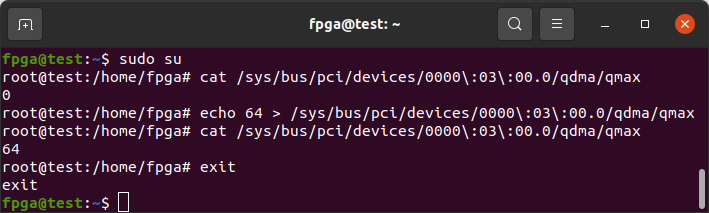

`sudo dma-ctl dev list` will show queue capacity for the QDMA Physical Function (PF) devices.

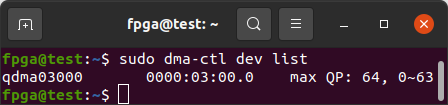

`dd if=/dev/urandom of=infile count=8192 bs=16` will generate a 128kb file of random data.

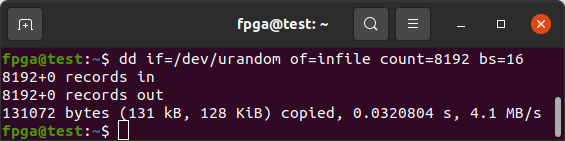

Set up queues for Memory-Mapped (MM) Host-to-Card (H2C) and Card-to-Host (C2H) data transfer. I am using `4` arbitrarily as my starting index for these queues. These are Memory-Mapped (MM) queues which will communicate with the AXI BRAM Block within the design.

```
sudo dma-ctl qdma03000 q add idx 4 mode mm dir h2c
sudo dma-ctl qdma03000 q add idx 5 mode mm dir c2h
sudo dma-ctl qdma03000 q start idx 4 dir h2c
sudo dma-ctl qdma03000 q start idx 5 dir c2h
sudo dma-ctl qdma03000 q list 4 64
```

Transfer data to the BRAM within the design, then read it back and compare the data.

```
sudo dma-to-device   -d /dev/qdma03000-MM-4 -s 3072 -f infile
sudo dma-from-device -d /dev/qdma03000-MM-5 -s 3072 -f outfile
md5sum infile outfile
```

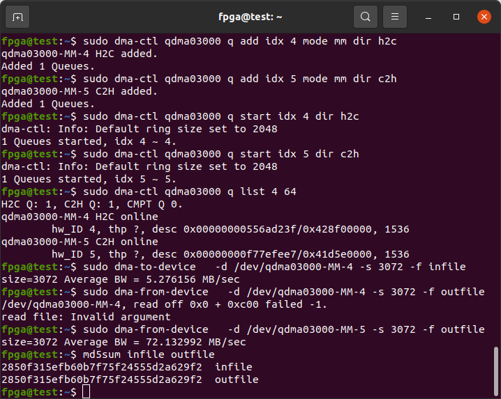


### dma_ip_driver Test Script

Run the [Physical Function](https://docs.xilinx.com/r/en-US/pg302-qdma/SRIOV-Config-Tab) (**PF**) [test script](https://github.com/Xilinx/dma_ip_drivers/blob/9f02769a2eddde008158c96efa39d7edb6512578/QDMA/linux-kernel/scripts/qdma_run_test_pf.sh). The PCIe Bus ID, `03000`, is a simplified version of the bus address from `lspci`, `03:00.0`.
```
cd dma_ip_drivers/QDMA/linux-kernel/scripts
sudo su
./qdma_run_test_pf.sh  03000 0 4 1 1 1 1
```

Note the Stream (**ST**) tests will fail as the Stream interfaces is not complete in this design.
```
03000 0 4 1 1 1
qdma03000    0000:03:00.0    max QP: 0, -~-
Applying function level reset
echo 1 > /sys/bus/pci/devices/0000\:03\:00.0/reset
***********************************************
AXI-MM for Func 03000 Start
setting up qdma03000-mm-0
setting DESC_BYPASS_MODE for mm-bi
qdma03000, 03:00.00, bar#2, reg 0x90, read back 0x1.
setup for qdma03000-MM-0 done
cmp: /tmp/out_mm03000_0: No such file or directory
**** Test pass. Queue 0
cleaning up qdma03000-st-0
-----------------------------------------------
setting up qdma03000-mm-1
setting DESC_BYPASS_MODE for mm-bi
qdma03000, 03:00.00, bar#2, reg 0x90, read back 0x1.
setup for qdma03000-MM-1 done
cmp: /tmp/out_mm03000_1: No such file or directory
**** Test pass. Queue 1
cleaning up qdma03000-st-1
-----------------------------------------------
setting up qdma03000-mm-2
setting DESC_BYPASS_MODE for mm-bi
qdma03000, 03:00.00, bar#2, reg 0x90, read back 0x1.
setup for qdma03000-MM-2 done
cmp: /tmp/out_mm03000_2: No such file or directory
**** Test pass. Queue 2
cleaning up qdma03000-st-2
-----------------------------------------------
setting up qdma03000-mm-3
setting DESC_BYPASS_MODE for mm-bi
qdma03000, 03:00.00, bar#2, reg 0x90, read back 0x1.
setup for qdma03000-MM-3 done
cmp: /tmp/out_mm03000_3: No such file or directory
**** Test pass. Queue 3
cleaning up qdma03000-st-3
-----------------------------------------------
AXI-MM for Func 03000 End
***********************************************
***********************************************
AXI-ST H2C for Func 03000 Start
setting up qdma03000-st-0
setting SIMPLE_BYPASS_MODE for st-h2c
qdma03000, 03:00.00, bar#2, reg 0x90, read back 0x1.
#### ERROR Test failed. Transfer failed ####
cleaning up qdma03000-st-0
setting up qdma03000-st-1
setting SIMPLE_BYPASS_MODE for st-h2c
qdma03000, 03:00.00, bar#2, reg 0x90, read back 0x1.
#### ERROR Test failed. Transfer failed ####
cleaning up qdma03000-st-1
setting up qdma03000-st-2
setting SIMPLE_BYPASS_MODE for st-h2c
qdma03000, 03:00.00, bar#2, reg 0x90, read back 0x1.
#### ERROR Test failed. Transfer failed ####
cleaning up qdma03000-st-2
setting up qdma03000-st-3
setting SIMPLE_BYPASS_MODE for st-h2c
qdma03000, 03:00.00, bar#2, reg 0x90, read back 0x1.
#### ERROR Test failed. Transfer failed ####
cleaning up qdma03000-st-3
AXI-ST H2C for Func 03000 End
***********************************************
***********************************************
AXI-ST C2H for Func 03000 Start
./qdma_run_test_pf.sh: line 436: 0 + - : syntax error: operand expected (error token is "- ")

```


## Generating the Vivado qdma_0_ex IP Example Design

Add a QDMA IP Block to a Block Diagram Design in Vivado or use this project as a starting point. Set `X0Y2` as the PCIe Block Location, `x8` as the PCIe Lane Width, and `8.0 GT/s` as the Maximum Link Speed. Refer to [Customizing and Generating the Example Design](https://docs.xilinx.com/r/en-US/pg302-qdma/Customizing-and-Generating-the-Example-Design).

Right-click on the QDMA Block and select *Open IP Example Design*.

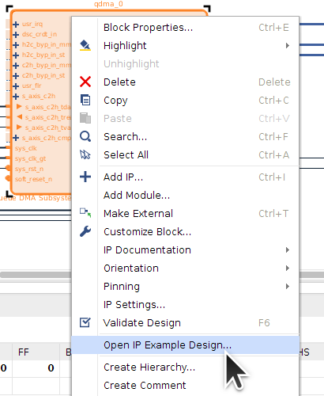

Once a new instance of Vivado starts, open the constraints file `xilinx_qdma_pcie_x0y2.xdc`.

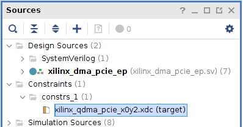

Copy-and-paste the following over the default constraints. These constraints are for the Innova2.
```
set_false_path -to [get_pins -hier {*sync_reg[0]/D}]

set_property PACKAGE_PIN AA38 [get_ports {pci_exp_rxp[7]}]
set_property PACKAGE_PIN AB36 [get_ports {pci_exp_rxp[6]}]
set_property PACKAGE_PIN AC38 [get_ports {pci_exp_rxp[5]}]
set_property PACKAGE_PIN AD36 [get_ports {pci_exp_rxp[4]}]
set_property PACKAGE_PIN AE38 [get_ports {pci_exp_rxp[3]}]
set_property PACKAGE_PIN AF36 [get_ports {pci_exp_rxp[2]}]
set_property PACKAGE_PIN AG38 [get_ports {pci_exp_rxp[1]}]
set_property PACKAGE_PIN AH36 [get_ports {pci_exp_rxp[0]}]

set_property PACKAGE_PIN AB28 [get_ports sys_clk_n]
set_property PACKAGE_PIN AB27 [get_ports sys_clk_p]
create_clock -period 10.000 -name sys_clk [get_ports sys_clk_p]

set_property PACKAGE_PIN F2 [get_ports sys_rst_n]
set_property IOSTANDARD LVCMOS33 [get_ports sys_rst_n]
set_property PULLUP true [get_ports sys_rst_n]
set_false_path -from [get_ports sys_rst_n]


set_property CONFIG_MODE SPIx8 [current_design]
set_property CONFIG_VOLTAGE 1.8 [current_design]
set_property CFGBVS GND [current_design]
set_property BITSTREAM.CONFIG.CONFIGFALLBACK DISABLE [current_design]
set_property BITSTREAM.CONFIG.CONFIGRATE 127.5 [current_design]
set_property BITSTREAM.CONFIG.EXTMASTERCCLK_EN DISABLE [current_design]
set_property BITSTREAM.CONFIG.NEXT_CONFIG_REBOOT DISABLE [current_design]
set_property BITSTREAM.CONFIG.OVERTEMPSHUTDOWN ENABLE [current_design]
set_property BITSTREAM.CONFIG.SPI_32BIT_ADDR YES [current_design]
set_property BITSTREAM.CONFIG.SPI_BUSWIDTH 8 [current_design]
set_property BITSTREAM.CONFIG.SPI_FALL_EDGE YES [current_design]
set_property BITSTREAM.CONFIG.UNUSEDPIN PULLUP [current_design]
set_property BITSTREAM.GENERAL.COMPRESS TRUE [current_design]
set_property BITSTREAM.GENERAL.CRC ENABLE [current_design]
```

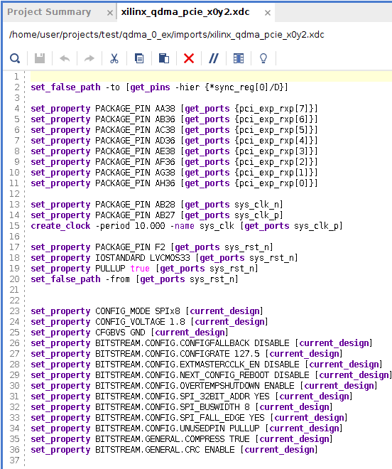

Change Synthesis and Implementation Run Strategies to [those used by this example design](#synthesis-and-implementation-run-strategies).


The resources used by the design:

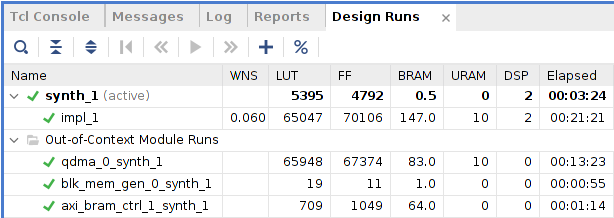

