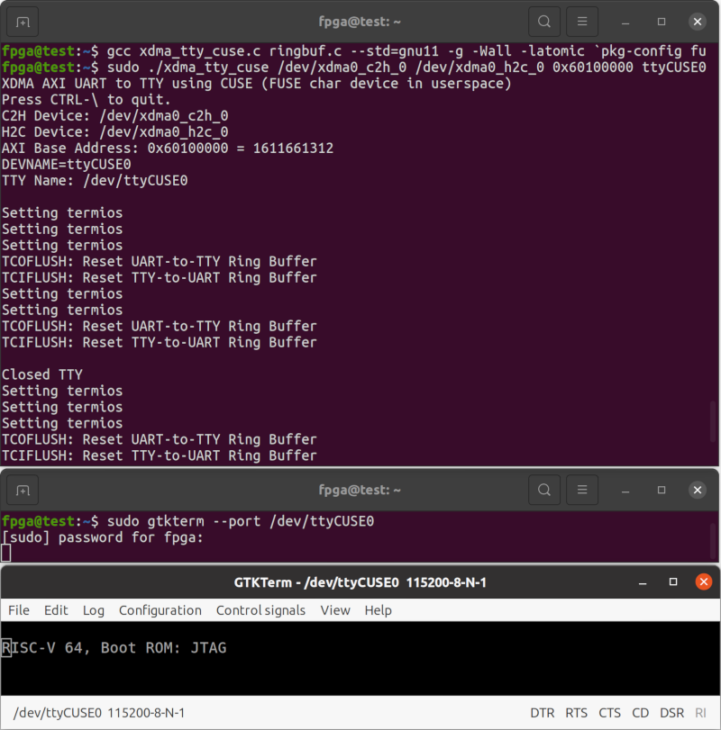

# Innova-2 RISC-V

# TODO:
 * Refer to the [Debug Log](debug_log.md) for progress notes
 * [Ethernet-over-XDMA using TUN/TAP](https://en.wikipedia.org/wiki/TUN/TAP) Driver
 * Test beyond `bare-metal` and `OpenSBI`; load Linux

---


**AXI Addresses**


## JTAG Load of RISC-V Software

Refer to the `innova2_flex_xcku15p_notes` project's instructions to install XDMA Drivers and [Load the RISC-V User Image](https://github.com/mwrnd/innova2_flex_xcku15p_notes/#loading-a-user-image) into the FPGA's Configuration Memory.

```
unzip innova2-riscv_bitstream.zip
md5sum innova2-riscv_primary.bin innova2-riscv_secondary.bin
echo 268c508b7013b16c9b76ab45c3a34d5d should be MD5 checksum of innova2-riscv_primary.bin
echo 878b6889ac60429cf00dcc75e01af2f7 should be MD5 checksum of innova2-riscv_secondary.bin
```


---


## JTAG Load of RISC-V Software

### Enable JTAG Access to the Innova-2

On the computer hosting the Innova-2, use `innova2_flex_app` to [enable JTAG Access](https://github.com/mwrnd/innova2_flex_xcku15p_notes#enable-jtag-access-to-the-xcku15p):
```
sudo mst start
cd ~/Innova_2_Flex_Open_18_12/driver/
sudo ./make_device
cd ~
sudo insmod /usr/lib/modules/`uname -r`/updates/dkms/mlx5_fpga_tools.ko
sudo ~/Innova_2_Flex_Open_18_12/app/innova2_flex_app -v
```


### Upload RISC-V Firmware to the Innova-2 using JTAG

Modify [`bare-metal hello-world boot.elf`](vivado-risc-v/bare-metal/hello-world/main.c) to print a string of consecutive characters and then compile it.


```
cd vivado-risc-v/bare-metal/hello-world/
make
cd ../..
```

Connect a [Xilinx-Compatible](https://docs.xilinx.com/r/en-US/ug908-vivado-programming-debugging/JTAG-Cables-and-Devices-Supported-by-hw_server) **1.8V** [JTAG Adapter](https://www.waveshare.com/platform-cable-usb.htm) to the Innova2. Run [`xsdb`](https://docs.xilinx.com/v/u/en-US/ug1043-embedded-system-tools) on the system hosting the JTAG Adapter. Note `xsdb` is included with [Vivado](https://www.xilinx.com/support/download/index.html/content/xilinx/en/downloadNav/vivado-design-tools/2021-2.html).
```
source /tools/Xilinx/Vivado/2021.2/settings64.sh
xsdb
```

The `connect` command begins communication with the FPGA's internal JTAG module. `targets` lists available JTAG devices. `targets 3` selects a specific device to communicate with. The `stop` command halts the current `target` RISC-V core. `dow` downloads the specified program to the current RISC-V core. `con` continues execution from the address specified within the loaded `.elf` file, `0x80000008`. `rr` reads registers.
```
connect
targets
target 3
stop
dow  vivado-risc-v/bare-metal/hello-world/boot.elf
con
rr pc
```


`rr pc` is *Read Register Program Counter* which is currently at `0x8000046c`. The `.elf` file can be disassembled to follow along with code execution.
```
cd vivado-risc-v/bare-metal/hello-world/
riscv64-unknown-elf-objdump -S -l --inlines -D boot.elf  > dis.txt
cd ../..
```


The above can also be done using the [Eclipse TCF Debugger](https://www.eclipse.org/tcf/).


## Communicating with the RISC-V UART over XDMA

On the computer with the Innova2, the data that `boot.elf` is generating can be read over XDMA from an AXI UART connected to the RISC-V core using [`xdma_tty_cuse.c`](https://github.com/mwrnd/innova2_experiments/blob/main/xdma_uart-to-uart/xdma_tty_cuse.c).

Install the `libfuse2` development library:
```
sudo apt install libfuse2 libfuse-dev
```

In one terminal, run `xdma_tty_cuse`:
```
cd innova2_experiments/riscv_rocket64b4l2w_xdma
cp ../xdma_uart-to-uart/xdma_tty_cuse.c  .
gcc xdma_tty_cuse.c `pkg-config fuse --cflags --libs` --std=gnu17 -g -Wall -latomic -o xdma_tty_cuse
sudo ./xdma_tty_cuse  /dev/xdma0_c2h_0  /dev/xdma0_h2c_0  0x60100000 ttyCUSE0
```

In a second terminal, connect to the TTY CUSE UART Bridge using a [Serial Terminal](https://manpages.ubuntu.com/manpages/focal/man1/gtkterm.1.html):
```
sudo gtkterm --port /dev/ttyCUSE0
```



You should be able to see the text being output by the `hello-world` firmware.


## OpenSBI

```
cd vivado-risc-v
make  CONFIG=rocket64b4l2w  BOARD=innova2  workspace/boot.elf
```

Still connected to the Innova-2 using JTAG, start `xsdb` on the computer hosting the JTAG adapter:
```
source /tools/Xilinx/Vivado/2021.2/settings64.sh
xsdb
```

Load OpenSBI:
```
connect
targets
target 3
stop
dow -clear workspace/boot.elf
rwr s0 0x80000000
rwr pc 0x80000000
rwr a0 0
rwr a1 0x10080
rr
con
```


On the PC hosting the Innova-2, run `xdma_tty_cuse` and `gtkterm` to communicate with the RISC-V system:


## RISC-V Status Signals

The design includes an [AXI GPIO](https://docs.xilinx.com/v/u/3.0-English/ds744_axi_gpio) block for reading various status signals within the design.


```
sudo ~/dma_ip_drivers/XDMA/linux-kernel/tools/dma_from_device -d /dev/xdma0_c2h_0 -a 0x60730000 -s 1 -f READ ; xxd -b READ
```


## RISC-V Reset

`axi_gpio_1` is a single output AXI GPIO block that can reset the RocketChip RISC-V cores.


```
echo -n -e "\xFF" >ff.bin   ;   xxd -b  ff.bin
echo -n -e "\x00" >00.bin   ;   xxd -b  00.bin
sudo ~/dma_ip_drivers/XDMA/linux-kernel/tools/dma_from_device -d /dev/xdma0_c2h_0 -a 0x60730000 -s 1 -f READ ; xxd -b READ
sudo ~/dma_ip_drivers/XDMA/linux-kernel/tools/dma_to_device   -d /dev/xdma0_h2c_0 -a 0x60720000 -s 1 -f ff.bin
sudo ~/dma_ip_drivers/XDMA/linux-kernel/tools/dma_from_device -d /dev/xdma0_c2h_0 -a 0x60730000 -s 1 -f READ ; xxd -b READ
sudo ~/dma_ip_drivers/XDMA/linux-kernel/tools/dma_to_device   -d /dev/xdma0_h2c_0 -a 0x60720000 -s 1 -f 00.bin
sudo ~/dma_ip_drivers/XDMA/linux-kernel/tools/dma_from_device -d /dev/xdma0_c2h_0 -a 0x60730000 -s 1 -f READ ; xxd -b READ
```


## Opening this Project for Editing

Clone this repository and update the two required submodules.
```
cd ~
git clone --depth=1 https://github.com/mwrnd/innova2_experiments.git
cd innova2_experiments/
git submodule update --init riscv_rocket64b4l2w_xdma/vivado-risc-v
cd riscv_rocket64b4l2w_xdma/vivado-risc-v
git submodule update --init ethernet/verilog-ethernet
```

Open Vivado and `source` [innova2_experiments/riscv_rocket64b4l2w_xdma/innova2-riscv.tcl](innova2-riscv.tcl) in the Tcl Console.


Run Generate Bitstream to compile the design. Refer to the `innova2_flex_xcku15p_notes` project's instructions on [Loading a User Image](https://github.com/mwrnd/innova2_flex_xcku15p_notes/#loading-a-user-image) to load the bitstream.


## Recreating the RISC-V Design

To change the RISC-V core configuration, run frequency, or initial boot firmware, the RISC-V subsystem will need to be regenerated using a full [RocketChip](https://bar.eecs.berkeley.edu/projects/rocket_chip.html) install which requires about 8GB of downloads. Vivado **2021.2** is currently supported.

Run all the `vivado-risc-v` setup commands (`apt-install`, `update-submodules`) if this is the first use. 8GB of files will be downloaded. Then `source` Vivado environment settings and run `make` to generate a Vivado project, bitstream, and binary configuration files.
```
cd vivado-risc-v
sudo make apt-install
make update-submodules
source /tools/Xilinx/Vivado/2021.2/settings64.sh
make  CONFIG=rocket64b4l2w  BOARD=innova2  bitstream
```


Refer to the `innova2_flex_xcku15p_notes` project's instructions on [Loading a User Image](https://github.com/mwrnd/innova2_flex_xcku15p_notes/#loading-a-user-image) to load the generated `innova2-riscv_primary.bin, innova2-riscv_secondary.bin` files. The generated `vivado-risc-v/workspace/rocket64b4l2w/vivado-innova2-riscv/innova2-riscv.xpr` project can also be opened in Vivado to make additional changes.


### Changing the RISC-V Run Frequency

Make any run frequency changes in `vivado-risc-v/board/rocket-freq`.


Run `make` for the `vivado-tcl` target.
```
cd vivado-risc-v
source /tools/Xilinx/Vivado/2021.2/settings64.sh
make  CONFIG=rocket64b4l2w  BOARD=innova2  vivado-tcl
```

`source` the generated `vivado-risc-v/workspace/rocket64b4l2w/system-innova2.tcl` in Vivado.


Edit `clk_out1` frequency of `clk_wiz_0` to the run frequency of the RISC-V cores.


After making changes to the Block Design in Vivado, run Generate Bitstream to synthesize and implement the design.


### Creating a New Block Design TCL Script

After confirming your design compiles and works, generate a new Block Design script for your current version of Vivado using the `write_bd_tcl` command in the Vivado *Tcl Console*. Copy it to the `vivado-risc-v/board/innova2` directory.
```
write_bd_tcl  riscv-2021.2.tcl
```

Add the following Vivado commands to the start of the Block Design script that is generated to ignore unconnected pin errors. The Innova2 XCKU15P FPGA has no physical connection for networking or UART RxD. The Ethernet modules cannot have external signals.
```
# Change the following two ERRORs to WARNINGs as they are related to unused signals
set_property SEVERITY {Warning} [get_drc_checks NSTD-1]
set_property SEVERITY {Warning} [get_drc_checks UCIO-1]
```

`list_check_mods` needs to have `Rocket64b4l2w` or similar replaced with `$rocket_module_name`.

```Tcl
if { $bCheckModules == 1 } {
   set list_check_mods "\ 
ethernet\
$rocket_module_name\
uart\
"
```

The `RocketChip Create instance` code:
```Tcl
  # Create instance: RocketChip, and set properties
  set block_name Rocket64b4l2w
  set block_cell_name RocketChip
  if { [catch {set RocketChip [create_bd_cell -type module -reference $block_name $block_cell_name] } errmsg] } {
     catch {common::send_gid_msg -ssname BD::TCL -id 2095 -severity "ERROR" "Unable to add referenced block <$block_name>. Please add the files for ${block_name}'s definition into the project."}
     return 1
   } elseif { $RocketChip eq "" } {
     catch {common::send_gid_msg -ssname BD::TCL -id 2096 -severity "ERROR" "Unable to referenced block <$block_name>. Please add the files for ${block_name}'s definition into the project."}
     return 1
   }
```

Needs to be replaced with the following:
```Tcl
  # Create instance: RocketChip, and set properties
  global rocket_module_name
  set RocketChip [create_bd_cell -type module -reference $rocket_module_name RocketChip]
```

Run `make` for your intended Rocket RISC-V configuration to check if the updated Block Design script works. You may need to move any currently existing `workspace/rocket64___` folder.
```
cd vivado-risc-v
source /tools/Xilinx/Vivado/2021.2/settings64.sh
make  CONFIG=rocket64b4l2w  BOARD=innova2  bitstream
```

