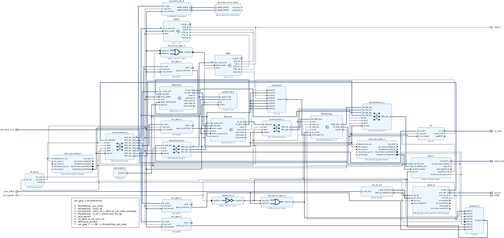
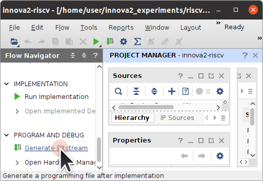
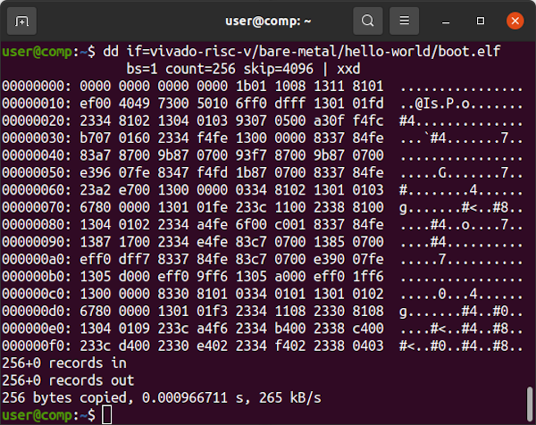

# Vivado RISC-V

# TODO:
 * Test beyond bare-metal, load Linux
 * [CUSE](https://libfuse.github.io/doxygen/cuse_8c.html) driver for UART
 * [CUSE](https://libfuse.github.io/doxygen/cuse_8c.html) driver for Ethernet



**RocketChip AXI Addresses**


**XDMA AXI Addresses**


Refer to the `innova2_flex_xcku15p_notes` project's instructions on [Loading a User Image](https://github.com/mwrnd/innova2_flex_xcku15p_notes/#loading-a-user-image) to load the `innova2-riscv_primary.bin` and `innova2-riscv_secondary.bin` FPGA Configuration files.

```
md5sum innova2-riscv_primary.bin innova2-riscv_secondary.bin
echo  should be MD5 checksum of innova2-riscv_primary.bin
echo  should be MD5 checksum of innova2-riscv_secondary.bin
```


## JTAG Load of RISC-V Software

Connect a [Xilinx-Compatible](https://docs.xilinx.com/v/u/en-US/ds593) **1.8V** [JTAG Adapter](https://www.waveshare.com/platform-cable-usb.htm) to the Innova2. Run `xsdb` on the system hosting the JTAG Adapter.
```
source /tools/Xilinx/Vivado/2021.2/settings64.sh
xsdb
```

The `connect` command begins `xsdb` communication with the FPGA's internal JTAG module. `targets` lists available JTAG devices. `targets 3` selects a specific device to communicate with. The `stop` command halts the RISC-V core. `dow` downloads the specified program to the selected RISC-V core. `con` continues execution from the address specified within the loaded `.elf` file, `0x80000008`. `rrd` dumps registers.
```
connect
targets
targets 3
stop
dow  vivado-risc-v/bare-metal/hello-world/boot.elf
con
rrd
```


`rrd` reveals the Program Counter is currently at `0x80000478`. The `.elf` file can be disassembled to follow along with code execution.
```
cd vivado-risc-v/bare-metal/hello-world/
riscv64-unknown-elf-objdump -S -l --inlines -D boot.elf  > dis.txt
```


The above can also be done using the [Eclipse TCF Debugger](https://www.eclipse.org/tcf/).


## Communicating with the RISC-V UART over XDMA

On the computer with the Innova2, the data that `boot.elf` is generating can be read over XDMA from the AXI UART connected to the RISC-V cores. The UART is at AXI Address `0x60800000`.


The `RX` register is at offset `0x0`.

```
sudo ~/dma_ip_drivers/XDMA/linux-kernel/tools/dma_from_device -d /dev/xdma0_c2h_0 -a 0x60800000 -s 1 -f READ ; xxd READ
```


The UART-Lite `STATUS` register is at offset `0x8`. The `00100101` result translates to *RX FIFO Data Valid*, *TX FIFO Empty*, and *Overrun Error*. This is a result of the RISC-V sending data faster than the XDMA UART is reading it. A proper UART driver needs to be used for communication.
```
sudo ~/dma_ip_drivers/XDMA/linux-kernel/tools/dma_from_device -d /dev/xdma0_c2h_0 -a 0x60800008 -s 1 -f READ ; xxd -b READ
```

Refer to the [UART-Lite User Guide](https://docs.xilinx.com/v/u/en-US/pg142-axi-uartlite).


## RISC-V Status Signals

The design includes an [AXI GPIO](https://docs.xilinx.com/v/u/3.0-English/ds744_axi_gpio) block for reading various status signals within the design.


```
sudo ~/dma_ip_drivers/XDMA/linux-kernel/tools/dma_from_device -d /dev/xdma0_c2h_0 -a 0x60730000 -s 1 -f READ ; xxd -b READ
```


## RISC-V Reset

`axi_gpio_1` is a single output AXI GPIO block that can reset the RocketChip RISC-V cores.


```
echo -n -e "\xFF" >ff.bin   ;   xxd -b  ff.bin
echo -n -e "\x00" >00.bin   ;   xxd -b  00.bin
sudo ~/dma_ip_drivers/XDMA/linux-kernel/tools/dma_from_device -d /dev/xdma0_c2h_0 -a 0x60730000 -s 1 -f READ ; xxd -b READ
sudo ~/dma_ip_drivers/XDMA/linux-kernel/tools/dma_to_device   -d /dev/xdma0_h2c_0 -a 0x60720000 -s 1 -f ff.bin
sudo ~/dma_ip_drivers/XDMA/linux-kernel/tools/dma_from_device -d /dev/xdma0_c2h_0 -a 0x60730000 -s 1 -f READ ; xxd -b READ
sudo ~/dma_ip_drivers/XDMA/linux-kernel/tools/dma_to_device   -d /dev/xdma0_h2c_0 -a 0x60720000 -s 1 -f 00.bin
sudo ~/dma_ip_drivers/XDMA/linux-kernel/tools/dma_from_device -d /dev/xdma0_c2h_0 -a 0x60730000 -s 1 -f READ ; xxd -b READ
```


## Opening this Project for Editing

Clone this repository and update the two required submodules.
```
cd ~
git clone https://github.com/mwrnd/innova2_experiments.git
cd innova2_experiments/
git submodule update --init riscv_rocket64b4l2w_xdma/vivado-risc-v
cd riscv_rocket64b4l2w_xdma/vivado-risc-v
git submodule update --init ethernet/verilog-ethernet
```

Open Vivado and `source` [innova2_experiments/riscv_rocket64b4l2w_xdma/innova2-riscv.tcl](innova2-riscv.tcl) in the Tcl Console.


Run Generate Bitstream to to compile the design. Refer to the `innova2_flex_xcku15p_notes` project's instructions on [Loading a User Image](https://github.com/mwrnd/innova2_flex_xcku15p_notes/#loading-a-user-image) to load the bitstream.




## Recreating the RISC-V Design

To change the RISC-V core configuration, run frequency, or initial boot firmware, the RISC-V subsystem will need to be regenerated using a full [RocketChip](https://bar.eecs.berkeley.edu/projects/rocket_chip.html) install which requires about 8GB of downloads. Vivado **2021.2** is currently supported.

Run all the `vivado-risc-v` setup commands (`apt-install`, `update-submodules`) if this is the first use. 8GB of files will be downloaded. Then `source` Vivado environment settings and run `make` to generate a Vivado project, bitstream, and binary configuration files.
```
cd vivado-risc-v
sudo make apt-install
make update-submodules
source /tools/Xilinx/Vivado/2021.2/settings64.sh
make  CONFIG=rocket64b4l2w  BOARD=innova2  bitstream
```


Refer to the `innova2_flex_xcku15p_notes` project's instructions on [Loading a User Image](https://github.com/mwrnd/innova2_flex_xcku15p_notes/#loading-a-user-image) to load the generated `innova2-riscv_primary.bin, innova2-riscv_secondary.bin` files. The generated `vivado-risc-v/workspace/rocket64b4l2w/vivado-innova2-riscv/innova2-riscv.xpr` project can also be opened in Vivado to make additional changes.


### Changing the RISC-V Run Frequency

Make any run frequency changes in `vivado-risc-v/board/rocket-freq`.


Run `make` for the `vivado-tcl` target.
```
cd vivado-risc-v
source /tools/Xilinx/Vivado/2021.2/settings64.sh
make  CONFIG=rocket64b4l2w  BOARD=innova2  vivado-tcl
```

`source` the generated `vivado-risc-v/workspace/rocket64b4l2w/system-innova2.tcl` in Vivado.


Edit `clk_out1` frequency of `clk_wiz_0` to the run frequency of the RISC-V cores.


After making changes to the Block Design in Vivado, generate a new script for your current version of Vivado and copy it to the `vivado-risc-v/board/innova2` directory.
```
write_bd_tcl  riscv-2021.2.tcl
```

I add the following Vivado commands to the start of the Block Design script that is generated to ignore unconnected pin errors. The Innova2 has no direct connection for networking or UART RxD. The Ethernet modules cannot have external signals.
```
# Change the following two ERRORs to WARNINGs as they are related to unused signals
set_property SEVERITY {Warning} [get_drc_checks NSTD-1]
set_property SEVERITY {Warning} [get_drc_checks UCIO-1]
```

Run Generate Bitstream to synthesize and implement the design.


## JTAG Fails Timing

JTAG register to TDO pin path fails timing. `xsdb` communication errors may be the result of this.

```
xsdb% Info: Hart #0 (target 3) Running (Debug Transport Module: data corruption (ID))
...
Failed to download vivado-risc-v/workspace/boot.elf
Memory write error at 0x80222C00. FPGA reprogrammed, wait for debugger resync
...
aborting, 1 pending requests...                                                                                 
Failed to download vivado-risc-v/workspace/boot.elf
Memory write error at 0x80000100. Debug Transport Module timeout
xsdb% Info: Hart #0 (target 3) Running (Debug Transport Module: data corruption (ID))
```


The Device View shows the path is very short.


## xsdb Notes


After running `xsdb`'s `dow` command to load `boot.elf`, I read the memory back over XDMA and it is correctly but partially written.


Here is a hex dump of `boot.elf`:
```
xxd /home/user/vivado-risc-v/workspace/boot.elf | less

00000120: 3304 0500 b384 0500 3309 0600 ef00 c054  3.......3......T
00000130: 3308 0500 3305 0400 b385 0400 3306 0900  3...3.......3...
00000140: fd58 6304 1801 631d 050b 1728 0100 1308  .Xc...c....(....
00000150: e8fd 8548 2f28 1801 6314 080a 9722 0100  ...H/(..c...."..
00000160: 9382 c2fd 1703 0000 1303 c3fb 23b0 6200  ............#.b.
00000170: 9722 0100 9382 02fd 83b2 0200 b303 5340  ."............S@
00000180: 172e 0100 130e 0efa 2330 7e00 9732 0100  ........#0~..2..
00000190: 9382 c2eb 1743 0100 1303 43e4 6383 6206  .....C....C.c.b.
```

Each run of `dow` correctly writes a random amount of `boot.elf`
```
 49%    0MB   0.0MB/s  00:07 ETA
Failed to download /home/user/vivado-risc-v/workspace/boot.elf
Memory write error at 0x8000B600. FPGA reprogrammed, wait for debugger resync
xsdb% Info: Hart #0 (target 3) Stopped at 0x80008ee0 (Suspended)
...
 83%    0MB   0.0MB/s  00:02 ETA
Failed to download /home/user/vivado-risc-v/workspace/boot.elf
Memory write error at 0x80226400. Debug Transport Module: data corruption (ID)
xsdb% Info: Hart #0 (target 3) Running (FPGA reprogrammed, wait for debugger resync)
```

`vbindiff` has a *next difference* function and I use it to confirm all leading data is identical.


Something is regularly interrupting the debugger.

---

Executable code starts at `0x1000=4096`.
```
dd if=vivado-risc-v/bare-metal/hello-world/boot.elf bs=1 count=256 skip=4096 | xxd
```



After loading the code using `xsdb`'s `dow` command over JTAG, it can be read back on the computer with the Innova2 from address `0x8000_0000`. It matches `boot.elf` from offset address `0x1000`.
```
sudo ~/dma_ip_drivers/XDMA/linux-kernel/tools/dma_from_device -d /dev/xdma0_c2h_0 -a 0x80000000 -s 256 -f RECV ; xxd RECV
```


However, the memory cannot be accessed directly from address `0x2_0000_0000`, the `C0_DDR4_MEMORY_MAP`, as the RISC-V system maps `0x80000000` to internal FPGA memory. Note `256*8388608 = 2147483648 = 0x8000_0000`. What is the full memory map?
```
sudo ~/dma_ip_drivers/XDMA/linux-kernel/tools/dma_from_device -d /dev/xdma0_c2h_0 -a 0x200000000 -s 4294967296 -f READ
dd if=READ bs=256 count=1 skip=8388608  |  xxd
```


I performed a cold boot on the Innova2 system and read the full DDR4 memory.
```
sudo ~/dma_ip_drivers/XDMA/linux-kernel/tools/dma_from_device -d /dev/xdma0_c2h_0 -a 0x200000000 -s 4294967296 -f READ1
```

I then ran `xsdb` on the system hosting the JTAG Adapter and loaded `hello-world/boot.elf`.
```
xsdb% connect                                                                                                   
tcfchan#0
xsdb% targets                                                                                                   
  1  xcku15p
     2  RISC-V
        3  Hart #0 (Running)
        4  Hart #1 (Running)
        5  Hart #2 (Running)
        6  Hart #3 (Running)
     7  Legacy Debug Hub
xsdb% targets 3                                                                                                 
xsdb% stop                                                                                                      
Info: Hart #0 (target 3) Stopped at 0x11578 (Suspended)                                                         
xsdb% dow vivado-risc-v/bare-metal/hello-world/boot.elf                                                         
Downloading Program -- /home/user/vivado-risc-v/bare-metal/hello-world/boot.elf
	section, .text: 0x80000000 - 0x8000054d
	section, .bss: 0x8000054e - 0x8000054f
100%    0MB   0.0MB/s  00:00                                                                                    
Setting PC to Program Start Address 0x80000008
Successfully downloaded /home/user/vivado-risc-v/bare-metal/hello-world/boot.elf
xsdb% targets                                                                                                   
  1  xcku15p
     2  RISC-V
        3* Hart #0 (Suspended, M)
        4  Hart #1 (Running)
        5  Hart #2 (Running)
        6  Hart #3 (Running)
     7  Legacy Debug Hub
xsdb% con                                                                                                       
Info: Hart #0 (target 3) Running
xsdb% rrd                                                                                                       
zero: 0000000000000000    ra: 00000000800004d8    sp: 0000000080ffffc0                                          
  gp: 0000000000000000    tp: 0000000000000000    t0: 0000000000000000
  t1: 0000000000000000    t2: 0000000000000000    s0: 0000000080fffff0
  s1: 0000000000000000    a0: 00000000000f4240    a1: 0000000000000040
  a2: 0000000000000000    a3: 00000000000f4240    a4: 00000000026a701f
  a5: 00000004ab61d909    a6: 0000000000000000    a7: 0000000000000000
  s2: 0000000000000000    s3: 0000000000000000    s4: 0000000000000000
  s5: 0000000000000000    s6: 0000000000000000    s7: 0000000000000000
  s8: 0000000000000000    s9: 0000000000000000   s10: 0000000000000000
 s11: 0000000000000000    t3: 0000000000000000    t4: 0000000000000000
  t5: 0000000000000000    t6: 0000000000000000    pc: 0000000080000464
priv:               03    fp                     csr                  
                                                                      
xsdb% exit                                                                                                      
exit
```

I performed a second read of the Innova2's DDR4 memory and ran `vbindiff` on the two and there was no difference. `boot.elf` is NOT loaded into DDR4.
```
sudo ~/dma_ip_drivers/XDMA/linux-kernel/tools/dma_from_device -d /dev/xdma0_c2h_0 -a 0x200000000 -s 4294967296 -f READ2
vbindiff READ1 READ2
```


