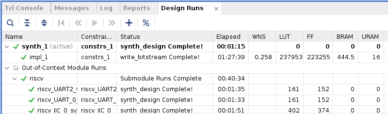
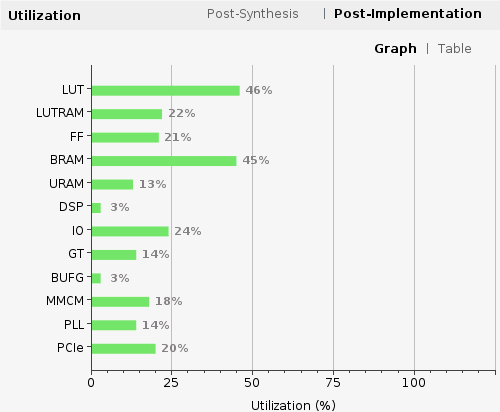
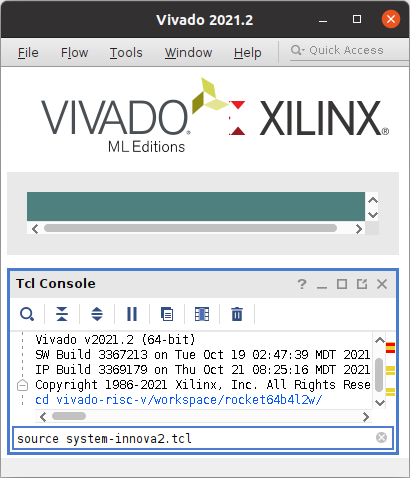

# Innova-2 RISC-V

# TODO:
 * Fully load a working Linux system. Currently failing on missing boot drive, which is expected as there is no SD card. Test with [debian-riscv64.sd.img.gz](https://github.com/eugene-tarassov/vivado-risc-v/releases/tag/v3.4.0).
 * [Ethernet-over-XDMA using TUN/TAP](https://en.wikipedia.org/wiki/TUN/TAP) Driver
 * Refer to the [Debug Log](debug_log.md) for more progress notes

---

The design currently has a functional RISC-V core and UART.


---

**Block Diagram**


**AXI Addresses**


## JTAG Load of RISC-V Software

Refer to the `innova2_flex_xcku15p_notes` project's instructions to install XDMA Drivers and [Load the RISC-V User Image](https://github.com/mwrnd/innova2_flex_xcku15p_notes/#loading-a-user-image) into the FPGA's Configuration Memory. [`innova2-riscv_bitstream.zip` is available in releases](https://github.com/mwrnd/innova2_experiments/releases/download/v0.1-alpha/innova2-riscv_bitstream.zip).

```
unzip -d .  innova2-riscv_bitstream.zip
md5sum innova2-riscv_primary.bin innova2-riscv_secondary.bin
echo 01d74b05d4b5421fdcf21be70f2048af should be MD5 checksum of innova2-riscv_primary.bin
echo 1948edcbf584d456683f0bd1530fb65a should be MD5 checksum of innova2-riscv_secondary.bin
```


---


## JTAG Load of RISC-V Software

### Enable JTAG Access to the Innova-2

On the computer hosting the Innova-2, use `innova2_flex_app` to [enable JTAG Access](https://github.com/mwrnd/innova2_flex_xcku15p_notes#enable-jtag-access-to-the-xcku15p):
```
sudo mst start
cd ~/Innova_2_Flex_Open_18_12/driver/
sudo ./make_device
cd ~
sudo insmod /usr/lib/modules/`uname -r`/updates/dkms/mlx5_fpga_tools.ko
sudo ~/Innova_2_Flex_Open_18_12/app/innova2_flex_app -v
```


### Upload RISC-V Firmware to the Innova-2 using JTAG

Modify [`bare-metal hello-world boot.elf`](vivado-risc-v/bare-metal/hello-world/main.c) to print a string of consecutive characters and then compile it.


```
git clone --depth=1 https://github.com/mwrnd/innova2_experiments.git
cd innova2_experiments/riscv_rocket64b4l2w_xdma/
git submodule update --init vivado-risc-v
cd vivado-risc-v/bare-metal/hello-world/
make
cd ../../..
```

Connect a [Xilinx-Compatible](https://docs.xilinx.com/r/en-US/ug908-vivado-programming-debugging/JTAG-Cables-and-Devices-Supported-by-hw_server) **1.8V** [JTAG Adapter](https://www.waveshare.com/platform-cable-usb.htm) to the Innova2. Run [`xsdb`](https://docs.xilinx.com/v/u/en-US/ug1043-embedded-system-tools) on the system hosting the JTAG Adapter. Note `xsdb` is included with [Vivado or Vivado Lab Edition](https://www.xilinx.com/support/download/index.html/content/xilinx/en/downloadNav/vivado-design-tools/2021-2.html).
```
source /tools/Xilinx/Vivado/2021.2/settings64.sh
xsdb
```

The `connect` command begins communication with the FPGA's internal JTAG module. `targets` lists available JTAG devices. `targets 3` selects a specific device to communicate with. The `stop` command halts the current `target` RISC-V core. `dow` downloads the specified program to the current RISC-V core. `con` continues execution from the address specified within the loaded `.elf` file, `0x80000008`. `rr` reads registers.
```
connect
targets
target 3
stop
dow  vivado-risc-v/bare-metal/hello-world/boot.elf
con
rr pc
```


`rr pc` is *Read Register Program Counter* which is currently at `0x8000046c`. The `.elf` file can be [disassembled](bare-metal_hello-world_disassembled.txt) to follow along with code execution.
```
cd vivado-risc-v/bare-metal/hello-world/
riscv64-unknown-elf-objdump -S -l --inlines -D boot.elf  > dis.txt
cd ../..
```


The above can also be done using the [Eclipse TCF Debugger](https://www.eclipse.org/tcf/).


## Communicating with the RISC-V UART over XDMA

On the computer with the Innova2, the data that `boot.elf` is generating can be read over XDMA from an AXI UART connected to the RISC-V UART using [`xdma_tty_cuse.c`](https://github.com/mwrnd/innova2_experiments/blob/main/xdma_uart-to-uart/xdma_tty_cuse.c).

Install the `libfuse2` development library:
```
sudo apt install libfuse2 libfuse-dev
```

In one terminal, compile and run `xdma_tty_cuse`:
```
cd innova2_experiments/riscv_rocket64b4l2w_xdma
cp ../xdma_uart-to-uart/xdma_tty_cuse.c  .
gcc xdma_tty_cuse.c `pkg-config fuse --cflags --libs` --std=gnu17 -g -Wall -latomic -o xdma_tty_cuse
sudo ./xdma_tty_cuse  /dev/xdma0_c2h_0  /dev/xdma0_h2c_0  0x60100000 ttyCUSE0
```

In a second terminal, connect to the TTY CUSE UART Bridge using a [Serial Terminal](https://manpages.ubuntu.com/manpages/focal/man1/gtkterm.1.html):
```
sudo gtkterm --port /dev/ttyCUSE0
```


When the RISC-V core starts, it prints [`RISC-V 64, Boot ROM: JTAG` to its UART](https://github.com/mwrnd/vivado-risc-v/blob/16c3ef22fc704b7f5f3580ac11b8ab59937e7a90/board/innova2/bootrom.c#L16). The first 16 bytes [(the UART FIFO depth)](https://github.com/eugene-tarassov/vivado-risc-v/blob/80323cd5b2a2254e87dd75c3a93059e5bb9f7272/uart/uart.v#L93) end up in the XDMA UART. When `GTKTerm` runs, it twice calls an `ioctl` in `xdma_tty_cuse` that [resets the XDMA RX FIFO](https://github.com/mwrnd/innova2_experiments/blob/74f1473361b246bbb64e40fe7234f68de22aa502/xdma_uart-to-uart/xdma_tty_cuse.c#L334). `M: JTAG` are the characters that get through once the RISC-V core is able to send data again.


## Load Linux Using OpenSBI

The Linux system files can be [recreated](#recreating-the-risc-v-design) or [downloaded from Releases](https://github.com/mwrnd/innova2_experiments/releases). If recreating the system files, OpenSBI `boot.elf` ends up in `vivado-risc-v/workspace/boot.elf`. The Linux `Image` in `vivado-risc-v/linux-stable/arch/riscv/boot/Image` and the `ramdisk` in `vivado-risc-v/debian-riscv64/ramdisk`.

Confirm the files downloaded correctly:
```
unzip -d .  innova2-riscv_system.zip
md5sum  Image  ramdisk  opensbi_boot.elf
echo fd156f7719b39f41e0fe0f04dca36214  should be MD5 Checksum of  Image
echo 868f767b0b6e838852c9075643a9fd1d  should be MD5 Checksum of  ramdisk
echo 0fef4ba92ff5d3014ab4787675458bfb  should be MD5 Checksum of  opensbi_boot.elf
```

On the computer hosting the Innova-2, confirm JTAG is `Enabled`.
```
sudo mst start
cd ~/Innova_2_Flex_Open_18_12/driver/
sudo ./make_device
cd ~
sudo insmod /usr/lib/modules/`uname -r`/updates/dkms/mlx5_fpga_tools.ko
sudo ~/Innova_2_Flex_Open_18_12/app/innova2_flex_app -v
```


On the computer hosting the [**1.8V** JTAG Adapter](https://docs.xilinx.com/r/en-US/ug908-vivado-programming-debugging/JTAG-Cables-and-Devices-Supported-by-hw_server), run `xsdb` and stop the RISC-V core that will be used for system boot.


```
source /tools/Xilinx/Vivado/2021.2/settings64.sh
xsdb
```

```
connect
targets
target 3
stop
target 2
targets
```


On the computer hosting the Innova-2, upload the Linux `Image` and `ramdisk` using [`dma_ip_driver`](https://github.com/mwrnd/innova2_flex_xcku15p_notes#install-xilinx-pcie-dma-ip-drivers)'s `dma_to_device` software. Note `Image` needs to be uploaded to `0x81000000` and `ramdisk` needs to be uploaded to `0x85000000`. `dma_to_device` also requires the exact size in bytes that will be uploaded. Using XDMA instead of JTAG is *significantly* faster. Once all firmware is uploaded, you can use `dma_from_device` to capture all memory for later upload. For now, JTAG is still required to set registers.

```
sudo ./dma_to_device --verbose --device /dev/xdma0_h2c_0 --address 0x81000000 --size 19723012 -f Image
sudo ./dma_to_device --verbose --device /dev/xdma0_h2c_0 --address 0x85000000 --size  4630347 -f ramdisk
```


Back on the computer hosting the [**1.8V** JTAG Adapter](https://docs.xilinx.com/r/en-US/ug908-vivado-programming-debugging/JTAG-Cables-and-Devices-Supported-by-hw_server), upload OpenSBI and set the RISC-V core's registers to the start condition.


```
target 3
dow -clear opensbi_boot.elf
rwr a0 0
rwr a1 0x10080
rwr s0 0x80000000
rwr pc 0x80000000
rr
```


`con`tinue execution.


On the computer hosting the Innova-2, [`xdma_tty_cuse` + `gtkterm`](#communicating-with-the-risc-v-uart-over-xdma) should allow viewing the boot log and communicating with the RISC-V core's TTY.


For some reason, `^@` gets added to every character typed into `gtkterm`. `initramfs` correctly parses the input and commands work.


The complete boot log is [available](boot_log.txt).


## RISC-V Status Signals

The design includes an [AXI GPIO](https://docs.xilinx.com/v/u/3.0-English/ds744_axi_gpio) block for reading various status signals within the design.


```
sudo ~/dma_ip_drivers/XDMA/linux-kernel/tools/dma_from_device -d /dev/xdma0_c2h_0 -a 0x60730000 -s 1 -f READ ; xxd -b READ
```


## RISC-V Reset

`axi_gpio_1` is a single output AXI GPIO block that can reset the RocketChip RISC-V cores.


```
echo -n -e "\xFF" >ff.bin   ;   xxd -b  ff.bin
echo -n -e "\x00" >00.bin   ;   xxd -b  00.bin
sudo ~/dma_ip_drivers/XDMA/linux-kernel/tools/dma_from_device -d /dev/xdma0_c2h_0 -a 0x60730000 -s 1 -f READ ; xxd -b READ
sudo ~/dma_ip_drivers/XDMA/linux-kernel/tools/dma_to_device   -d /dev/xdma0_h2c_0 -a 0x60720000 -s 1 -f ff.bin
sudo ~/dma_ip_drivers/XDMA/linux-kernel/tools/dma_from_device -d /dev/xdma0_c2h_0 -a 0x60730000 -s 1 -f READ ; xxd -b READ
sudo ~/dma_ip_drivers/XDMA/linux-kernel/tools/dma_to_device   -d /dev/xdma0_h2c_0 -a 0x60720000 -s 1 -f 00.bin
sudo ~/dma_ip_drivers/XDMA/linux-kernel/tools/dma_from_device -d /dev/xdma0_c2h_0 -a 0x60730000 -s 1 -f READ ; xxd -b READ
```


## Opening this Project for Editing

Clone this repository and update the two required submodules.
```
cd ~
git clone --depth=1 https://github.com/mwrnd/innova2_experiments.git
cd innova2_experiments/
git submodule update --init riscv_rocket64b4l2w_xdma/vivado-risc-v
cd riscv_rocket64b4l2w_xdma/vivado-risc-v
git submodule update --init ethernet/verilog-ethernet
```

Open Vivado and `source` [innova2_experiments/riscv_rocket64b4l2w_xdma/innova2-riscv.tcl](innova2-riscv.tcl) in the Tcl Console.


Run Generate Bitstream to compile the design. Refer to the `innova2_flex_xcku15p_notes` project's instructions on [Loading a User Image](https://github.com/mwrnd/innova2_flex_xcku15p_notes/#loading-a-user-image) to load the bitstream.


The design takes around 2 hours to synthesize and implement.



About half the XCKU15P FPGA is used.




## Recreating the RISC-V Design

To change the RISC-V core configuration, run frequency, or initial boot firmware, the RISC-V subsystem will need to be regenerated using a full [RocketChip](https://bar.eecs.berkeley.edu/projects/rocket_chip.html) install which requires about 8GB of downloads. Vivado **2021.2** is currently supported.

Run all the `vivado-risc-v` setup commands (`apt-install`, `update-submodules`) if this is the first use. 8GB of files will be downloaded. Then `source` Vivado environment settings and run `make` for the `jtag-boot` target to generate a Vivado project, bitstream, binary configuration files, and all the Linux system boot files.
```
cd vivado-risc-v
sudo make apt-install
make update-submodules
source /tools/Xilinx/Vivado/2021.2/settings64.sh
make  CONFIG=rocket64b4l2w  BOARD=innova2  jtag-boot
```


Refer to the `innova2_flex_xcku15p_notes` project's instructions on [Loading a User Image](https://github.com/mwrnd/innova2_flex_xcku15p_notes/#loading-a-user-image) to load the generated `innova2-riscv_primary.bin, innova2-riscv_secondary.bin` files. The generated `vivado-risc-v/workspace/rocket64b4l2w/vivado-innova2-riscv/innova2-riscv.xpr` project can also be opened in Vivado to make additional changes.


### Changing the RISC-V Run Frequency

Make any run frequency changes in `vivado-risc-v/board/rocket-freq`.


Run `make` for the `vivado-tcl` target.
```
cd vivado-risc-v
source /tools/Xilinx/Vivado/2021.2/settings64.sh
make  CONFIG=rocket64b4l2w  BOARD=innova2  vivado-tcl
```

[`source`](https://docs.xilinx.com/r/2021.2-English/ug939-vivado-designing-with-ip-tutorial/Source-the-Tcl-Script?tocId=K45Kl8hoyn9dApZ7PZP~Ng) the generated `vivado-risc-v/workspace/rocket64b4l2w/system-innova2.tcl` in Vivado.



Edit `clk_out1` frequency of `clk_wiz_0` to the run frequency of the RISC-V cores.


After making changes to the Block Design in Vivado, run Generate Bitstream to synthesize and implement the design.


### Creating a New Block Design TCL Script

After confirming your design compiles and works, generate a new Block Design script for your current version of Vivado using the `write_bd_tcl` command in the Vivado *Tcl Console*. Copy it to the `vivado-risc-v/board/innova2` directory.
```
write_bd_tcl  riscv-2021.2.tcl
```

Add the following Vivado commands to the start of the Block Design script that is generated to ignore unconnected pin errors. The Innova2 XCKU15P FPGA has no physical connection for networking or UART RxD. The Ethernet modules cannot have external signals.
```
# Change the following two ERRORs to WARNINGs as they are related to unused signals
set_property SEVERITY {Warning} [get_drc_checks NSTD-1]
set_property SEVERITY {Warning} [get_drc_checks UCIO-1]
```

`list_check_mods` needs to have `Rocket64b4l2w` or similar replaced with `$rocket_module_name`.

```Tcl
if { $bCheckModules == 1 } {
   set list_check_mods "\ 
ethernet\
$rocket_module_name\
uart\
"
```

The `RocketChip Create instance` code:
```Tcl
  # Create instance: RocketChip, and set properties
  set block_name Rocket64b4l2w
  set block_cell_name RocketChip
  if { [catch {set RocketChip [create_bd_cell -type module -reference $block_name $block_cell_name] } errmsg] } {
     catch {common::send_gid_msg -ssname BD::TCL -id 2095 -severity "ERROR" "Unable to add referenced block <$block_name>. Please add the files for ${block_name}'s definition into the project."}
     return 1
   } elseif { $RocketChip eq "" } {
     catch {common::send_gid_msg -ssname BD::TCL -id 2096 -severity "ERROR" "Unable to referenced block <$block_name>. Please add the files for ${block_name}'s definition into the project."}
     return 1
   }
```

Needs to be replaced with the following:
```Tcl
  # Create instance: RocketChip, and set properties
  global rocket_module_name
  set RocketChip [create_bd_cell -type module -reference $rocket_module_name RocketChip]
```

Run `make` for your intended Rocket RISC-V configuration to check if the updated Block Design script works. You may need to move any currently existing `workspace/rocket64___` folder.
```
cd vivado-risc-v
source /tools/Xilinx/Vivado/2021.2/settings64.sh
make  CONFIG=rocket64b4l2w  BOARD=innova2  bitstream
```

