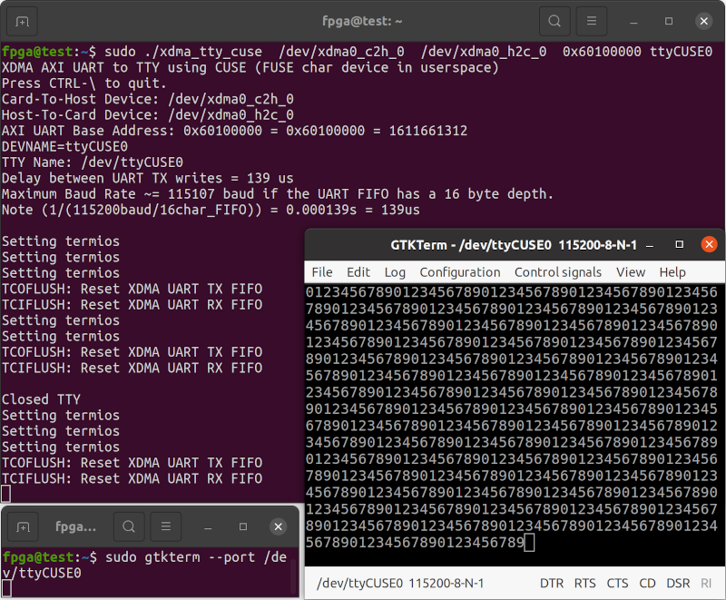
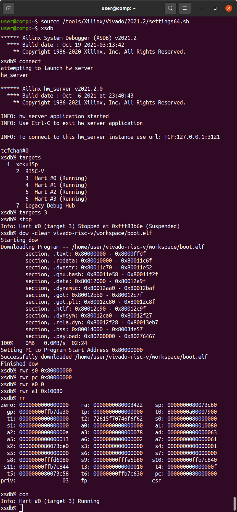
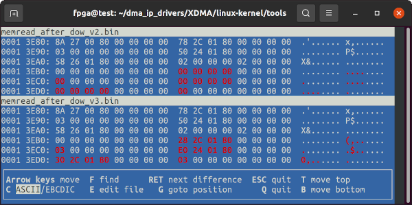
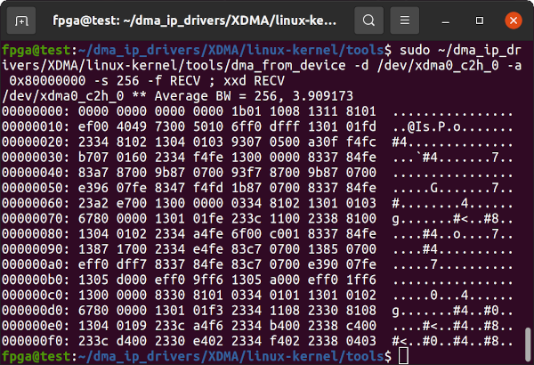
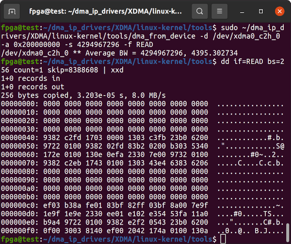

# Innova-2 RISC-V Debug Log


## UART over XDMA Drops Data Bytes

When the two UARTs (one for the RISC-V core and the second for XDMA) are connected to the same AXI SmartConnect:


Communication fails as a result and drops RX FIFO bytes after a `STATUS` byte read:


Note that [`bare-metal hello-world`](https://github.com/eugene-tarassov/vivado-risc-v/blob/v3.4.0/bare-metal/hello-world/main.c#L20) is modified to print numerical digits.


Grouping the RISC-V IO Blocks solves the communication issues!


Communication with the RISC-V can now be done using standard Linux TTY Terminal Software such as [`gtkterm`](https://manpages.ubuntu.com/manpages/focal/man1/gtkterm.1.html).




## OpenSBI

```
cd vivado-risc-v
make  CONFIG=rocket64b4l2w  BOARD=innova2  workspace/boot.elf
```

Still connected to the Innova-2 using JTAG, start `xsdb` on the computer hosting the JTAG adapter:
```
source /tools/Xilinx/Vivado/2021.2/settings64.sh
xsdb
```

Load OpenSBI:
```
connect
targets
target 3
stop
dow -clear workspace/boot.elf
rwr s0 0x80000000
rwr pc 0x80000000
rwr a0 0
rwr a1 0x10080
rr
con
```



On the PC hosting the Innova-2, run `xdma_tty_cuse` and `gtkterm` to communicate with the RISC-V system:


## UART over XDMA Debug

This issue has been fixed!

If you allow the RISC-V core to run for several minutes before starting [`xdma_tty_cuse.c`](https://github.com/mwrnd/innova2_experiments/blob/main/xdma_uart-to-uart/xdma_tty_cuse.c), the UART will buffer data. `xdma_tty_cuse.c` will successfully read the buffered data but new data consistently drops the last character, `0`, as well as occasional random characters.


I added an [Integrated Logic Analyzer (ILA)](https://docs.xilinx.com/r/2021.2-English/ug936-vivado-tutorial-programming-debugging/Using-the-Vivado-Integrated-Logic-Analyzer) to each AXI UART block.


RISC-V Status byte `0x08` read from `UART`.


RISC-V TX byte `0x04` write to `UART`.


XDMA 16-Byte Read of all `UART2` Registers:


## xsdb Notes


The following issue has been [fixed!](https://github.com/eugene-tarassov/vivado-risc-v/issues/97)

Innova-2 *JTAG Access* must be enabled before attempting to download programs to a RISC-V core in the FPGA.


`xsdb` then works:


The issue was that after running `xsdb`'s `dow` command to load `boot.elf`, I read the memory back over XDMA and it was correctly but partially written.


Here is a hex dump of `boot.elf`:
```
xxd /home/user/vivado-risc-v/workspace/boot.elf | less

00000120: 3304 0500 b384 0500 3309 0600 ef00 c054  3.......3......T
00000130: 3308 0500 3305 0400 b385 0400 3306 0900  3...3.......3...
00000140: fd58 6304 1801 631d 050b 1728 0100 1308  .Xc...c....(....
00000150: e8fd 8548 2f28 1801 6314 080a 9722 0100  ...H/(..c...."..
00000160: 9382 c2fd 1703 0000 1303 c3fb 23b0 6200  ............#.b.
00000170: 9722 0100 9382 02fd 83b2 0200 b303 5340  ."............S@
00000180: 172e 0100 130e 0efa 2330 7e00 9732 0100  ........#0~..2..
00000190: 9382 c2eb 1743 0100 1303 43e4 6383 6206  .....C....C.c.b.
```

Each run of `dow` correctly writes a random amount of `boot.elf`
```
 49%    0MB   0.0MB/s  00:07 ETA
Failed to download /home/user/vivado-risc-v/workspace/boot.elf
Memory write error at 0x8000B600. FPGA reprogrammed, wait for debugger resync
xsdb% Info: Hart #0 (target 3) Stopped at 0x80008ee0 (Suspended)
...
 83%    0MB   0.0MB/s  00:02 ETA
Failed to download /home/user/vivado-risc-v/workspace/boot.elf
Memory write error at 0x80226400. Debug Transport Module: data corruption (ID)
xsdb% Info: Hart #0 (target 3) Running (FPGA reprogrammed, wait for debugger resync)
```

`vbindiff` has a *next difference* function and I use it to confirm all leading data is identical.



Something is regularly interrupting the debugger.

---

Executable code starts at `0x1000=4096`.
```
dd if=vivado-risc-v/bare-metal/hello-world/boot.elf bs=1 count=256 skip=4096 | xxd
```


After loading the code using `xsdb`'s `dow` command over JTAG, it can be read back on the computer with the Innova2 from address `0x8000_0000`. It matches `boot.elf` from offset address `0x1000`.
```
sudo ~/dma_ip_drivers/XDMA/linux-kernel/tools/dma_from_device -d /dev/xdma0_c2h_0 -a 0x80000000 -s 256 -f RECV ; xxd RECV
```



However, the memory cannot be accessed directly from address `0x2_0000_0000`, the `C0_DDR4_MEMORY_MAP`, as the RISC-V system appears to map at least the leading portion of `0x80000000` into internal FPGA memory. Note `256*8388608 = 2147483648 = 0x8000_0000`.
```
sudo ~/dma_ip_drivers/XDMA/linux-kernel/tools/dma_from_device -d /dev/xdma0_c2h_0 -a 0x200000000 -s 4294967296 -f READ
dd if=READ bs=256 count=1 skip=8388608  |  xxd
```



I performed a cold boot on the Innova2 system and read the full DDR4 memory.
```
sudo ~/dma_ip_drivers/XDMA/linux-kernel/tools/dma_from_device -d /dev/xdma0_c2h_0 -a 0x200000000 -s 4294967296 -f READ1
```

I then ran `xsdb` on the system hosting the JTAG Adapter and loaded `hello-world/boot.elf`.
```
xsdb% connect                                                                                                   
tcfchan#0
xsdb% targets                                                                                                   
  1  xcku15p
     2  RISC-V
        3  Hart #0 (Running)
        4  Hart #1 (Running)
        5  Hart #2 (Running)
        6  Hart #3 (Running)
     7  Legacy Debug Hub
xsdb% targets 3                                                                                                 
xsdb% stop                                                                                                      
Info: Hart #0 (target 3) Stopped at 0x11578 (Suspended)                                                         
xsdb% dow vivado-risc-v/bare-metal/hello-world/boot.elf                                                         
Downloading Program -- /home/user/vivado-risc-v/bare-metal/hello-world/boot.elf
	section, .text: 0x80000000 - 0x8000054d
	section, .bss: 0x8000054e - 0x8000054f
100%    0MB   0.0MB/s  00:00                                                                                    
Setting PC to Program Start Address 0x80000008
Successfully downloaded /home/user/vivado-risc-v/bare-metal/hello-world/boot.elf
xsdb% targets                                                                                                   
  1  xcku15p
     2  RISC-V
        3* Hart #0 (Suspended, M)
        4  Hart #1 (Running)
        5  Hart #2 (Running)
        6  Hart #3 (Running)
     7  Legacy Debug Hub
xsdb% con                                                                                                       
Info: Hart #0 (target 3) Running
xsdb% rrd                                                                                                       
zero: 0000000000000000    ra: 00000000800004d8    sp: 0000000080ffffc0                                          
  gp: 0000000000000000    tp: 0000000000000000    t0: 0000000000000000
  t1: 0000000000000000    t2: 0000000000000000    s0: 0000000080fffff0
  s1: 0000000000000000    a0: 00000000000f4240    a1: 0000000000000040
  a2: 0000000000000000    a3: 00000000000f4240    a4: 00000000026a701f
  a5: 00000004ab61d909    a6: 0000000000000000    a7: 0000000000000000
  s2: 0000000000000000    s3: 0000000000000000    s4: 0000000000000000
  s5: 0000000000000000    s6: 0000000000000000    s7: 0000000000000000
  s8: 0000000000000000    s9: 0000000000000000   s10: 0000000000000000
 s11: 0000000000000000    t3: 0000000000000000    t4: 0000000000000000
  t5: 0000000000000000    t6: 0000000000000000    pc: 0000000080000464
priv:               03    fp                     csr                  
                                                                      
xsdb% exit                                                                                                      
exit
```

I performed a second read of the Innova2's DDR4 memory and ran `vbindiff` on the two and there was no difference. `boot.elf` is NOT loaded into the DDR4 address space.
```
sudo ~/dma_ip_drivers/XDMA/linux-kernel/tools/dma_from_device -d /dev/xdma0_c2h_0 -a 0x200000000 -s 4294967296 -f READ2
vbindiff READ1 READ2
```


---

## xsdb Cannot Load boot.elf - Fixed

This has been [fixed!](https://github.com/eugene-tarassov/vivado-risc-v/issues/97)

`xsdb` fails during `dow boot.elf`:
```
Failed to download /home/user/boot.elf
Memory write error at 0x8022D500. FPGA reprogrammed, wait for debugger resync
xsdb% Info: Hart #0 (target 3) Stopped at 0x10dd4 (Suspended)

```

However, on the system with the Innova-2 I can read the memory back over XDMA and it is written correctly, but partially.


`sudo gedit /tools/Xilinx/Vivado/2021.2/scripts/xsdb/xsdb/xsdb.tcl` and add all debug options to the call to `hw_server` except full `jtag` tracing to debug the issue.
```
-l alloc,eventcore,waitpid,events,protocol,context,children,discovery,asyncreq,proxy,tcflog,elf,stack,plugin,shutdown,disasm,jtag2,slave,dpc -L hw_server_log_xsdb
```


The problem persists and the debug log is not helpful.


---

## JTAG Fails Timing - Fixed

This has been [fixed!](https://github.com/eugene-tarassov/vivado-risc-v/issues/97)

JTAG register to TDO pin path fails timing. `xsdb` communication errors may be the result of this.

```
xsdb% Info: Hart #0 (target 3) Running (Debug Transport Module: data corruption (ID))
...
Failed to download vivado-risc-v/workspace/boot.elf
Memory write error at 0x80222C00. FPGA reprogrammed, wait for debugger resync
...
aborting, 1 pending requests...                                                                                 
Failed to download vivado-risc-v/workspace/boot.elf
Memory write error at 0x80000100. Debug Transport Module timeout
xsdb% Info: Hart #0 (target 3) Running (Debug Transport Module: data corruption (ID))
```


The Device View shows the path is very short.


