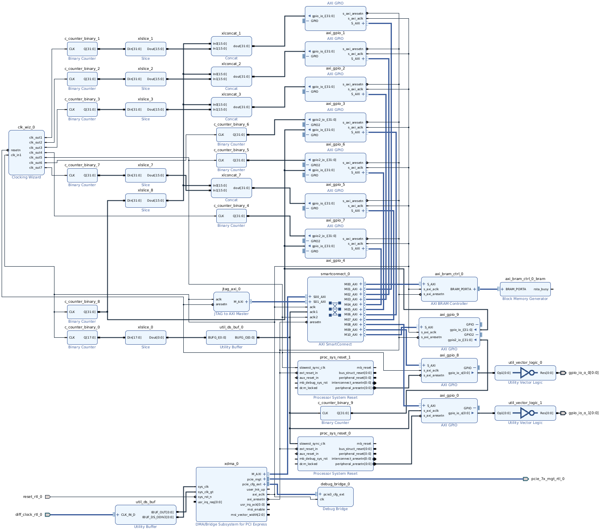
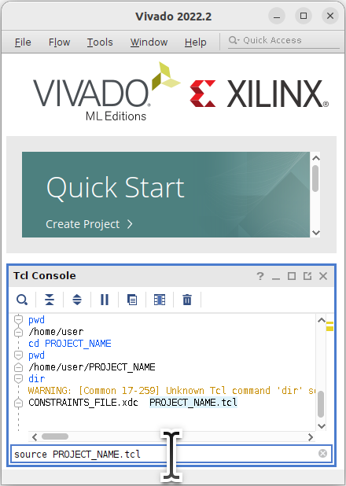
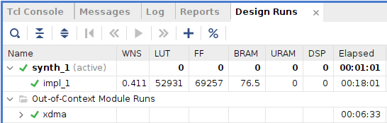
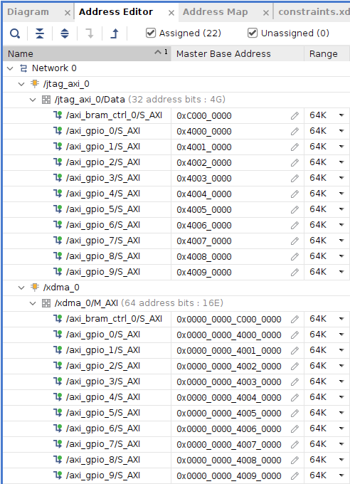
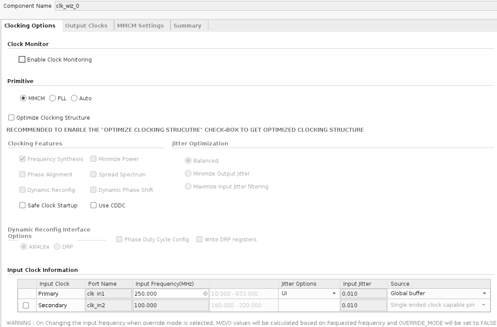
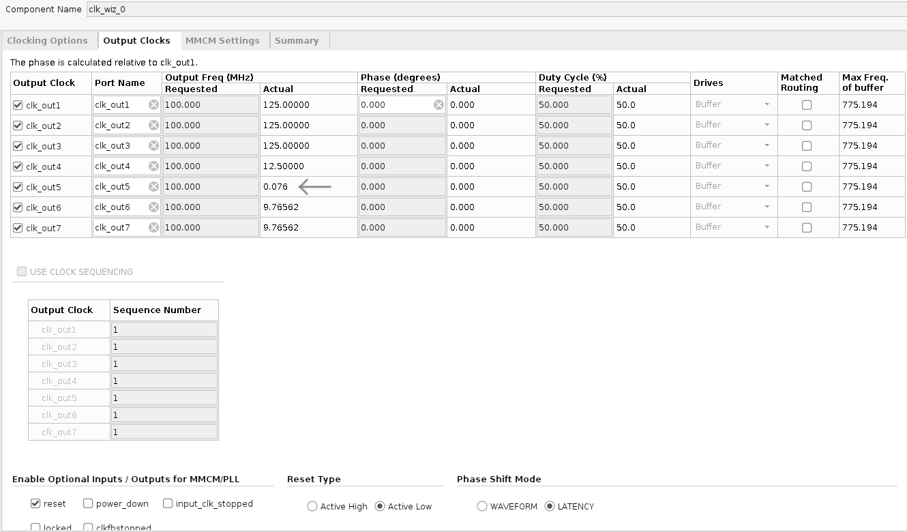
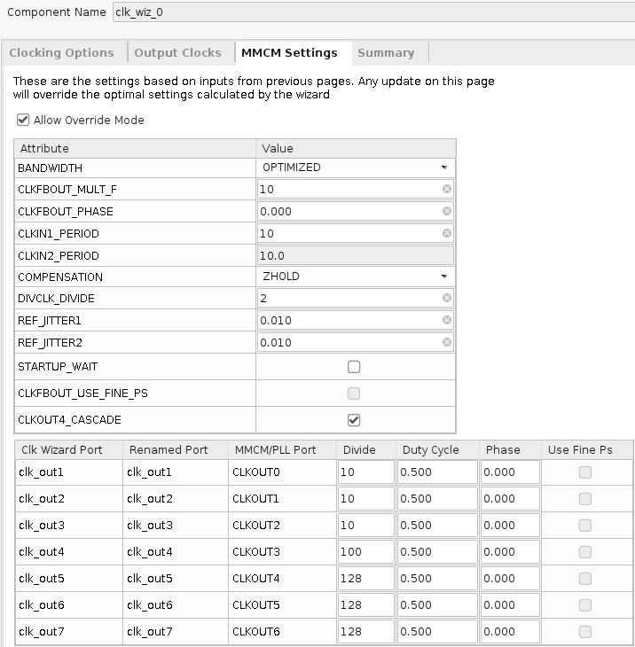
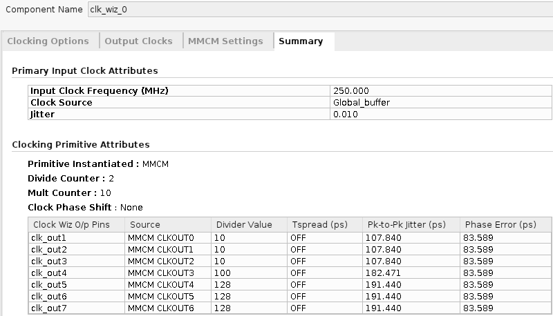
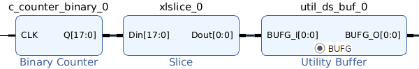
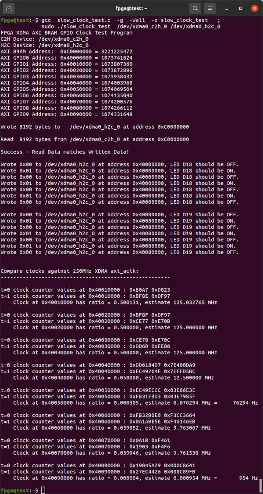

# Innova2 XCKU15P XDMA Clocking Wizard Testing

[PCIe XDMA](https://docs.xilinx.com/r/en-US/pg195-pcie-dma/Introduction) demo with various [Clocking Wizard](https://docs.xilinx.com/r/en-US/pg065-clk-wiz) tests for the [Innova-2](https://www.nvidia.com/en-us/networking/ethernet/innova-2-flex/) using [**Vivado 2022.2**](https://www.xilinx.com/support/download/index.html/content/xilinx/en/downloadNav/vivado-design-tools/2022-2.html). The goal is a slow clock that works with AXI peripherals.


## Block Design



Note each [AXI GPIO](https://docs.xilinx.com/v/u/en-US/pg144-axi-gpio) peripheral clocked by a slow clock needs its own [Processor System Reset](https://docs.xilinx.com/v/u/en-US/pg164-proc-sys-reset) module to generate a [clock-domain crossing](https://en.wikipedia.org/wiki/Clock_domain_crossing) reset signal based on the XDMA `axi_aresetn` signal.


## Bitstream

Recreate the bitstream. Download [`slow_clock_tests.tcl`](slow_clock_tests.tcl) and [`constraints.xdc`](constraints.xdc) and [`source`](https://docs.xilinx.com/r/2022.2-English/ug939-vivado-designing-with-ip-tutorial/Source-the-Tcl-Script?tocId=7apMNdBzAEx4udRnUANS9A) the Tcl script in the **Vivado 2022.2** *Tcl Console* then run *Generate Bitstream*.

```
pwd
cd PROJECT_NAME
dir
source slow_clock_tests.tcl
```



[Load the bitstream into your Innova-2](https://github.com/mwrnd/innova2_flex_xcku15p_notes#loading-a-user-image). It should work with every variant of the Innova-2. Refer to [innova2_flex_xcku15p_notes](https://github.com/mwrnd/innova2_flex_xcku15p_notes) for system setup.


### FPGA Resources Used




## AXI Addresses




## Design Overview

The [Clocking Wizard](https://docs.xilinx.com/r/en-US/pg065-clk-wiz) is set up to generate the slowest clock possible.

The first method is courtesy _markg@prosensing_ from [this discussion thread](https://support.xilinx.com/s/question/0D54U00005cTndHSAS/how-can-clocking-wizard60-generate-output-clock-under-625mhz-in-zedboard?language=en_US). The slowest output clock using a 250MHz XDMA `axi_aclk` as the input is 76kHz.

Clocking Wizard Setup - Clocking Options:



Clocking Wizard Setup - Output Clocks:



Clocking Wizard Setup - MMCM Settings:



Clocking Wizard Setup - Summary:



The second method uses a [`BUFG` Utility Buffer](https://docs.xilinx.com/v/u/en-US/pb043-util-ds-buf) to route a [binary counter](https://docs.xilinx.com/v/u/en-US/pg121-c-counter-binary) output onto the global clock network. [`Slice`](https://docs.xilinx.com/r/2021.2-English/ug994-vivado-ip-subsystems/Slice) is used to cut out the most significant bit ([MSb](https://en.wikipedia.org/wiki/Bit_numbering#Bit_significance_and_indexing)). The clock input to the 18-bit counter is 250MHz so the output should be about (250000000/(2^18)) ~= 954 Hz.




## Testing

[`slow_clock_test.c`](slow_clock_test.c) is a simple C program to test the XDMA interface, communicate with AXI peripherals clocked by the slow clocks, and estimate the slow clock periods.

```
gcc  slow_clock_test.c  -g  -Wall  -o slow_clock_test
sudo ./slow_clock_test  /dev/xdma0_c2h_0 /dev/xdma0_h2c_0
```




