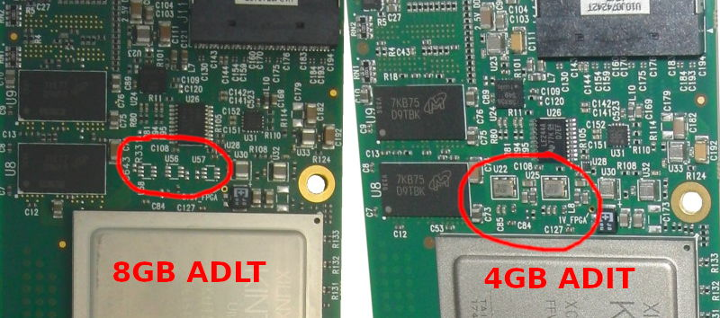
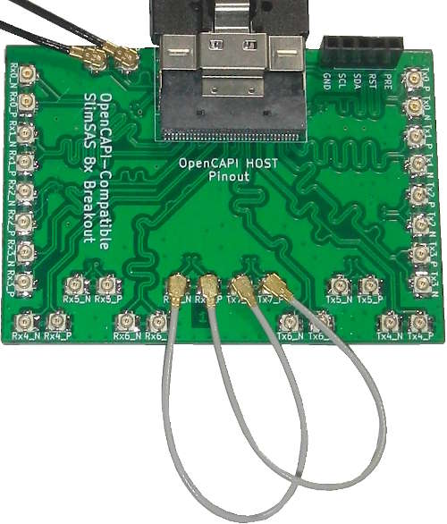
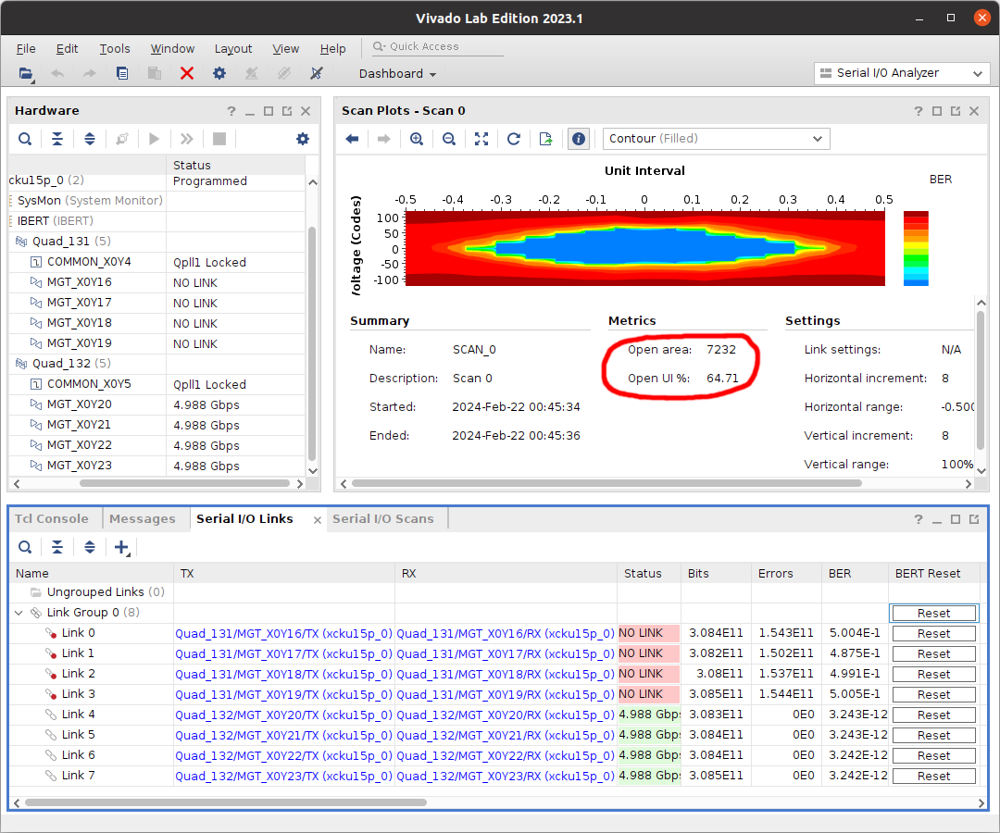
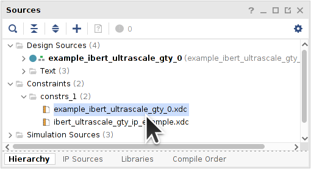

# XCKU15P FFVE1517 GTY IBERT Testing

The [IBERT for GTY](https://docs.xilinx.com/v/u/en-US/pg196-ibert-ultrascale-gty) Example Design can be used to test connections of the [GTY Transceivers](https://docs.xilinx.com/v/u/en-US/ug578-ultrascale-gty-transceivers).


## Testing Quads 129 and 130 on the MNV303212A-ADIT

The 8GB(D9WFR) MNV303212A-AD**L**T has a different design than the 4GB(D9TBK) MNV303212A-AD**I**T:



Thanks [*Applepi*](https://github.com/Applepi) for finding the [4GB MNV303212A-AD**A**T Product Brief](https://manualzz.com/download/33751280)(*manualzz.com*) which shows a direct connection between the FPGA and an SFP Port.


I was able to [figure out that Quads 129 and 130 are clocked by the 161.13MHz oscillators](https://github.com/mwrnd/innova2_flex_xcku15p_notes/issues/3) on the 4GB MNV303212A-AD**I**T.


### Program the Design into the MNV303212A-ADIT XCKU15P Configuration Memory

Refer to the [`innova2_flex_xcku15p_notes`](https://github.com/mwrnd/innova2_flex_xcku15p_notes) project's instructions on [Loading a User Image](https://github.com/mwrnd/innova2_flex_xcku15p_notes/#loading-a-user-image). Binary Memory Configuration Bitstream Files are included in this project's [Release v0.1.2-alpha](https://github.com/mwrnd/innova2_experiments/releases/tag/v0.1.2-alpha).

```
wget https://github.com/mwrnd/innova2_experiments/releases/download/v0.1.2-alpha/IBERT_GTY_Quads_129_130_161.13MHz.zip
unzip IBERT_GTY_Quads_129_130_161.13MHz.zip
sha256sum *bin
echo dcce513080b47c942bed6810d78330635d695d951fb1f1b500b190f0b0aa7cd5 should be checksum of IBERT_GTY_Quads_129_130_161.13MHz_primary.bin
echo bbad661609112b3cca911d81ca19d6da7df55c1532159f0b0215f4d20d4785fc should be checksum of IBERT_GTY_Quads_129_130_161.13MHz_secondary.bin
```

After reboot, enable JTAG using `innova2_flex_app` on the system hosting the Innova2.

```Shell
sudo mst start
sudo mst status
sudo mst status -v
sudo flint -d /dev/mst/mt4119_pciconf0 q
cd ~/Innova_2_Flex_Open_18_12/driver/
sudo ./make_device
sudo insmod /usr/lib/modules/`uname -r`/updates/dkms/mlx5_fpga_tools.ko
lsmod | grep mlx
cd ~
sudo ~/Innova_2_Flex_Open_18_12/app/innova2_flex_app -v
```


Connect your JTAG adapter to the Innova2 and start [Vivado Hardware Manager](https://docs.xilinx.com/r/en-US/ug908-vivado-programming-debugging/Opening-the-Hardware-Manager).


### Testing SFP Port Connections

A simple [SFP loopback](https://www.digikey.ca/en/products/detail/amphenol-cables-on-demand/SF-SFPPLOOPBK-003-5/6873737) can be made using an [SFP Direct-Attach Cable](https://www.fs.com/products/65841.html) and an [SFP Connector](https://www.digikey.com/en/products/detail/amphenol-cs-commercial-products/UE75-A20-6000T/1242770) by shorting RXp-to-TXp and RXn-to-TXn using [32AWG wire](https://www.digikey.com/en/products/detail/tensility-international-corp/30-01803/13998275).


With the loopback plugged into SFP Port 2 (closest to the PCIe card edge):


It turns out Quad 129 Channel X0Y10 is used for the SFP port:


With the loopback plugged into SFP Port 1:


There is no direct FPGA connection. From the AD**A**T Block Diagram that would imply the second connection is to the ConnectX-5.


## Testing Quads 131 and 132 on the MNV303212A-ADIT

My 4GB MNV303212A-AD**I**T does not work with an [OpenCAPI-to-PCIe](https://github.com/mwrnd/OpenCAPI-to-PCIe) board when running the [innova2_xdma_opencapi](https://github.com/mwrnd/innova2_xdma_opencapi) project due to having a different pinout than the 8GB MNV303212A-AD**L**T.


### Program the Design into the MNV303212A-ADIT XCKU15P Configuration Memory

Refer to the [`innova2_flex_xcku15p_notes`](https://github.com/mwrnd/innova2_flex_xcku15p_notes) project's instructions on [Loading a User Image](https://github.com/mwrnd/innova2_flex_xcku15p_notes/#loading-a-user-image). Binary Memory Configuration Bitstream Files are included in this project's [Release v0.1.2-alpha](https://github.com/mwrnd/innova2_experiments/releases/tag/v0.1.2-alpha).

```
wget https://github.com/mwrnd/innova2_experiments/releases/download/v0.1.2-alpha/IBERT_GTY_Quads_131_132_100MHz.zip
unzip IBERT_GTY_Quads_131_132_100MHz.zip
sha256sum *bin
echo 689dcf3519903e91c3468d023c3c27aa026d4333c27ec9a5011678ee30d46bd4 should be checksum of IBERT_GTY_Quads_131_132_100MHz_primary.bin
echo 77d90acffc398590e14a95929bf5a169115c3746a52d4405fc21742fb3419ee1 should be checksum of IBERT_GTY_Quads_131_132_100MHz_secondary.bin
```

After reboot, enable JTAG using `innova2_flex_app` on the system hosting the Innova2.

```Shell
sudo mst start
sudo mst status
sudo mst status -v
sudo flint -d /dev/mst/mt4119_pciconf0 q
cd ~/Innova_2_Flex_Open_18_12/driver/
sudo ./make_device
sudo insmod /usr/lib/modules/`uname -r`/updates/dkms/mlx5_fpga_tools.ko
lsmod | grep mlx
cd ~
sudo ~/Innova_2_Flex_Open_18_12/app/innova2_flex_app -v
```


Connect your JTAG adapter to the Innova2 and start [Vivado Hardware Manager](https://docs.xilinx.com/r/en-US/ug908-vivado-programming-debugging/Opening-the-Hardware-Manager).


### Testing OpenCAPI Connector


A [PCIe_x8_Breakout](https://github.com/mwrnd/PCIe_x8_Breakout) in a PCIe socket was used as the source of the OpenCAPI 100MHz `GTREFCLK` clock.


I manually searched for working connections.


After finding working connections I connected both N and P signals.



I discovered that the Innova2 4GB MNV303212A-AD**I**T has a significantly different OpenCAPI pinout than the Innova2 8GB MNV303212A-AD**L**T.
```
X0Y16: RX3p-TX0n, RX3n-TX0p
X0Y17: RX0p-TX1n, RX0n-TX1p
X0Y18: RX2p-TX2p, RX2n-TX2n
X0Y20: RX4p-TX4n, RX4n-TX4p
X0Y21: RX5p-TX5p, RX5n-TX5n
X0Y22: RX6p-TX6p, RX6n-TX6n
X0Y23: RX7p-TX7p, RX7n-TX7n
```

The following are Eye Diagram Scans for one of the OpenCAPI GTY Channels:

`X0Y16 RX3n-TX0p`-only:


`X0Y16 RX3p-TX0n RX3n-TX0p`:


Results for the other GTY channels are available at [innova2_flex_xcku15p_notes/hardware_notes](https://github.com/mwrnd/innova2_flex_xcku15p_notes/tree/main/hardware_notes#innova2-8gb-mnv303212a-adlt-hardware-notes)


### Using the IBERT as a Cable Tester


A [PCIe_x8_Breakout](https://github.com/mwrnd/PCIe_x8_Breakout) in a PCIe socket can be used as the source for the OpenCAPI 100MHz `GTREFCLK` clock.


Only using one serial link in this example but the following procedure needs to be performed for all used links. Connect a link for Loopback using short and high-quality [U.FL-to-U.FL Cables](https://www.digikey.com/en/products/detail/te-connectivity-amp-connectors/2118651-6/11205742):


Run an Eye Diagram Scan to get the baseline Eye Diagram. This is the best performance possible.


Connect 4 TX links to one [HDMI_Breakout](https://github.com/mwrnd/HDMI_Breakout) board and 4 RX links to another. Connect an HDMI Cable to create a loopback.


Reset the BER (Bit-Error-Rate) statistics.


Run an Eye Diagram Scan. You now have the relative performance of this cable for one channel. Notice the relative *Open UI %* drop from about 76% to 65% between the cable and baseline.



Connect a different HDMI cable. I switched to one with ferrite cores.


Run an Eye Diagram Scan. Notice the *Open UI %* is now about 71%. This one link in a 6m cable with ferrites is better than this same link in the short cable without ferrites. Do not compare results link-to-link as each link may each have different baseline results.


Run Eye Diagram Scans on the other links and compare to the baseline and other cables.


After about 15 minutes of use my board overheats and links start failing.


## Recreating the Design in Vivado

Create a new project in Vivado and open the IP Catalog.


Select IBERT UltraScale GTY:


Configure the Protocol to be used. Choose a *RefClk(MHz)* that is closest to the frequency that is clocking the transceivers. Set the *LineRate(Gbps)* to be an integer multiple of the reference clock and close to 5, `161.2903226*30=4.838709678`. The *Quad Count* is 2 as testing two Quads (8 Channels) in this project.


Choose the Quads you want to test and their reference clock sources. On the Innova2 the reference clocks are routed to both Quads for both the SFP and OpenCAPI Quads.


The System Clock is a separate free-running (always-on) clock. On the Innova2 there is a 100MHz differential (*SSTL12*) clock on pin **AR14**.


Once configuration is done, right-click on `ibert_ultrascale_gty_0` and Open IP Example Design:


A new project will be generated. Edit its constraints:



With constraints for the Innova2's FPGA Configuration Memory:
```
# Memory Configuration File Settings
set_property CONFIG_MODE SPIx8 [current_design]
set_property CONFIG_VOLTAGE 1.8 [current_design]
set_property CFGBVS GND [current_design]
set_property BITSTREAM.CONFIG.CONFIGRATE 127.5 [current_design]
set_property BITSTREAM.CONFIG.CONFIGFALLBACK DISABLE [current_design]
set_property BITSTREAM.CONFIG.EXTMASTERCCLK_EN DISABLE [current_design]
set_property BITSTREAM.CONFIG.NEXT_CONFIG_REBOOT DISABLE [current_design]
set_property BITSTREAM.CONFIG.OVERTEMPSHUTDOWN ENABLE [current_design]
set_property BITSTREAM.CONFIG.SPI_32BIT_ADDR YES [current_design]
set_property BITSTREAM.CONFIG.SPI_BUSWIDTH 8 [current_design]
set_property BITSTREAM.CONFIG.SPI_FALL_EDGE YES [current_design]
set_property BITSTREAM.CONFIG.UNUSEDPIN PULLUP [current_design]
set_property BITSTREAM.GENERAL.COMPRESS TRUE [current_design]
set_property BITSTREAM.GENERAL.CRC ENABLE [current_design]
```


Generate the Bitstream:


