# Innova2 XCKU15P XDMA Using OpenCAPI Connector

[PCIe XDMA](https://docs.xilinx.com/r/en-US/pg195-pcie-dma/Introduction) demo project for the [Innova-2](https://www.nvidia.com/en-us/networking/ethernet/innova-2-flex/)'s OpenCAPI connector.


## Bitstream

Refer to the `innova2_flex_xcku15p_notes` project's instructions on installing XDMA drivers and [Loading a User Image](https://github.com/mwrnd/innova2_flex_xcku15p_notes/#loading-a-user-image) to load the [release bitstream](https://github.com/mwrnd/innova2_experiments/releases) into the Innova-2's FPGA Configuration Memory.

```
wget https://github.com/mwrnd/innova2_experiments/releases/download/v0.1.1-alpha/xdma_mm_oc_x8.zip
unzip -d .  xdma_mm_oc_x8.zip
md5sum  xdma_mm_opencapi_x8_primary.bin  xdma_mm_opencapi_x8_secondary.bin
echo 9167479f7fe99175d24382c3765fcf96 should be MD5 Checksum of xdma_mm_opencapi_x8_primary.bin
echo e3fe796a7c2a568f8938c5e35e354ac3 should be MD5 Checksum of xdma_mm_opencapi_x8_secondary.bin
```


## Testing

The design retargets [`xdma_mm.tcl`](https://github.com/mwrnd/notes/blob/4e1ad75aed96eb8179aa0a412fde77543853141e/XDMA_Communication/xdma_mm.tcl) from [XDMA_Communication](https://github.com/mwrnd/notes/tree/main/XDMA_Communication) to the OpenCAPI interface on the [Innova2 8GB MNV303212A-ADLT](https://github.com/mwrnd/innova2_flex_xcku15p_notes). Try [`mm_axi_test.c`](https://github.com/mwrnd/notes/blob/4e1ad75aed96eb8179aa0a412fde77543853141e/XDMA_Communication/mm_axi_test.c) and [`mm_axilite_test.c`](https://github.com/mwrnd/notes/blob/4e1ad75aed96eb8179aa0a412fde77543853141e/XDMA_Communication/mm_axilite_test.c).

```
gcc -Wall mm_axi_test.c -o mm_axi_test
sudo ./mm_axi_test
```


Can also test larger transfers using [`dd`](https://manpages.ubuntu.com/manpages/trusty/man1/dd.1.html).
```
dd if=/dev/urandom bs=8192 of=TEST count=1
printf "%d\n" 0xC0000000
sudo dd if=TEST of=/dev/xdma0_h2c_0 count=1 bs=8192 seek=3221225472 oflag=seek_bytes
sudo dd if=/dev/xdma0_c2h_0 of=RECV count=1 bs=8192 skip=3221225472 iflag=skip_bytes
md5sum TEST RECV
```

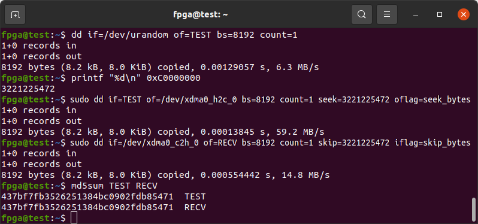


## PCIe Link Downgrade Issues

Experiencing occasional issues with PCIe Link Downgrades, [1](https://support.xilinx.com/s/question/0D54U00007XJ4l1SAD/how-to-change-to-pcie-gen2-x4-lane-or-pcie-gen2-x4-lane-while-operating-in-pcie-gen3-x4-lane?language=en_US), [2](https://support.xilinx.com/s/question/0D54U00007HjpxzSAB/when-placing-a-gen3-x8-configured-pcie-board-into-a-gen4gen5-compatible-x8-slot-link-width-recognition-issue-occurs?language=en_US), [3](https://support.xilinx.com/s/question/0D54U00007950HjSAI/xilinx-pcie-endpoint-is-no-longer-recognized-by-the-system-after-a-warm-reset?language=en_US).

If I [delay BIOS Boot](https://github.com/mwrnd/innova2_flex_xcku15p_notes/tree/c46870c3a3f18e3aa30c7b1572059518458462c1/debug_notes#delay-motherboard-boot-using-reset-capacitor) the board is successfully recognized by BIOS and Linux and runs at PCIe 8.0GT/s x4.


## Board Setup

A [PCIe_x8_Breakout](https://github.com/mwrnd/PCIe_x8_Breakout) board along with an [OpenCAPI_Breakout](https://github.com/mwrnd/OpenCAPI_Breakout) board are connected to an [Innova-2](https://www.nvidia.com/en-us/networking/ethernet/innova-2-flex/) using a 
 [SlimSAS SFF-8654 8i 85-Ohm Cable](https://www.sfpcables.com/24g-internal-slimsas-sff-8654-to-sff-8654-8i-cable-straight-to-90-degree-left-angle-8x-12-sas-4-0-85-ohm-0-5-1-meter)([Archived](https://web.archive.org/web/20210121175017/https://www.sfpcables.com/24g-internal-slimsas-sff-8654-to-sff-8654-8i-cable-straight-to-90-degree-left-angle-8x-12-sas-4-0-85-ohm-0-5-1-meter)). [RSL74-0540](http://www.amphenol-ast.com/v3/en/product_view.aspx?id=235) or [8ES8-1DF21-0.50](https://www.3m.com/3M/en_US/p/d/b5000000278/)([Datasheet](https://multimedia.3m.com/mws/media/1398233O/3m-slimline-twin-ax-assembly-sff-8654-x8-30awg-78-5100-2665-8.pdf)) should also work.


### PCIe x4 Setup

PCIe x4 using short (<4"~=100mm) cables works.

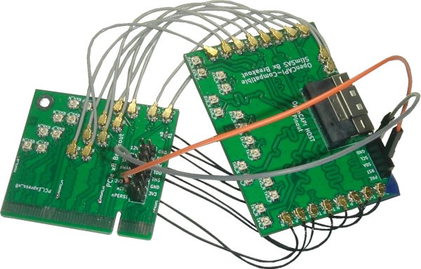

Note the [RX U.FL-to-U.FL cables](https://www.digikey.com/en/products/detail/te-connectivity-amp-connectors/2118651-6/11205742) are all the same length as each other and likewise all [TX cables](https://www.digikey.com/en/products/detail/te-connectivity-amp-connectors/2015698-2/1249186) are the same length but RX and TX are different lengths as that is what I had access to. RX on the PCIe board connects to RX on the OpenCAPI board as it uses the OpenCAPI Host pinout. Standard [0.1" M-F Jumpers](https://www.digikey.com/en/products/detail/adafruit-industries-llc/1954/6827087) are used for the PCIe Reset Signal (*nPERST*) and its GND.

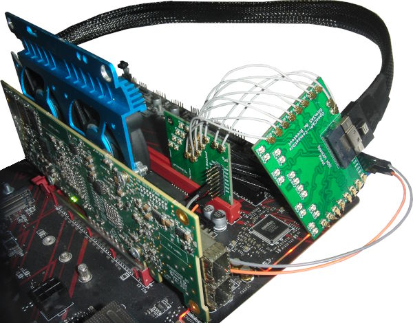


### PCIe x8 Setup

PCIe x8 using 250mm IPEX cables fails.

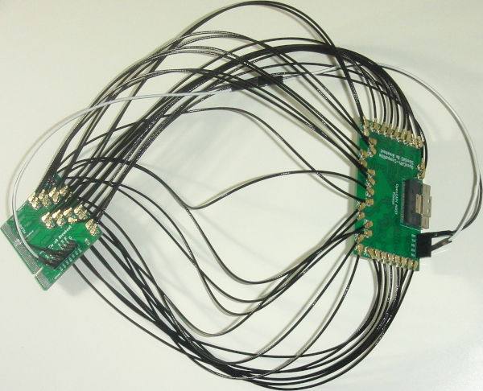

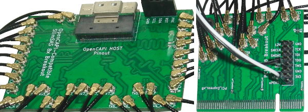

The whole system:

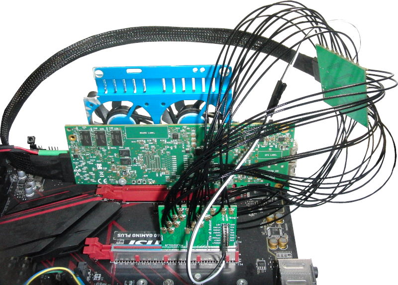

The OpenCAPI PCIe link shows up in `lspci` as x8 and working.
```
sudo lspci -vnn -d 10ee: ; sudo lspci -vvnn -d 10ee: | grep Lnk
```

```
01:00.0 Memory controller [0580]: Xilinx Corporation Device [10ee:9038]
    Subsystem: Xilinx Corporation Device [10ee:0007]
    Flags: fast devsel, IRQ 255
    Memory at 8d200000 (32-bit, non-prefetchable) [virtual] [size=1M]
    Memory at 8d300000 (32-bit, non-prefetchable) [virtual] [size=64K]
    Capabilities: [40] Power Management version 3
    Capabilities: [48] MSI: Enable- Count=1/1 Maskable- 64bit+
    Capabilities: [70] Express Endpoint, MSI 00
    Capabilities: [100] Advanced Error Reporting
    Capabilities: [1c0] Secondary PCI Express
    Kernel modules: xdma

        LnkCap:  Port #0, Speed 8GT/s, Width x8, ASPM not supported
        LnkCtl:  ASPM Disabled; RCB 64 bytes Disabled- CommClk-
        LnkSta:  Speed 8GT/s (ok), Width x8 (ok)
        LnkCtl2: Target Link Speed: 8GT/s, EnterCompliance- SpeedDis-
        LnkSta2: Current De-emphasis Level: -6dB, EqualizationComplete+, EqualizationPhase1+
        LnkCtl3: LnkEquIntrruptEn-, PerformEqu-
```

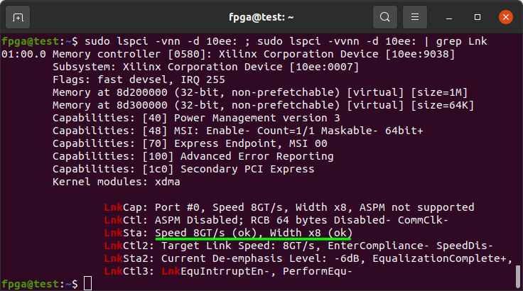

`sudo lspci -vvnn -t` shows the Innova-2 OpenCAPI interface connected to the Root PCIe switch:

```
-[00]-+-00.0 Intel Corporation Device [8086:3e0f]
      +-01.0-[01]----00.0 Xilinx Corporation Device [10ee:9038]
      +-1d.0-[02-05]----00.0-[03-05]--+-08.0-[04]--
      |                               \-10.0-[05]--+-00.0 Mellanox Technologies MT27800 Family [ConnectX-5] [15b3:1017]
      |                                            \-00.1 Mellanox Technologies MT27800 Family [ConnectX-5] [15b3:1017]
```

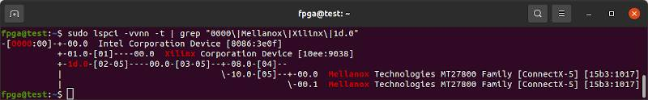

However, `dmesg` shows the `xdma` driver fails to load:

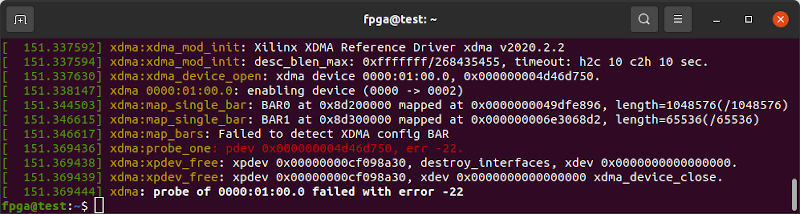

If I restrict the PCIe to x1:

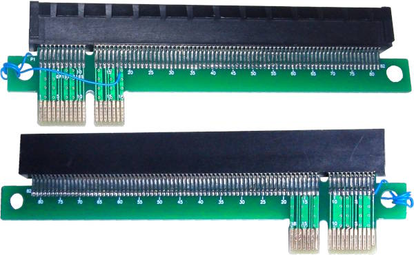

Everything works fine so it looks like a signal integrity issue with the long IPEX cables.

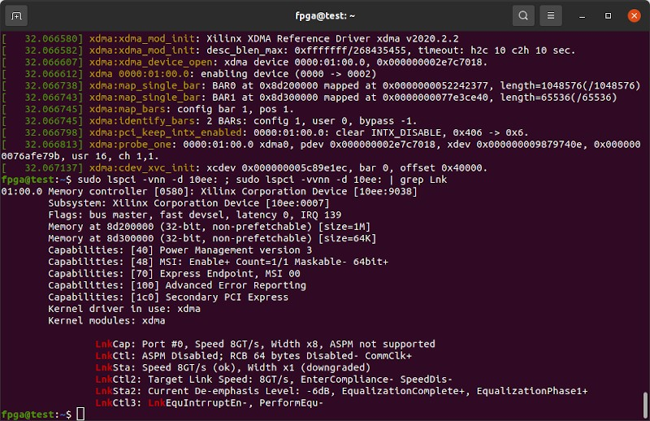


