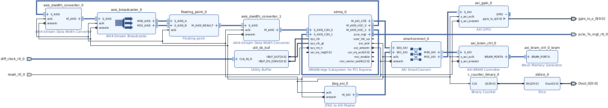
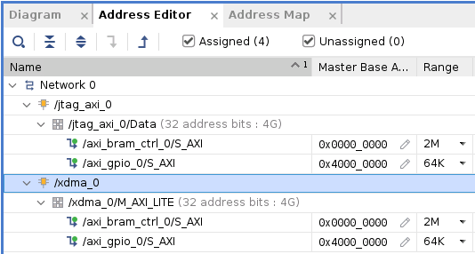
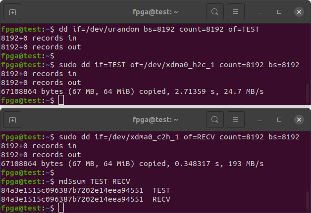
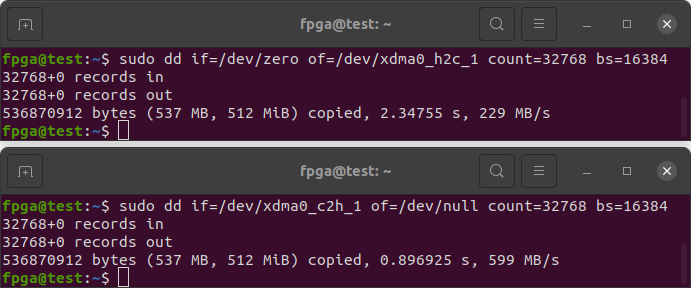
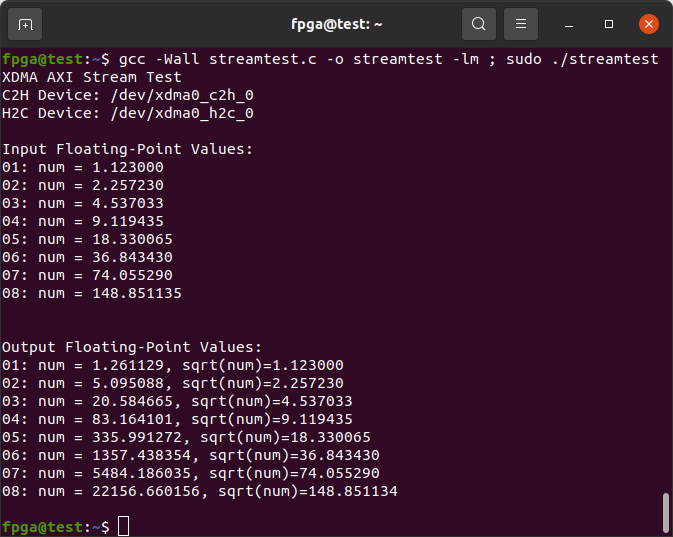
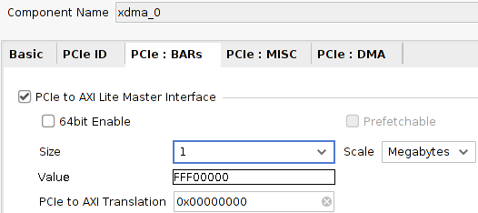
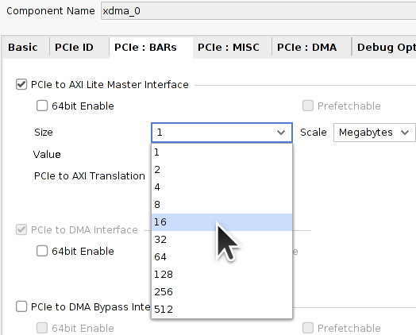
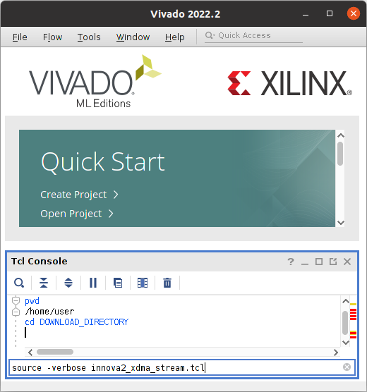

# Innova2 XCKU15P XDMA to AXI4-Stream Demo

[PCIe XDMA](https://docs.xilinx.com/r/en-US/pg195-pcie-dma/Introduction) to [AXI4-Stream](https://docs.xilinx.com/r/en-US/ug1399-vitis-hls/How-AXI4-Stream-Works) demo for the [Innova-2](https://www.nvidia.com/en-us/networking/ethernet/innova-2-flex/) using [**Vivado 2022.2**](https://www.xilinx.com/support/download/index.html/content/xilinx/en/downloadNav/vivado-design-tools/2022-2.html) with [Floating-Point](https://docs.xilinx.com/v/u/en-US/pg060-floating-point) and [AXI-Lite](https://www.xilinx.com/products/intellectual-property/axi_lite_ipif.html) to [BRAM](https://www.xilinx.com/products/intellectual-property/axi_bram_if_ctlr.html) and [GPIO](https://docs.xilinx.com/v/u/en-US/pg144-axi-gpio).


## Block Design




## Bitstream

Download the demo bitstream and [load it into your Innova-2](https://github.com/mwrnd/innova2_flex_xcku15p_notes#loading-a-user-image). It should work with every variant of the Innova-2. Refer to [innova2_flex_xcku15p_notes](https://github.com/mwrnd/innova2_flex_xcku15p_notes) for system setup.

```
wget https://github.com/mwrnd/innova2_experiments/releases/download/v0.1.1-alpha/innova2_xdma_stream_demo.zip
md5sum innova2_xdma_stream_demo.zip
echo 4fe405753b00b895fc8858996d40eb2c should be the MD5 Checksum
unzip -d . innova2_xdma_stream_demo.zip
md5sum *bin
echo 3685651141d715af32902520add8d529 is the MD5 checksum of innova2_xdma_stream_demo_primary.bin
echo 5bf29940319ba46a6206a8c8807b06bf is the MD5 checksum of innova2_xdma_stream_demo_secondary.bin
```


## AXI Addresses




## Testing

### Correct Data Transfer Test

Confirm data transfers correctly using [dd](https://manpages.ubuntu.com/manpages/focal/en/man1/dd.1.html). Note interface set `_1` is set up as a [loopback](https://en.wikipedia.org/wiki/Loopback).

In one terminal window generate some data and send it to the file that the [XDMA Driver](https://github.com/Xilinx/dma_ip_drivers) creates for the AXI4-Stream Host-to-Card (**H2C**) interface.
```
dd if=/dev/urandom bs=8192 count=8192 of=TEST
sudo dd if=TEST of=/dev/xdma0_h2c_1 count=8192 bs=8192
```

In a second terminal window, read data from the file that the XDMA Driver creates for the AXI4-Stream Card-to-Host (**C2H**) interface and check the read and written data is identical.
```
sudo dd if=/dev/xdma0_c2h_1 of=RECV count=8192 bs=8192
md5sum TEST RECV
```



Experiment with different `count=` and `bs=` (Block Size) values. The maximum throughput depends on the speed of your disk drive as the data is being written from and to files. The **H2C** throughput will be slower as it includes the time it takes you to switch to the second window and start the second `dd`.


### Data Throughput Tests

By using [`/dev/zero`](https://en.wikipedia.org/wiki//dev/zero) as the source of data and [`/dev/null`](https://en.wikipedia.org/wiki/Null_device) as the sink you can experiment with data throughput vs. `count=` and `bs=` (Block Size) values.

In one terminal:
```
sudo dd if=/dev/zero of=/dev/xdma0_h2c_1 count=32768 bs=16384
```

In a second terminal:
```
sudo dd if=/dev/xdma0_c2h_1 of=/dev/null count=32768 bs=16384
```



The **H2C** throughput will be slower as it includes the time it takes you to switch to the second window and start the second `dd`.


### Testing the Floating-Point Block

Interface set `_0` is connected to a [Floating-Point Block](https://docs.xilinx.com/v/u/en-US/pg060-floating-point) that multiplies its inputs. Each input is the same so it is calculating a [square](https://en.wikipedia.org/wiki/Square_(algebra)) of the input.

Compile and run the [`streamtest.c`](streamtest.c) demo. Note [`DATA_SIZE`](https://github.com/mwrnd/innova2_experiments/blob/fbf579154788fb373e52a7d880e311496f894841/xdma_stream/streamtest.c#L30) must be at least `32` which is the width of the AXI4-Stream Interface, `256`bits=`32`bytes. The demo runs [square-root](https://en.wikipedia.org/wiki/Square_root) on the received data to confirm it was squared correctly.
```
gcc -Wall streamtest.c -o streamtest -lm
sudo ./streamtest
```




### Testing the BRAM and GPIO over AXI-Lite

**TODO**

I synthesized and implemented the design with the address space set to 1Mbyte.



This does not allow access to half the BRAM and the GPIO Block as the BRAM alone is 2Mbytes.


This can be fixed by increasing the AXI-Lite Address Space to 4Mbyte and moving the GPIO Block to something within that range, like `0x300000`.




## Recreating the Design

Download [`innova2_xdma_stream.tcl`](innova2_xdma_stream.tcl) and [`constraints.xdc`](constraints.xdc) and [`source`](https://docs.xilinx.com/r/2022.2-English/ug939-vivado-designing-with-ip-tutorial/Source-the-Tcl-Script?tocId=7apMNdBzAEx4udRnUANS9A) the Tcl script in **Vivado 2022.2**.

```
pwd
cd DOWNLOAD_DIRECTORY
source -verbose innova2_xdma_stream.tcl
```


