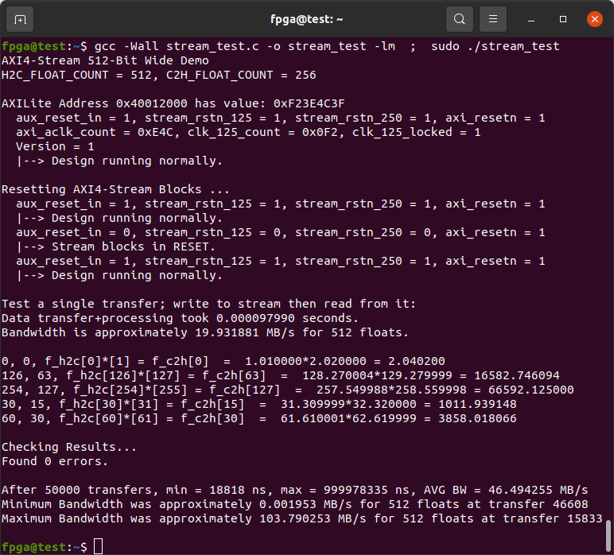
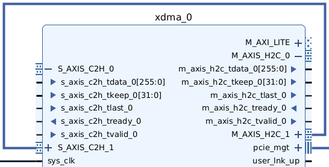
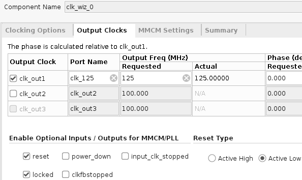

# XDMA AXI4-Stream Demo with H2C Bus Widened to 512-Bit

[PCIe XDMA](https://docs.xilinx.com/r/en-US/pg195-pcie-dma/Introduction) to [AXI4-Stream](https://docs.xilinx.com/r/en-US/ug1399-vitis-hls/How-AXI4-Stream-Works) with a 512-Bit H2C Bus. Demonstration for the [Innova-2](https://www.nvidia.com/en-us/networking/ethernet/innova-2-flex/) using [**Vivado 2022.2**](https://www.xilinx.com/support/download/index.html/content/xilinx/en/downloadNav/vivado-design-tools/2022-2.html). Stream multiplies [Floating-Point](https://docs.xilinx.com/v/u/en-US/pg060-floating-point) numbers.


## Block Design


## AXI-Lite Addresses


The AXI-Lite BAR has a `0x40000000` [PCIe to AXI Translation offset](https://docs.xilinx.com/r/en-US/pg195-pcie-dma/PCIe-BARs-Tab).


## Bitstream

Recreate the bitstream. Download [`xdma_stream_512bit.tcl`](xdma_stream_512bit.tcl) and [`constraints.xdc`](constraints.xdc). [`source`](https://docs.xilinx.com/r/2022.2-English/ug939-vivado-designing-with-ip-tutorial/Source-the-Tcl-Script?tocId=7apMNdBzAEx4udRnUANS9A) the Tcl script in the **Vivado 2022.2** *Tcl Console* then run *Generate Bitstream*.

[Load the bitstream into your Innova-2](https://github.com/mwrnd/innova2_flex_xcku15p_notes#loading-a-user-image). It should work with every variant of the Innova-2. Refer to [innova2_flex_xcku15p_notes](https://github.com/mwrnd/innova2_flex_xcku15p_notes) for system setup.

```
pwd
cd DOWNLOAD_DIRECTORY
dir
source xdma_stream_512bit.tcl
```


Generate the bitstream:


Resources used for the design:


## Testing

### Check Drivers and Hardware

Confirm the `xdma` driver has loaded and the hardware is recognized and operating as expected.
```
sudo lspci -vnn -d 10ee: ; sudo lspci -vvnn -d 10ee: | grep Lnk
sudo lspci -vv -d 15b3:1974 | grep "Mellanox\|LnkSta"
```


`dmesg | grep xdma` will detail how the XDMA driver has loaded.


`ls /dev/xdma*` will show all [character device files](https://en.wikipedia.org/wiki/Device_file#Character_devices) associated with the [XDMA driver](https://github.com/xilinx/dma_ip_drivers).


### Test Software

Compile and run the test program.
```
gcc -Wall stream_test.c -o stream_test -lm  ;  sudo ./stream_test
```



Every once in a while there will be a problem with communication. A portion of the resulting C2H floating-point array gets shifted by a few indices. I have run the core `pwrite`+`pread` loop millions of times and problems pop up early.


I have also encountered a calculation error:


### Data Throughput Tests

By using [`/dev/zero`](https://en.wikipedia.org/wiki//dev/zero) as the source of data and [`/dev/null`](https://en.wikipedia.org/wiki/Null_device) as the sink with [dd](https://manpages.ubuntu.com/manpages/focal/en/man1/dd.1.html) you can experiment with data throughput vs. `count=` and `bs=` (Block Size) values. Channel 1, `xdma0_h2c_1` and `xdma0_c2h_1`, are shorted for [loopback](https://en.wikipedia.org/wiki/Loopback). This gives an estimate for the maximum possible throughput.



In one terminal:
```
sudo dd if=/dev/zero of=/dev/xdma0_h2c_1 count=32768 bs=16384
```

In a second terminal:
```
sudo dd if=/dev/xdma0_c2h_1 of=/dev/null count=32768 bs=16384
```


The **H2C** throughput will be slower as it includes the time it takes you to switch to the second window and start the second `dd`.


## Design Details

The maximum width for the AXI Bus with a PCIe 3.0 x8 design is 256-Bit but a 512-Bit stream is required.


The goal is to re-clock and channel the data through the stream. Clocks and resets are carefully managed.


### Clocking

In order to widen the 256-Bit AXI4-Stream bus to 512-Bit the *axi_aclk* [clock](https://docs.xilinx.com/r/en-US/pg065-clk-wiz) is halved in order to maintain the same bandwidth.




### RESETs

Each clock needs an associated *aresetn* synchronized to it and controllable by a GPIO signal to allow [resetting](https://docs.xilinx.com/v/u/en-US/pg164-proc-sys-reset) the stream.


### FIFOs

Input (Host-to-Card **H2C**) and output (Card-to-Host **C2H**) [FIFOs](https://docs.xilinx.com/r/en-US/pg085-axi4stream-infrastructure/AXI4-Stream-Data-FIFO?tocId=gyNUSa81sSudIrD3MNZ6aw) were added to increase througput. The output C2H FIFO has the minimum depth of 16.


To match throughput the input H2C FIFO has a depth of 32 as its stream uses twice as many bits.


### Data Width Converter

The 256-Bit XDMA Block H2C stream is widened to 512-Bit using a [Data Width Converter](https://docs.xilinx.com/r/en-US/pg085-axi4stream-infrastructure/AXI4-Stream-Data-Width-Converter?tocId=XeJGiRyJ7jaFrWoPmP_A0w).


### Clock Converter

The input (H2C) data stream is [re-timed](https://docs.xilinx.com/r/en-US/pg085-axi4stream-infrastructure/AXI4-Stream-Clock-Converter?tocId=~IzTrg2BxmuhSg7Byd_UQA) to half of the XDMA block's *axi_aclk*. The halved clock is used by the stream blocks.


The output (C2H) data stream is re-timed back to *axi_aclk* before going into the XDMA block.


### Broadcaster and Combiner

The 512-Bit=64-Byte H2C data stream is [split/broadcast](https://docs.xilinx.com/r/en-US/pg085-axi4stream-infrastructure/AXI4-Stream-Broadcaster?tocId=lTRZ8UtIrjz6JIc8NcwYXg) into sixteen 32-Bit=4-Byte streams for the floating-point units.


The bits of each 32-Bit=4-Byte stream 


The floating-point unit results are [combined](https://docs.xilinx.com/r/en-US/pg085-axi4stream-infrastructure/AXI4-Stream-Combiner?tocId=8HmUlSZRrylcyf9aL1bMOw) into the 256-Bit output C2H stream.


### Stream Does Something

I put [Floating-Point](https://docs.xilinx.com/v/u/en-US/pg060-floating-point) blocks in the stream as an example of something useful. Each pair of 4-byte=32-bit single precision floating-point values in the 64-Byte=512-Bit Host-to-Card (H2C) stream gets multiplied to produce a floating-point value in the 32-Byte=256-Bit Card-to-Host (C2H) stream.

The floating-point blocks are set up to multiply their inputs.


Full DSP usage is allowed to maximize throughput.


The interface is set up as *Blocking* so that the AXI4-Stream interfaces include `tready` signals like the rest of the Stream blocks.


