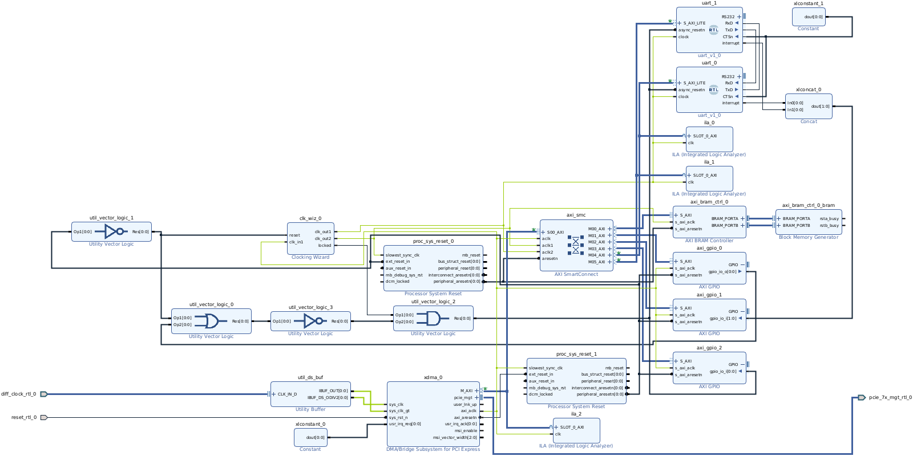
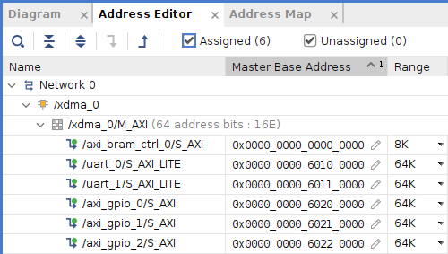
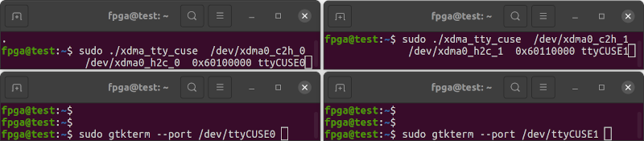
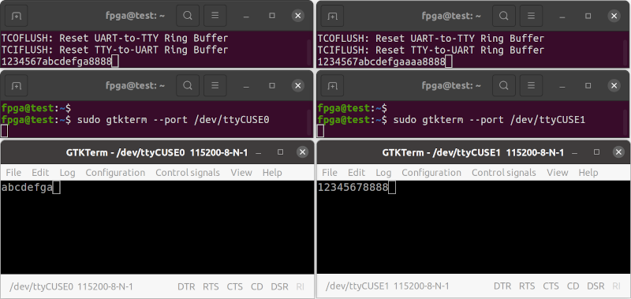
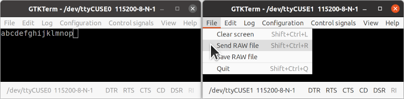
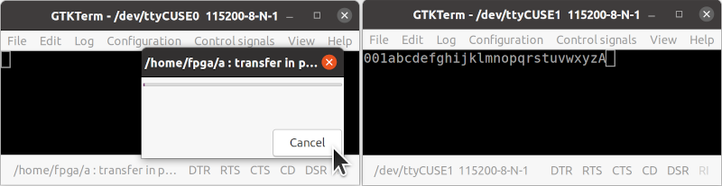
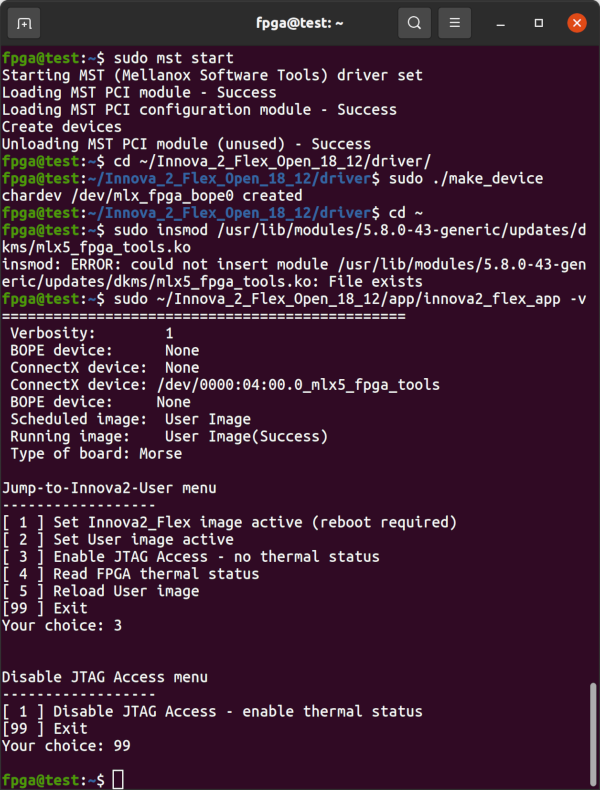
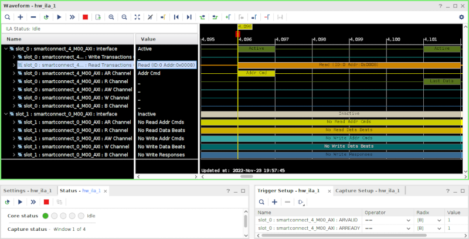

# Innova-2 PCIe UART over XDMA Test

Two non-blocking [UARTs](https://github.com/eugene-tarassov/vivado-risc-v/blob/v3.4.0/uart/uart.v) are connected to each other and through an AXI SmartConnect to XDMA PCIe. This is a test platform for UART over XDMA.


## Block Design




## Bitstream

Refer to the `innova2_flex_xcku15p_notes` project's instructions on installing XDMA drivers and [Loading a User Image](https://github.com/mwrnd/innova2_flex_xcku15p_notes/#loading-a-user-image) to load the [release bitstream](https://github.com/mwrnd/innova2_experiments/releases) into the Innova-2's FPGA Configuration Memory.

```
wget https://github.com/mwrnd/innova2_experiments/releases/download/v0.1-alpha/xdma_uart-to-uart_bitstream.zip
unzip -d .  xdma_uart-to-uart_bitstream.zip
md5sum  xdma_uart-to-uart_primary.bin  xdma_uart-to-uart_secondary.bin
echo 4cab44d93b10960a7dd0ce653630d69b should be MD5 Checksum of xdma_uart-to-uart_primary.bin
echo 015c797003f4ddf770c6ea418bd22a18 should be MD5 Checksum of xdma_uart-to-uart_secondary.bin
```


## AXI Addresses




## Testing

[xdma_tty_cuse.c](xdma_tty_cuse.c) bridges the AXI UARTs to the host's TTY subsystem. Compile then run with:

```
gcc xdma_tty_cuse.c `pkg-config fuse --cflags --libs` --std=gnu17 -g -Wall -latomic -o xdma_tty_cuse

sudo ./xdma_tty_cuse  /dev/xdma0_c2h_0  /dev/xdma0_h2c_0  0x60100000 ttyCUSE0
```

In a second terminal, connect to the CUSE TTY device:
```
sudo gtkterm --port /dev/ttyCUSE0
```

In a third terminal, run a second instance of XDMA TTY CUSE TTY:
```
sudo ./xdma_tty_cuse  /dev/xdma0_c2h_1  /dev/xdma0_h2c_1  0x60110000 ttyCUSE1
```

In a fourth terminal, connect to the second CUSE TTY device:
```
sudo gtkterm --port /dev/ttyCUSE1
```



Typing in one `GTKTerm` window should display the characters in the other window.




### Sending Files Larger than twice the FIFO Buffer Depth Fails

If you attempt to send a file, the TTY will lock up after sending about twice the number of characters that the RX and TX FIFOs hold.



`001abcdefghijklmnopqrstuvwxyzA` is 30 bytes while each FIFO has a [2^4=16-byte depth](https://github.com/mwrnd/innova2_experiments/blob/74f1473361b246bbb64e40fe7234f68de22aa502/xdma_uart-to-uart/uart.v#L113).




### Basic XDMA UART Testing

[`uart.c`](uart.c) sends as much data as it can to the first [AXI UART](uart.v) then reads as much data as it can from the second. Compile then run with:
```
gcc uart.c `pkg-config fuse --cflags --libs` --std=gnu17 -g -Wall -latomic -o uart
```

In a seperate terminal, test with:
```
sudo ./uart /dev/xdma0_c2h_0 /dev/xdma0_h2c_0 0x60100000 /dev/xdma0_c2h_1 /dev/xdma0_h2c_1 0x60110000
```

The software is able to fill the RX and TX FIFOs with 30 bytes (15 to each FIFO), and successfully read them back.
```
...
Wrote count = 30 bytes of data to XDMA0 : ABCDEFGHIJKLMNOPQRSTUVWXYZABCD
...
Read count = 30 bytes of data from XDMA1, readstring = ABCDEFGHIJKLMNOPQRSTUVWXYZABCD
...
```

Similarly with [`uartlite.c`](uartlite.c) for the [`UARTlite`](https://docs.xilinx.com/v/u/en-US/pg142-axi-uartlite) interfaces:
```
gcc uartlite.c `pkg-config fuse --cflags --libs` --std=gnu17 -g -Wall -latomic -o uartlite
sudo ./uartlite /dev/xdma0_c2h_0 /dev/xdma0_h2c_0 0x60300000 /dev/xdma0_c2h_1 /dev/xdma0_h2c_1 0x60310000
```

The `UARTlite` software needs further debugging. Either delay after each byte sent or wait for the transmit FIFO to empty before sending another byte. Check for the various *STATUS* register errors.
```
...
Wrote count = 24 bytes of data to XDMA0 : ABCDEFGHIJKLMNOPQRSTUVWX
...
Read count = 17 bytes of data from XDMA1, readstring = AABCDEFGHIJKLMNOP
...
```

## Integrated Logic Analyzer

The design includes an Integrated Logic Analyzer (ILA) for the AXI interface of each UART.

On the computer hosting the Innova-2, enable JTAG Access:
```
sudo mst start
cd ~/Innova_2_Flex_Open_18_12/driver/
sudo ./make_device
cd ~
sudo insmod /usr/lib/modules/`uname -r`/updates/dkms/mlx5_fpga_tools.ko
sudo ~/Innova_2_Flex_Open_18_12/app/innova2_flex_app -v
```



Connect a [Xilinx-Compatible **1.8V** JTAG Adapter](https://docs.xilinx.com/r/en-US/ug908-vivado-programming-debugging/JTAG-Cables-and-Devices-Supported-by-hw_server) to the Innova-2 and run [Vivado Hardware Manager](https://docs.xilinx.com/r/en-US/ug908-vivado-programming-debugging/Debugging-Logic-Designs-in-Hardware). Add [`debug_nets.ltx`](debug_nets.ltx) to the *Trigger Setup* and capture AXI communication.




## Recreating the Design in Vivado

[`source`](https://docs.xilinx.com/r/2021.2-English/ug939-vivado-designing-with-ip-tutorial/Source-the-Tcl-Script?tocId=K45Kl8hoyn9dApZ7PZP~Ng) [xdma_uart-to-uart.tcl](xdma_uart-to-uart.tcl) in Vivado.


## Useful References

- [fpga-axi-uart.c](https://github.com/eugene-tarassov/vivado-risc-v/blob/v3.4.0/patches/fpga-axi-uart.c) is the RISC-V UART driver code from `vivado-risc-v`
- [cusexmp.c CUSE example](https://github.com/libfuse/libfuse/blob/fuse-2.9.9/example/cusexmp.c)
- [tty0tty](https://github.com/lcgamboa/tty0tty) is a Virtual TTY to TTY Bridge
- [Linux Device Drivers 3rd Edition](https://lwn.net/Kernel/LDD3/) [tiny_tty example](https://github.com/martinezjavier/ldd3/blob/master/tty/tiny_tty.c)
- [CuseTTY](https://bitbucket.org/hetii/cusetty/raw/8143a4472710ec90632d010c70e7ef8b87fe1181/cusetty.c) is a [Virtual TTY for ESP-Link](https://github.com/jeelabs/esp-link/issues/215) and a great example of a TTY using CUSE

