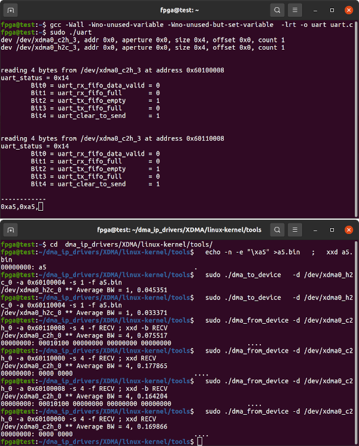

# Innova-2 PCIe UART over XDMA Test

Two non-blocking [UARTs](https://github.com/eugene-tarassov/vivado-risc-v/raw/6c8d522c78bb17abce552fefe4f5cb0f7b8388ee/uart/uart.v) are connected to each other and to PCIe XDMA. This is a test platform for UART over XDMA.


## Block Design


## Bitstream

Refer to the `innova2_flex_xcku15p_notes` project's instructions on [Loading a User Image](https://github.com/mwrnd/innova2_flex_xcku15p_notes/#loading-a-user-image) and load the included bitstream into the Innova-2's FPGA Configuration Memory.

```
unzip  xdma_uart-to-uart_bitstream.zip
md5sum  xdma_uart-to-uart_primary.bin  xdma_uart-to-uart_secondary.bin
echo c86f70720e752294cb5a3fe49f4a12aa should be MD5 Checksum of xdma_uart-to-uart_primary.bin
echo f379833eb8ae77b1610be79a9e438265 should be MD5 Checksum of xdma_uart-to-uart_secondary.bin
```


## AXI Addresses


## Testing

[xdma_tty_cuse.c](xdma_tty_cuse.c) assumes `dma_ip_drivers` are [installed and tested](https://github.com/mwrnd/innova2_flex_xcku15p_notes#install-xilinx-pcie-dma-ip-drivers). Compile then run with:

```
gcc xdma_tty_cuse.c ./c-ringbuf/ringbuf.c --std=gnu11 -g -Wall -latomic  \
`pkg-config fuse --cflags --libs` -I`echo $HOME`/dma_ip_drivers/         \
-I./c-ringbuf/ -o xdma_tty_cuse

sudo ./xdma_tty_cuse  /dev/xdma0_c2h_0  /dev/xdma0_h2c_0  0x60100000 ttyCUSE0
```

In a second terminal, connect to the CUSE TTY device:
```
sudo gtkterm --port /dev/ttyCUSE0
```

In a third terminal, run a second instance of XDMA TTY CUSE TTY:
```
sudo ./xdma_tty_cuse  /dev/xdma0_c2h_1  /dev/xdma0_h2c_1  0x60110000 ttyCUSE1
```

In a fourth terminal, connect to the second CUSE TTY device:
```
sudo gtkterm --port /dev/ttyCUSE1
```


Typing in one `GTKTerm` window should display the characters in the second window. There is currently a bug where one of the windows will fail to display repeated characters.


### Basic XDMA UART Testing

[uart.c](uart.c) assumes `dma_ip_drivers` are [installed and tested](https://github.com/mwrnd/innova2_flex_xcku15p_notes#install-xilinx-pcie-dma-ip-drivers). Compile then run with:

```
cp uart.c ~
cd ~
gcc -Wall -Wno-unused-variable -Wno-unused-but-set-variable  -lrt -o uart uart.c
sudo ./uart
```


In a seperate terminal, test with:

```
cd  dma_ip_drivers/XDMA/linux-kernel/tools/

echo -n -e "\xa5" >a5.bin   ;   xxd a5.bin

sudo ./dma_to_device   -v -d /dev/xdma0_h2c_0 -a 0x60100004 -s 1 -f a5.bin
sudo ./dma_to_device   -v -d /dev/xdma0_h2c_0 -a 0x60110004 -s 1 -f a5.bin
sudo ./dma_from_device -v -d /dev/xdma0_c2h_0 -a 0x60110008 -s 4 -f RECV ; xxd -b RECV
sudo ./dma_from_device -v -d /dev/xdma0_c2h_0 -a 0x60110000 -s 4 -f RECV ; xxd RECV
sudo ./dma_from_device -v -d /dev/xdma0_c2h_0 -a 0x60100008 -s 4 -f RECV ; xxd -b RECV
sudo ./dma_from_device -v -d /dev/xdma0_c2h_0 -a 0x60100000 -s 4 -f RECV ; xxd RECV
```




## Recreating the Design in Vivado

`source` [xdma_uart-to-uart.tcl](xdma_uart-to-uart.tcl) in Vivado.

