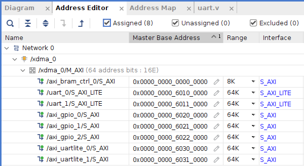
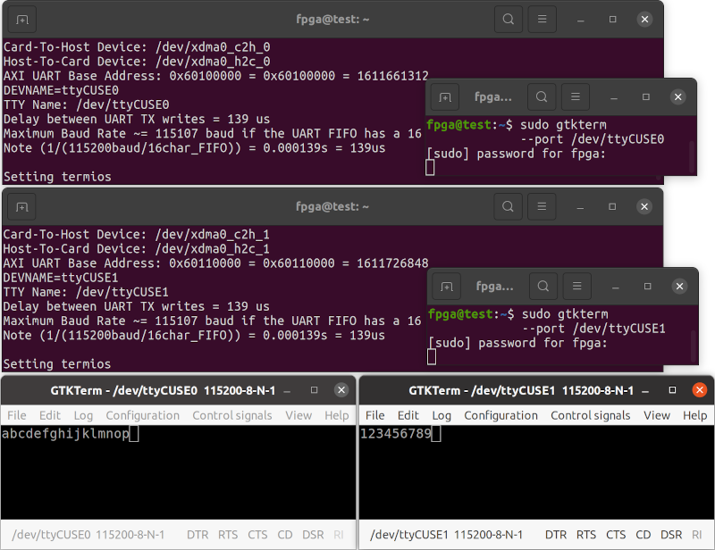

# Innova-2 PCIe UART over XDMA Test

Two non-blocking [UARTs](https://github.com/eugene-tarassov/vivado-risc-v/blob/v3.4.0/uart/uart.v) are connected to each other and to PCIe XDMA. This is a test platform for UART over XDMA.


## Block Design


## Bitstream

Refer to the `innova2_flex_xcku15p_notes` project's instructions on installing XDMA drivers and [Loading a User Image](https://github.com/mwrnd/innova2_flex_xcku15p_notes/#loading-a-user-image) to load the included bitstream into the Innova-2's FPGA Configuration Memory.

```
unzip  xdma_uart-to-uart_bitstream.zip
md5sum  xdma_uart-to-uart_primary.bin  xdma_uart-to-uart_secondary.bin
echo c86f70720e752294cb5a3fe49f4a12aa should be MD5 Checksum of xdma_uart-to-uart_primary.bin
echo f379833eb8ae77b1610be79a9e438265 should be MD5 Checksum of xdma_uart-to-uart_secondary.bin
```


## AXI Addresses




## Testing

[xdma_tty_cuse.c](xdma_tty_cuse.c) bridges the AXI UARTs to the host's TTY subsystem. Compile then run with:

```
gcc xdma_tty_cuse.c `pkg-config fuse --cflags --libs` --std=gnu17 -g -Wall -latomic -o xdma_tty_cuse

sudo ./xdma_tty_cuse  /dev/xdma0_c2h_0  /dev/xdma0_h2c_0  0x60100000 ttyCUSE0
```

In a second terminal, connect to the CUSE TTY device:
```
sudo gtkterm --port /dev/ttyCUSE0
```

In a third terminal, run a second instance of XDMA TTY CUSE TTY:
```
sudo ./xdma_tty_cuse  /dev/xdma0_c2h_1  /dev/xdma0_h2c_1  0x60110000 ttyCUSE1
```

In a fourth terminal, connect to the second CUSE TTY device:
```
sudo gtkterm --port /dev/ttyCUSE1
```


Typing in one `GTKTerm` window should display the characters in the second window.




### Basic XDMA UART Testing

[`uart.c`](uart.c) sends as much data as it can to the first UART then reads as much data as it can from the second. Compile then run with:

```
gcc uart.c `pkg-config fuse --cflags --libs` --std=gnu17 -g -Wall -latomic -o uart
```

In a seperate terminal, test with:

```
sudo ./uart /dev/xdma0_c2h_0 /dev/xdma0_h2c_0 0x60100000 /dev/xdma0_c2h_1 /dev/xdma0_h2c_1 0x60110000
```


## Recreating the Design in Vivado

`source` [xdma_uart-to-uart.tcl](xdma_uart-to-uart.tcl) in Vivado.


## Useful References

- [fpga-axi-uart.c](https://github.com/eugene-tarassov/vivado-risc-v/blob/v3.4.0/patches/fpga-axi-uart.c) is the RISC-V UART driver code from `vivado-risc-v`
- [cusexmp.c CUSE example](https://github.com/libfuse/libfuse/blob/fuse-2.9.9/example/cusexmp.c)
- [tty0tty](https://github.com/lcgamboa/tty0tty) is a Virtual TTY to TTY Bridge
- [Linux Device Drivers 3rd Edition](https://lwn.net/Kernel/LDD3/) [tiny_tty example](https://github.com/martinezjavier/ldd3/blob/master/tty/tiny_tty.c)
- [CuseTTY](https://bitbucket.org/hetii/cusetty/raw/8143a4472710ec90632d010c70e7ef8b87fe1181/cusetty.c) is a [Virtual TTY for ESP-Link](https://github.com/jeelabs/esp-link/issues/215) and a great example of a TTY using CUSE

